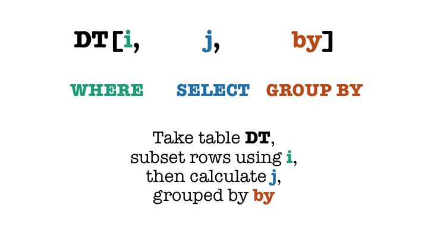

# Introduction

Data in R are best handled by a class called `data.frame`. This is actually a special `list`: containing only equal-sized elements, that correspond to the columns of your data set. As opposed to Stata, you can load many data sets (`data.frames`) into your workspace.

There are multiple ways to deal with `data.frames` in R. You can use base R syntax (that essentially uses the fact that a `data.frame` is just a special `list`), or choose one of the many packages that aim to make data manipulation easier. Our favorite package for this purpose is `data.table`, that was developed by Matt Dowle in 2006. It is elegant, and very effective with large data sets. For an intro by the authors look at [this vignette](https://cran.r-project.org/web/packages/data.table/vignettes/datatable-intro.html).

RStudio guys prefer `dplyr` (as part of the so called `tidyverse`), which mainly explains why `dplyr` is more popular among R users. You can use whichever method you favor, we will understand it. But in our examples, we will stick to `data.table` and hope that we can demonstrate you why we love the package so much.

To ensure that we are on the same page, make sure you use the latest (as of 2021-09-01) CRAN version (`1.14.0`) of data.table.

```{r, warning=FALSE}
library(data.table)
options(datatable.print.class = TRUE)
```

## Sample data

Throughout this illustration, you will use a sample data (with randomized ids) of the sales of an e-commerce customer, consisting of ~2.5 million rows. To run the code, please download the file from [here](https://drive.google.com/drive/folders/1HmCp1pTpEaqta7z0p1fnCas1dN6myVxg?usp=sharing) and put into a `data` folder within your working directory.


```{r}
data_file <- 'data/sales_sample.csv'
sales <- fread(data_file)
class(sales)
```
Note that `sales` is a special `data.frame`, it is also a `data.table`.

```{r}
sales  # classes are printed because of the option set
```

## Syntax

```{r, echo=FALSE, eval=TRUE, out.width='100%'}

```


## Subset rows using i...

```{r}
sales[1:10]
sales[status == 'lead']
```

The environment is the `data.table` itself. In base R, you have to explicitly give the environment: `sales[sales$status == 'lead']`.


## ...then calculate j...
```{r}
sales[, sum(spent)]
sales[, list(min(purchase_date), max(purchase_date))]
```

## ...grouped by by
```{r}
sales[, sum(spent), by = purchase_date]
sales[, sum(spent), by = list(status, purchase_date)]
sales[, sum(spent), by = (purchase_date > '2016-12-31')]
sales[, sum(spent), by = list(in_2017 = purchase_date > '2016-12-31')]
```


## Selections

For columns:

```{r}
sales[, spent]  # returns vector
sales[, list(spent)]  # returns data.table
sales[, .(spent)]  # shortcut for list()
sales[, .(money_spent = spent)] # using another name
sales[, 'spent']  # data.frame-way but returns data.table
sales[, c('contact_id', 'spent')]  # same as with data.frame
```

For aggregates:

```{r}
sales[, .(sum(spent), sd(spent))]
sales[, .(spent = sum(spent), spent = sd(spent))]
sales[, .(avg_sales = mean(spent)), by = status]
```

## Efficient `data.table` functions

```{r}
sales[, .N, by = status]
sales[, uniqueN(customer_id), by = status]
```

## You can really do whatever calculation in j

```{r}
sales[, table(status)]
sales[, hist(spent)]
sales[, lm(spent ~ status)]
```

# The power of data.table

## Combine with plots (using pipe from `magrittr` package)
```{r}
library(magrittr)
library(ggplot2)
sales[, .(avg_sales = mean(spent)), by = status] %>%
    ggplot(aes(status, avg_sales)) + geom_col()
```

## Chain operations
```{r}
sales[, .(daily_sales = sum(spent)), by = purchase_date][daily_sales > 400000]
sales[, .(daily_sales = sum(spent)), by = purchase_date] %>%
    .[daily_sales > 400000]
```


## Modify in-place

A very nice feature of `data.table` is in-place modification. It means that it can create/delete/modify any variable within the table without having to copy them first. If you work with large data, it is really important for memory reasons.

```{r}
sales[, a := 'a']
sales
sales[, a := NULL]
sales
```


In-place modification comes handy if you want to create new variables. Let's add an aggregated number next to each purchase (without aggregating the whole table):

```{r}
sales[, daily_sum := sum(spent), by = purchase_date]
sales
```

You can also use `i` to filter where you want to create the new variable. For sales before the given date, the created new variable will be missing.

```{r}
sales[purchase_date > '2016-12-31', daily_sum_in_2017 := sum(spent), by = purchase_date]
```

You can also add multiple variables at once (using one of the following methods):

```{r}
sales[, c('year', 'month') := .(year(purchase_date), month(purchase_date))]
sales[, `:=`(year = year(purchase_date), month = month(purchase_date))]
```

Or remove multiple variance at once:

```{r}
sales[, c('daily_sum', 'daily_sum_in_2017') := NULL]
```


## Do the same calculation for each columns

If you want to do the same calculations multiple times, you should use loops. It works within `data.table` itself. If you want to calculate the unique number of values for each column, you use the same `lapply()` function what you learnt previously. You should loop over a special `data.table` object, `.SD`, a shortcut for "subset of dataframe". Without any further specification, it means each column of the table.

```{r}
sales[, lapply(.SD, uniqueN)]
```

If you really want just a subset of the data, you can specify the relevant columns using the `.SDcols` parameter:

```{r}
sales[, lapply(.SD, median), .SDcols = c('n_units', 'spent')]
```

If you want to run a more complicated calculation, simply use the `function()` syntax of `lapply()`:

```{r}
sales[,
    lapply(.SD, function(x) quantile(x, p = 0.75)),
    by = status,
    .SDcols = c('n_units', 'spent')
]
```


Let's say we want to find the orders with the maximum spending for each year. Unfortunately, the `by` clause only refers to calculation done in `j` so the following will not work.

```{r}
sales[
    spent == max(spent),
    .(customer_id, spent),
    by = year  # by only applies to calculation in j!
]
```

You can combine ordering in `i` and use `.SD` to choose from each group. You can also use the fact, that `.SD` is itself a `data.table` so you can just filter it in the standard way. Both of the following methods will work:

```{r}
sales[order(-spent), lapply(.SD, head, n = 1), by = year]
sales[order(-spent), .SD[1], by = year]
```

If you just want to return the relevant columns, you can use `.SD` as a normal `data.table`:
```{r}
sales[order(-spent), .SD[1, .(spent)], by = year]
```

## Select within function: `get()`

Sometimes, we want to write a function that accepts a column name as string. You can use the `get()` function to make this happen:

```{r}
returnMax <- function(dt, column) {
    dt[, max(get(column))]
}
returnMax(sales, 'purchase_date')
returnMax(sales, 'n_units')
```


## Reshape

Sometimes, we want to reshape our data. You can use `dcast` to go from wide to long, and `melt` to go from wide to long (ie. to "melt down" the data). You can read more about efficient reshaping with `data.table` [here](https://cran.r-project.org/web/packages/data.table/vignettes/datatable-reshape.html).

We can easily calculate sales by `year` and `status` in a nice table with `dcast`>

```{r}
sales[, max(spent), by = .(status, year)] %>%
    dcast(status ~ year)
```

For plots, we usually want long data, where `melt` is at hand. Let's plot daily sales and quantity at once using facets. (Note that the aggregated sales is of class `double` whereas the aggregated quantity is integer which results in a warning.)

```{r}
sales[, lapply(.SD, sum), by = purchase_date, .SDcols = c('spent', 'n_units')] %>%
    melt(id.vars = 'purchase_date') %>%
    ggplot(aes(purchase_date, value)) +
        geom_line() +
        facet_wrap(~ variable, ncol = 1, scales = 'free_y')
```


## Key

`data.table` can have a key that makes lots of things easier. The data.table is ordered by its key.


```{r}
sales[, .(yearly_sales = sum(spent)), by = year]
sales[, .(yearly_sales = sum(spent)), keyby = year]  # sorts by year
```

If the key is set, you can more easily filter by the key:

```{r}
setkey(sales, status)
sales['lead']
```

You can also use the key to join datasets.

```{r}
status_sales <- sales[,
    .(sum_sales_by_status = sum(spent)),
    keyby = status
]
status_sales[sales] # merge by key

merge(sales, status_sales, by = 'status')  # works as well
```


# Tasks

1. Calculate the mean sales by customer status
2. Create a table that contains each buyer with the number of orders they made
3. Create a table that contains each buyer of 2017 with the number of orders they made
4. Create a summary table by status: number of purchases, total revenue generated, number of buyers
5. Select days when someone spent more than 10k
6. Create a new "season" variable (winter, spring, summer, autumn)
7. Count the number of orders by status and year
8. Add the status-specific average sales amount to each purchase
9. Find the maximum quantity and spending for each year

# Additional resources

- [Intro video by Matt Dowle](https://www.youtube.com/watch?v=pc1ARG6kbAM&t=49s) (Warning: Almost 4 years old, uses an older version of the package)
- [Slides of my data.table workshop on ERUM2018 containing mainly the same content along with benchmarks about the speed of the package](http://divenyijanos.github.io/documents/erum_workshop_datatable.html#1)
- [Talk of Arun Srinivasan (Co-Developer) at USER2019](https://github.com/Rdatatable/data.table/wiki//talks/useR2019_Arun.pdf)
- [Introduction by Nilakanta & Ky](http://rpubs.com/kykimeng/intro-to-data-table)
- [Comparison with dplyr](https://atrebas.github.io/post/2019-03-03-datatable-dplyr/)
