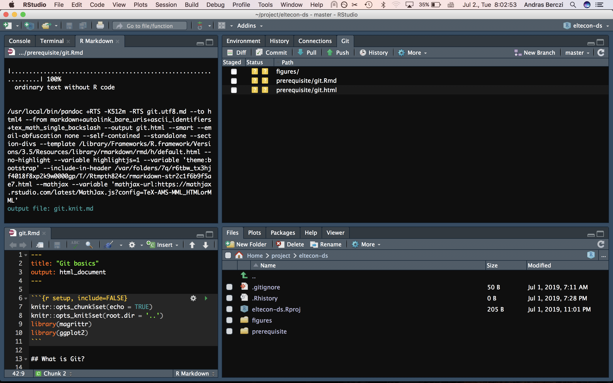
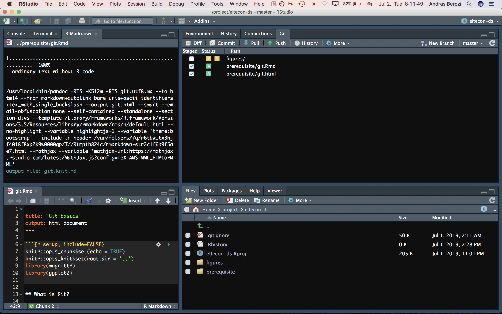
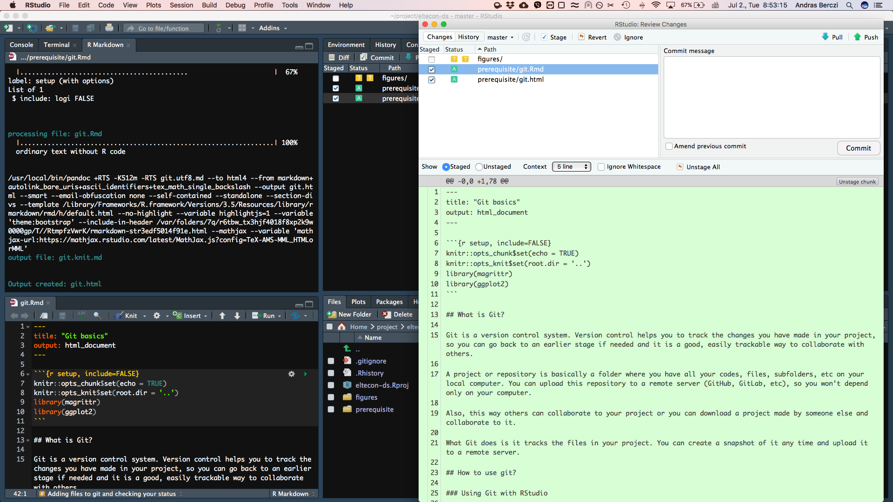
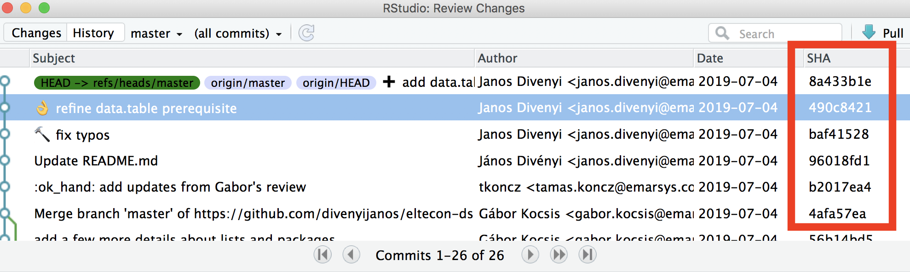

```{r setup, include=FALSE}
knitr::opts_chunk$set(echo = TRUE)
knitr::opts_knit$set(root.dir = '..')
library(magrittr)
library(ggplot2)
```

## What is Git?

Git is a version control system. Version control helps you to track the files and show the changes you have made in your project. You can create a snapshot of your the files in your project any time. A project or repository is basically a folder where you have all your codes, files, subfolders, etc on your local computer. 

You can upload this repository to a remote server (GitHub, GitLab, etc), so you won't depend only on your computer. This way others can collaborate in your project or you can download (which is cloning in Git terms) a project made by someone else and collaborate in it.

## Why is it good to use?

Git is good for a number of reasons:

* Git is a good tool for tracking different versions of your files. This way you won't have to create files like: `final_v3_this_is_really_the_final.doc`. Instead, you can create a snapshot of your file as often you would like when working on it, so you will have a saved version of your file over time.
* This means that you don't need to keep all versions of your files and codes in your project folder. You should only keep the things you currently need. If you realize there is something you need from an earlier state, you can go back in your project's history and restore your file to the state where you still had the piece you need.
This way you won't have a huge mess in your project, but you don't have to worry about loosing anything.
* If you store your project on a remote server, others can collaborate in your project. This makes teamwork easier, but beware, working together on the same project can cause conflicts when for example multiple people edit the same file(s). There are methods, techniques in Git, which makes working together easier, but it is outside the scope of this short introduction to explain them.

## How Git works?

There are 3+1 stages in Git: the Working Directory, the Staging Area, the local repository and the remote repository.

The **Working Directory** is the folder of your project. This is the directory whose files Git tracks. Git doesn't actually track all files, it only tracks the files you tell it to track.

Git starts to track a file, when you **add** it to the **Staging Area**.

You can create a snapshot of a bunch of staged files whenever you want. This process is called **commiting**. When you make a commit, Git stores on your **local repository** how the file looks like at the time of the commit. You can also check what changes were made since your previous commit of that file. This way you will have the full history of your files and thus your project.

You probably want to store your project's history on a **remote repository** like GitHub, so it won't be all lost if something happens to your computer.


## How to use Git?

First you need to download Git. You can find help on the RStudio's [website](https://support.rstudio.com/hc/en-us/articles/200532077-Version-Control-with-Git-and-SVN) on how to install it on your computer.

This project is on [GitHub](https://github.com/). If you want to upload changes to GitHub you have made to this project, you will need to register first on GitHub.

### **Using Git with RStudio**

#### Creating a new Git based project (on GitHub) {#creating_new_project}

Altough  it is possible to create a local Git based project and link it later to a remote server, it is easier to do it the other way around:

[Create a GitHub repository](https://help.github.com/en/articles/create-a-repo).
After your repository is created, you can clone it onto your local computer:

* Go to `File > New Project > Version Control > Git`
* Copy the remote repository's URL. You can find this on the repository's Github site (in this case [here](https://github.com/divenyijanos/eltecon-ds)), near the upper right corner. Press `Clone or download` and then copy the address you see there (make sure you copy the http address, not ssh).
* Give a name of you project's directory. It is a good practice to give the same name as it is named on GitHub already.

#### Checking your status

You can check your current status, which shows the changes you have made since the last snapshot (or commit in Git terms - we will get to this soon).

*Go to the Git panel in RStudio*


<br>

#### Adding files to the staging area

Every new file to the project or the changes you have made in a file is in the 'unstaged' area, which means it is not tracked by Git yet. You can `add` a file (or the changes in it) by ticking the box next to the file. This way the file will move to the staging area:


<br>

#### Creating snapshot about your current status aka. commiting

Once you have started to make changes, you can make a snapshot of your current status at any point. This way you can go back to this point any time later.
You can commit any file which is in the staging area.

* Press on the `Commit` button, a new window will pop up. Here you will see the changes you have made since your last commit: red shows the rows you have removed and green shows new rows (if you change eg. a few letters in a row, Git will show you that you have deleted that row and created a new one.) If you have added a brand new file, you will see it in all green.
* You should write a commit message for every commit. A commit message is a short message (max. 50-60 characters) which describes the changes you have made. If you feel like you need to write a longer description, you can write a short summary in the first line, than leave a blank line and write a longer description.


<br>

#### Push your project to the remote repository (GitHub in this case)

After commiting your files you can press the `Push` button on the upper right corner.

#### Pulling stuff from GitHub

Since others are also able to push in the repository, next time before you do anything, you should press the `Pull` button.

#### Cloning an existing project

You can clone an existing project from a remote server. The steps are the same as when [creating a new project](#creating_new_project) based on a newly created repository on GitHub.

* Go to `File > New Project > Version Control > Git`
* Copy the remote repository's URL. You can find this on the repository's Github site (in this case [here](https://github.com/divenyijanos/eltecon-ds)), near the upper right corner. Press `Clone or download` and then copy the address you see there (make sure you copy the http address, not ssh).
* Give a name of you project's directory. It is a good practice to give the same name as it is named on GitHub already.

*NOTE: that by only downloading the ZIP file from the project's GitHub webpage you do not actually get a project tracked by Git. You need to actually clone the repository to have a project followed by Git on your local computer*

### **Using Git with command line**

You can do the same things in command line. There is no difference if you do it in RStudio or in command line, it is just personal preference.
You need to have a [Command Line Interface](https://en.wikipedia.org/wiki/Command-line_interface) (such as Terminal for Mac or Command Prompt for Windows)

#### Creating a new Git based project
`git init`

This will only make a local Git project. If you want to connect it with a remote server, the easiest way would be to make a project first on GitHub and then clone it.

#### Download an existing project
`git clone remote-repository-url`

#### Checking your status
`git status`

#### Checking the changes you have made
`git diff` (this shows all changes in all files)

`git diff selected_file` (this shows changes you have made in a selected file)

#### Adding files to the staging area
You can select a few files to add
`git add write_down all_selected files_here`

Or you can select all files
`git add .`

#### Creating snapshot abouts your current status aka. commiting
`git commit -m "write your commit message here"`

#### Push your project to the remote repository (GitHub in this case)
`git push`

#### Pulling stuff from GitHub
`git pull`

## Some useful stuff
<u>The `.gitignore` file:</u> You can write anything into the .gitignore file, which you don't want to track and don't want to push it in the remote repository. We do this usually to files which contains some kind of secret (eg. password) or to huge files/images. Note that this is a hidden file, which can be seen in RStudio's file manager, but on most file managers you need enable showing hidden files to be able to see `.gitignore`.

<u>Checking your history with `git log`:</u> In RStudio you can get the logs by pressing on `History`. This command shows the commit history of the project. You can see the commit messages which can give you an idea, what happened in the project. 
You can use the *SHA-key* to go back to a certain state in your project. The SHA-key is a mixture of numbers and letters you can see when checking your history, which serves as a unique identifier for each commit. When using RStudio, only the first 8 characters are shown.


<u>Go back to an earlier state with `git checkout SHA-key`:</u> This is not possible in RStudio, only with command line. By providing the SHA-key you can go back to any (commited) state in your project. You can go back to your current state by typing `git checkout master`


## Example task

1. Clone [this](https://github.com/divenyijanos/eltecon-ds) project to your computer.
2. Create a folder, where the folder name should be your name (firstname_lastname).
3. Create a file in your folder. It can be any kind of file, even an empty txt.
4. Add your new file (and folder) to the staging area.
5. Commit the staged file and write a short commit message.
6. Push it!

## Resources
* https://www.freecodecamp.org/news/how-not-to-be-afraid-of-git-anymore-fe1da7415286/
* https://gitexplorer.com/
* https://git-scm.com/book/en/v1/
* https://happygitwithr.com

Some more advanced stuff (not necessary to know now, but can be very useful in the future)

* https://github.blog/2015-06-08-how-to-undo-almost-anything-with-git/
* https://ohshitgit.com/
* http://christoph.ruegg.name/blog/git-howto-revert-a-commit-already-pushed-to-a-remote-reposit.html
* http://tednaleid.github.io/understanding-git/
