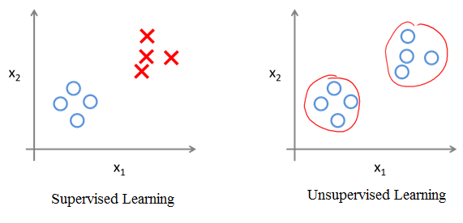
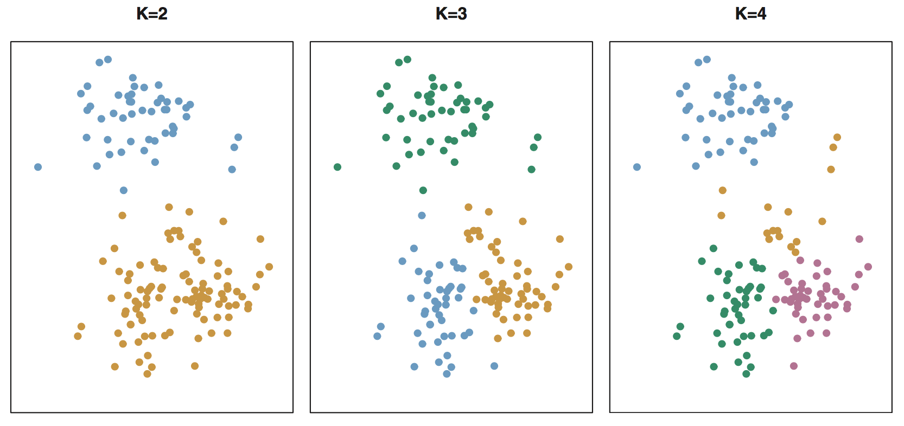
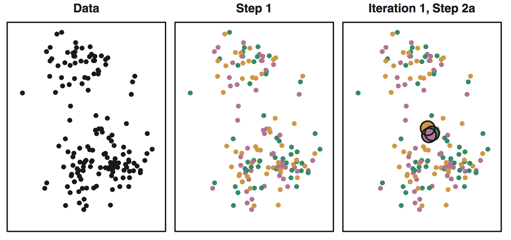
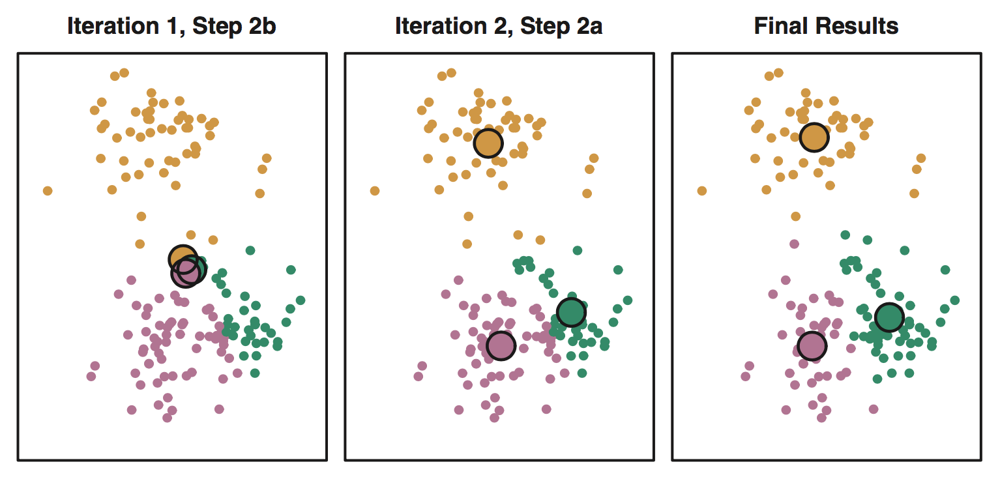
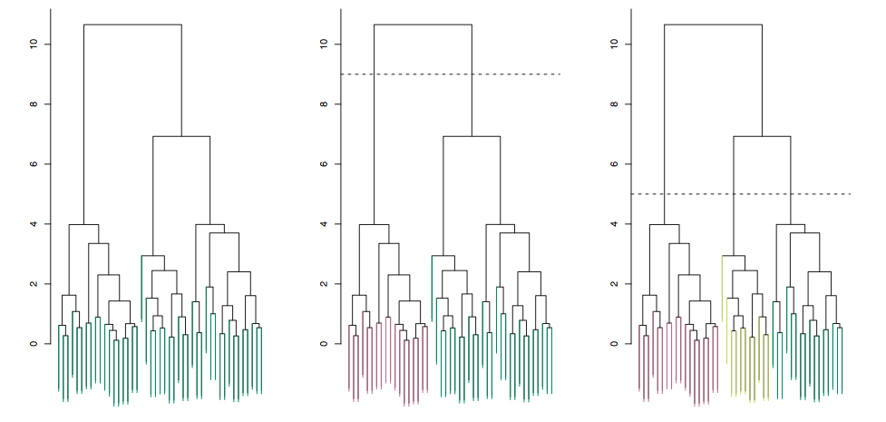
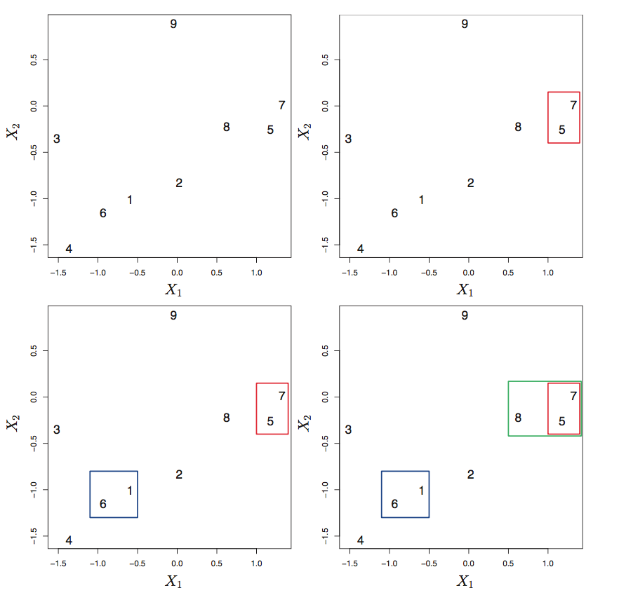
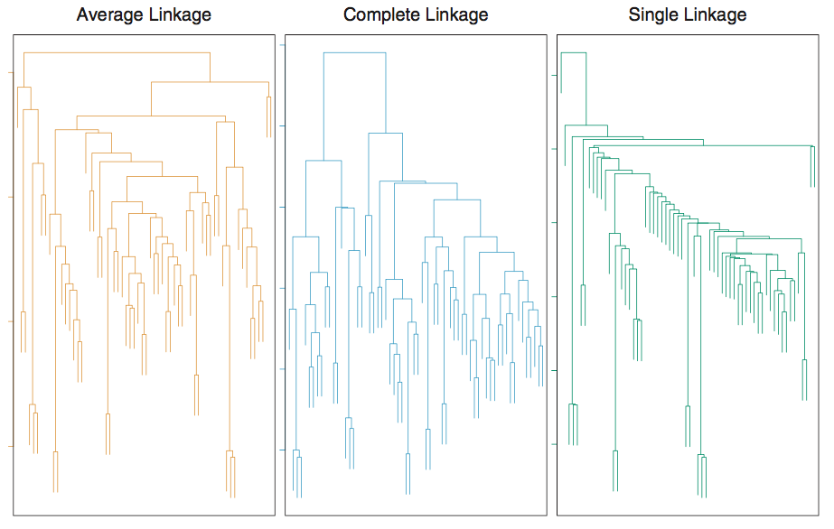
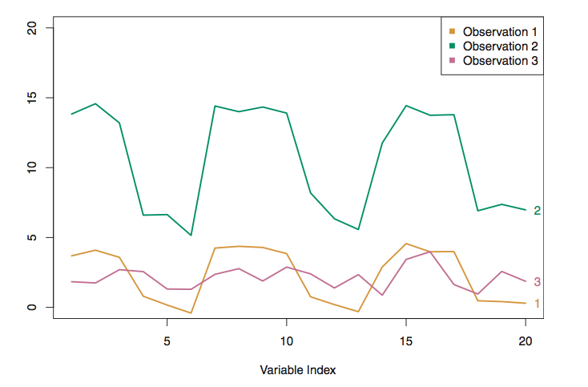
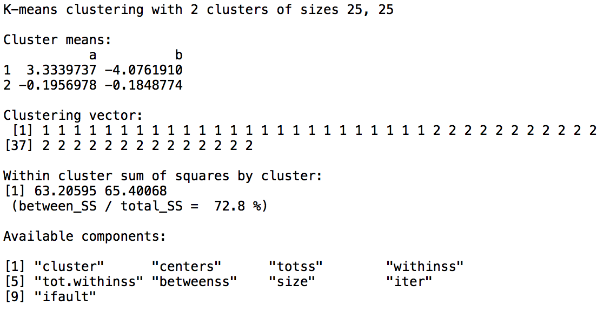

```{r setup, include=FALSE}
knitr::opts_chunk$set(echo = TRUE)
knitr::opts_knit$set(root.dir = '..')
library(ggplot2)
library(data.table)
```

# Supervised vs unsupervised learning
## What is the difference between Supervised and Unsupervised learning?
```{r, out.height = "160px", echo=FALSE}

```

## Supervised learning
- For each observation of the predictor measurements (**X**) there is an associated response measurement (*Y*).

- The goal is to fit a model that predicts the amount or the label of the response.

- Eg. linear regression, logistic regression, classification etc.
    
## Unsupervised learning
- We observe measurements (**X**), but no associated response variable (*Y*), so we cannot fit any regressions.

- The goal is to find relationship or structure among the measurements.

## Goals of unsupervised learning
- Find patterns in the features of the data by dimensionality reduction
    - Ex 1. instead of using both humidity and rainfall in a classification problem, they can be collapsed into just one underlying feature, since both of them are strongly correlated
\linebreak
- Find homogenous subgroups (clusters) within a population
    - Ex 1. segmenting consumers based on demographics and purchasing history
    - Ex 2. find similar movies based on features of each movie and reviews of the movies

# Dimensionality reduction with PCA
- This section is based on [James, G., Witten, D., Hastie, T., and Tibshirani, R. *An Introduction to Statistical Learning with Applications in R.*  Pages 373-385.](http://faculty.marshall.usc.edu/gareth-james/ISL/)

## Dimensionality reduction with PCA
- *Principal components* allow us to summarize a large set of correlated variables with a smaller number of representative variables that collectively explain most of the variablility in the original set.

- *Principal component analysis* (PCA) is simply reducing the number of variables of a data set, while preserving as much information as possible.

- Reducing the number of variables comes at the expense of accuracy, so with PCA we trade a little accuracy for simplicity.

## What are principal components?
- Try to visualize *n* observations with measurements of *p* features by two-dimensional scatterplots (with *p* = 10 there are 45 plots!).

- Instead we'd like to find a low-dimensional representation of the data that captures most of the information.

- Imagine that each of the *n* observations lives in a *p*-dimensional space, but not all of these dimensions are equally *interesting*.

- Interesting is measured by the amount that the observations vary along each dimension.

- Each of the dimensions (principal components) found by PCA is a linear combination of the *p* features.

# Steps of PCA
- This section is based on [Jaadi, Z. *A step by step explanation of principal component analysis.*](https://builtin.com/data-science/step-step-explanation-principal-component-analysis)

## Step 1: Standardization
- The aim is to standardize the range of the continuous initial variables so that each one of them contributes equally to the analysis.

- We do standardization because PCA is quite sensitive regarding the variances of the initial variables (variables with larger ranges dominate over those with small ranges leading to biased results).

- Standardization can be done by **subtracting the mean and dividing by the standard deviation** for each value of each variable.

## Step 2: Covariance matrix computation
- The aim is to understand how the variables of the input data set are varying from the mean with respect to each other, i.e. to see if there is any relationship between them.

- We compute the covariance matrix in order to identify highly correlated variables.

## Step 2: Covariance matrix computation (cont.)
$$\begin{bmatrix}
  Cov({x, x}) & Cov({x, y}) & \cdots & Cov({x, p}) \\
  Cov({y, x}) & Cov({y, y}) & \cdots & Cov({y, p}) \\
  \vdots  & \vdots  & \ddots & \vdots  \\
  Cov({p, x}) & Cov({p, y}) & \cdots & Cov({p, p})
 \end{bmatrix}$$

- The main diagonal gives the variances of each variable, moreover the entries of the covariance matrix are symmetric with respect to it.

- If the sign of a covariance is
    - positive: the two variables increase or decrease together (correlated)
    - if negative: one increases when the other decreases (inversely correlated)

## Step 3: Compute the eigenvectors and eigenvalues of the covariance matrix to identify the PCs
- Every eigenvector has an eigenvalue and their number is equal to the number of dimensions of the data.

 - **Eigenvectors** of the covariance matrix **are actually the directions of the axes where there is the most variance** and that we call principal components. 
 
 - **Eigenvalues** are simply the coefficients attached to eigenvectors, which **give the amount of variance carried in each principal component**.

- By ranking eigenvectors in order of their eigenvalues, highest to lowest, we get the principal components in order of significance.

- To compute the percentage of variance explained by each component, we divide the eigenvalue of each component by the sum of eigenvalues.

## Step 4: Feature vector
- Choose whether to keep all components or discard those of lesser significance (of low eigenvalues), and form with the remaining ones a matrix of vectors that we call *feature vector*.

- The feature vector is simply a matrix that has as columns the eigenvectors of the components that we decide to keep.

- Discarding a component will reduce dimensionality, and will consequently cause a loss of information in the final data set.

## Step 5: Score vector
- The aim is to use the feature vector to reorient the data from the original axes to the ones represented by the principal components.

- Recasting can be done by multiplying the transpose of the original data set by the transpose of the feature vector.

$$
ScoreVector = FeatureVector^T * StandardizedOriginalDataSet^T
$$

# PCA Lab
- This section is based on [James, G., Witten, D., Hastie, T., and Tibshirani, R. *An Introduction to Statistical Learning with Applications in R.*  Pages 401-403.](http://faculty.marshall.usc.edu/gareth-james/ISL/)

## PCA Lab
```{r}
head(USArrests)
```

## PCA Lab
```{r}
apply(USArrests, 2, mean)
```

```{r}
apply(USArrests, 2, var)
```

## PCA Lab
```{r}
pca_output <- prcomp(USArrests, scale = TRUE)
```
```{r}
pca_output$center
pca_output$scale
```

- ``center`` and ``scale`` are the *means* and *standard deviations* of the variables that were used for scaling prior to implementing PCA

## PCA Lab
```{r}
pca_output$rotation
```

- ``rotation`` is the matrix whose columns contain the eigenvectors (also called loadings)

## PCA Lab
```{r}
dim(pca_output$x)
head(pca_output$x)
```
- matrix ``x`` has as its columns the principal component score vectors

## PCA Lab
```{r, out.width = "55%", fig.align = "center"}
biplot(pca_output, scale = 0)
```

## PCA Lab
```{r}
pca_output$rotation <- -pca_output$rotation
pca_output$x <- -pca_output$x
```
- principal components are only unique up to a sign change

## PCA Lab
```{r, out.width = "55%", fig.align = "center"}
biplot(pca_output, scale = 0)
```

## PCA Lab
```{r}
pca_output$sdev
```

```{r}
pca_var <- pca_output$sdev^2
pca_var
```

```{r}
pca_var_expl <- pca_var / sum(pca_var)
pca_var_expl
```

## PCA Lab
```{r, out.width = "80%", fig.align = "center"}
plot(pca_var_expl, xlab = "Principal Component", 
     ylab = "Proportion of Variance Explained", 
     ylim = c(0, 1), type = "b")
```

## PCA Lab
```{r, out.width = "80%", fig.align = "center"}
plot(cumsum(pca_var_expl), xlab = "Principal Component", 
     ylab = "Cumulative Proportion of Variance Explained", 
     ylim = c(0, 1), type = "b")
```

# Clustering methods
- This section is based on [James, G., Witten, D., Hastie, T., and Tibshirani, R. *An Introduction to Statistical Learning with Applications in R.*  Pages 385-401.](http://faculty.marshall.usc.edu/gareth-james/ISL/)

# K-means clustering

## K-means theory
- Clustering the observations of a data set means partitioning them into groups so that observations within each group are quite *similar*, while observations in different groups are quite *different* from each other.

- Each observation should belong to exactly one cluster.

- To perform K-means clustering, we must first specify the desired number of clusters K; then the K-means algorithm will assign each observation to exactly one of the K clusters.

## K-means clustering with different values of K
```{r, echo=FALSE}

```

## K-means optimization problem
- A *good* clustering is one for which the *within-cluster variation* is as small as possible.
- If the within-cluster variation for cluster *C~k~* is a measure *W(C~k~)*, then we want to solve:
$$\underset{C_{1},...,C_{K}}{\text{minimize}}\left\{\sum_{k=1}^{K}W(C_{k})\right\}$$
- The most common choice of measure is the *squared Euclidean distance*:
$$W(C_{k})=\frac{1}{|C_{k}|}\sum_{i,i' \in C_{k}}\sum_{j=1}^{p}(x_{ij}-x_{i'j})^2$$
- Thus the optimization problem is:
$$\underset{C_{1},...,C_{K}}{\text{minimize}}\left\{\sum_{k=1}^{K}\frac{1}{|C_{k}|}\sum_{i,i' \in C_{k}}\sum_{j=1}^{p}(x_{ij}-x_{i'j})^2\right\}$$

## K-means algorithm
1. Randomly assign a number, from 1 to *K*, to each of the observations. These serve as initial cluster assignments for the observations.

2. Iterate until the cluster assignments stop changing:
    (a) For each of the *K* clusters, compute the cluster *centroid*. The *k*th cluster centroid is the vector of the *p* feature means for the observations in the *k*th cluster.
    (b) Assign each observation to the cluster whose centroid is closest (where *closest* is defined using Euclidean distance).

## K-means algorithm (cont.)
- The results will depend on the initial (random) cluster assignment in Step 1, thus we need to run the algorithm multiple times from different random initial
configurations.

- We select the *best* solution, for which the objective is the smallest.

## K-means algorithm explained
- Notice that:
$$\frac{1}{|C_{k}|}\sum_{i,i'\in C_{k}}\sum_{j=1}^{p}(x_{ij}-x_{i'j})^2=2\sum_{i\in C_{k}}\sum_{j=1}^{p}(x_{ij}-\bar{x}_{kj})^2$$
where $$\bar{x}_{kj}=\frac{1}{|C_{k}|}\sum_{i\in C_{k}}x_{ij}$$ is the mean for feature *j* in cluster *C~k~*

- The above shows that in Step 2(a) the cluster means for each feature are the constants that minimize the sum-of-squared deviations, and by reallocation in Step 2(b) we can only improve.

- When the result no longer changes, a *local optimum* has been reached.

## K-means clustering progression
```{r, echo=FALSE}

```

## K-means clustering progression (cont.)
```{r, echo=FALSE}

```

# Hierarchical clustering
- Hierarchical clustering does not require choosing a particular *K* number of clusters.

- It results in a tree-based representation of the observations, called a *dendogram*.

- We focus on *bottom-op* or *agglomerative* clustering (vs *top-down* or *divisive*).

## The dendogram
```{r, echo=FALSE}

```

## The dendogram
- Each *leaf* is an observation, as we move up the tree, leafs begin to *fuse* into branches based on their *similarity*.

- The height of fusion (on the vertical axis) indicates how different the observations are.

- Clusters are defined by cuting the dendogram horizontally, although where to make the cut is not so obvious.

- *Hierarchical* refers to that clusters obtained by cutting the tree at a given height are necessarily nested within the clusters obtained by cutting higher. However, it isn't always the case!

## Hierarchical clustering algorithm
- We need to define a *dissimilarity measure* between each pair of observations (most often Euclidean distance).

- Starting from the bottom, each observation is treated as a separate cluster, then the two most similar are *fused*, next the two most similar clusters are fused, etc., until all observations belon to a cluster and the dendogram is complete.

- Dissimilarity between clusters depend on the selected *linkage* (average and complete linkage are the most preferred ones) and the dissimilarity measure.

## Hierarchical clustering algorithm (example)
```{r, out.width = "65%", fig.align = "center", echo=FALSE}

```

## Linkage types
- The linkage function tells you how to measure the distance between clusters.

- Single linkage: Minimal intercluster dissimilarity.
$$f = min(d(x, y))$$

- Complete linkage: Maximal intercluster dissimilarity.
$$f = max(d(x, y))$$

- Average linkage: Mean intercluster dissimilarity.
$$f = average(d(x, y))$$

## Clustering with different linkages
```{r, out.width = "100%", fig.align = "center", echo=FALSE}

```

## Dissimilarity measures
- Euclidean distance is the most common measure used.

$$\sqrt{\sum_{i}(a_{i}-b_{i})^2}$$

- *Correlation-based distance* is also very useful, eg. it is used for gene expression. 
    - It considers two observations to be similar if their features are highly correlated, even though the observed values may be far apart in terms of Euclidean distance. 
    - The distance between two vectors is 0 when they are perfectly correlated.
    - It focuses on the shapes of observation profiles rather than their magnitudes.

## Euclidean vs correlation-based distance
```{r, out.width = "100%", fig.align = "center", echo=FALSE}

```

## Scaling variables before clustering
- If variables are scaled to have standard deviation one before dissimilarities are computed, then each variable will be given equal importance in the hierarchical clustering.

- We might also want to scale the variables to have standard deviation one if they are measured on different scales.

## Practical issues in clustering
- There are tevhniques for validating clustering, although there is no single best approach.

- Outliers might distort the clustering. The mixture of models are used to treat this.

- Clustering methods generally are not very robust to perturbations to the data.

# Summary
- Supervised vs unsupervised learning

- PCA looks to find a low-dimensional representation of the observations that explain a good fraction of the variance.

- Clustering looks to find homogeneous subgroups among the observations.
    - In K-means clustering, we seeks to partition the observations into a pre-specified number of clusters.

    - In hierarchical clustering, we do not know in advance how many clusters we want; in fact, we end up with a tree-like visual representation of the observations, called a dendrogram, that allows us to view at once the clusterings obtained for each possible number of clusters, from 1 to *n*.

# Clustering lab
- This section is based on [James, G., Witten, D., Hastie, T., and Tibshirani, R. *An Introduction to Statistical Learning with Applications in R.*  Pages 404-407.](http://faculty.marshall.usc.edu/gareth-james/ISL/)

## K-means clustering with K=2
```{r}
set.seed(2)
x <- data.table(a = rnorm(50), b = rnorm(50))
x[1:25, `:=`(a = a + 3, b = b - 4)]
```

```{r}
km_output <- kmeans(x, centers = 2, nstart = 20)
```

```{r}
km_output$cluster
```

## K-means clustering with K=2
```{r, out.width = "70%", fig.align = "center"}
ggplot(x, aes(x = a, y = b)) +
    geom_point(colour = (km_output$cluster+1), size = 4) 
```

## K-means clustering with K=2
```{r, out.width = "100%", fig.align = "center", echo=FALSE}

```

## K-means clustering with K=3
```{r}
set.seed(4)
km_output <- kmeans(x, centers = 3, nstart = 20)
```

## K-means clustering with K=3
```{r, out.width = "70%", fig.align = "center"}
ggplot(x, aes(x = a, y = b)) +
    geom_point(colour = (km_output$cluster+1), size = 4) 
```

## Different `nstart` initial cluster assignments result different total within-cluster sum of squares
```{r}
set.seed(3)
km_output <- kmeans(x, centers = 3, nstart = 1)
km_output$tot.withinss
km_output <- kmeans(x, centers = 3, nstart = 20)
km_output$tot.withinss
km_output <- kmeans(x, centers = 3, nstart = 50)
km_output$tot.withinss
```

## How to determine the number of clusters?
1. Run K-means with *K*=1, *K*=2, ..., *K*=*n*.

2. Record total within-cluster sum of squares for each value of *K*.

3. Choose *K* at the *elbow* position.

```{r}
ks <- 1:5
tot_within_ss <- sapply(ks, function(k) {
    km_output <- kmeans(x, k, nstart = 20)
    km_output$tot.withinss
})
```

## How to determine the number of clusters?    
```{r, out.width = "90%", fig.align = "center"}
plot(ks, tot_within_ss, type = "b", xlab = "Values of K", 
     ylab = "Total within cluster sum of squares")
```

## Hierachical clustering using different linkage types
```{r}
set.seed(2)
x <- data.table(a = rnorm(50), b = rnorm(50))
x[1:25, `:=`(a = a + 3, b = b - 4)]
```

```{r}
hc_complete <- hclust(dist(x), method = "complete")
hc_average <- hclust(dist(x), method = "average")
hc_single <- hclust(dist(x), method = "single")
```

- Compute the inter-observation Euclidean distance matrix using `dist()`
- Set the linkage type in the `method` argument

## Preparing the dendogram
```{r, eval=FALSE}
par(mfrow = c(1, 3))
plot(hc_complete, main = "Complete linkage", xlab = "", 
     ylab = "", sub = "")
plot(hc_average, main = "Average linkage", xlab = "", 
     ylab = "", sub = "")
plot(hc_single, main = "Single linkage", xlab = "", 
     ylab = "", sub = "")
```

## Preparing the dendogram
```{r, out.width = "90%", fig.align = "center", echo=FALSE}
par(mfrow = c(1, 3))
plot(hc_complete, main = "Complete linkage", xlab = "", ylab = "", sub = "")
plot(hc_average, main = "Average linkage", xlab = "", ylab = "", sub = "")
plot(hc_single, main = "Single linkage", xlab = "", ylab = "", sub = "")
```

## Determining cluster labels with `cutree()` by selecting `k`
```{r}
cutree(hc_complete, k = 2)
cutree(hc_average, k = 2)
cutree(hc_single, k = 2)
```

## Determining cluster labels with `cutree()` by selecting `h`
```{r}
cutree(hc_complete, h = 5)
cutree(hc_average, h = 4)
cutree(hc_single, h = 1.4)
```

## Scale variables with `scale()`
```{r, out.width = "80%", fig.align = "center"}
x_scaled <- scale(x)
plot(hclust(dist(x_scaled), method = "complete"), 
     main = "Hierarchical clustering with scaled features")
```

## Compute correlation-based distance using `as.dist()`
```{r}
set.seed(5)
x <- matrix(rnorm(30 * 3), ncol = 3)
dd <- as.dist(1 - cor(t(x)))
```

## Compute correlation-based distance using `as.dist()`
```{r, out.width = "80%", fig.align = "center"}
plot(hclust(dd, method = "complete"), 
     main = "Complete linkage with correlation-based distance",
     xlab = "", sub = "")
```

# Resources
- [Uberoi, A. *Introduction to Dimensionality Reduction.*](https://www.geeksforgeeks.org/dimensionality-reduction/)
- [Jaadi, Z. *A step by step explanation of principal component analysis.*](https://builtin.com/data-science/step-step-explanation-principal-component-analysis)
- [James, G., Witten, D., Hastie, T., and Tibshirani, R. *An Introduction to Statistical Learning with Applications in R.*](http://faculty.marshall.usc.edu/gareth-james/ISL/)
- [Gatto, L. Chapter 4 Unsupervised Learning. In *An Introduction to Machine Learning with R*.](https://lgatto.github.io/IntroMachineLearningWithR/unsupervised-learning.html)
- [Surles, W. *Unsupervised Learning in R.*](https://rpubs.com/williamsurles/310847)
