```{r setup, include=FALSE}
knitr::opts_chunk$set(echo = TRUE)
knitr::opts_chunk$set(message = FALSE)
knitr::opts_knit$set(root.dir = '..')

library(data.table)
library(ggplot2)
library(magrittr)
```

## About me - Tamás
- Spent the last 6+ years of working with data daily one way or another
- 1 year mark @ Emarsys as a Data Scientist
- CEU MSc in Business Analytics
- reach me @ <t.koncz@gmail.com>
- [Twitter](https://twitter.com/koncz_tomi), [LinkedIn](https://www.linkedin.com/in/tamaskoncz/)

## About me - Peti
- Spent 1 year in Academia
- 2.5 yrs @ Emarsys
- Economics MSc in Amsterdam
- email: <peter.lukacs@emarsys.com>

# Communication as a Data Scientist

## Why should you care?

- Data Science is very complex, technical field
- But at the end we usually want to have an impact on the business
- Business people tend not to be technical
- Our impact as a DS depends on the decisions (human-made or automated) that we can influence.
- Communication is the tool to transfer the right ideas, and build _trust_
- You'll most frequently communicate with charts and other visualization tools

## Let's see an example about Hurricanes

[LIVE DEMO](https://www.nytimes.com/interactive/2019/08/29/opinion/hurricane-dorian-forecast-map.html)

OR

use `hurricane_dorian_forecast_map.pdf`...

## And a tweet by Mr. Trump...

```{r, echo=FALSE, out.width='60%', fig.align='center'}
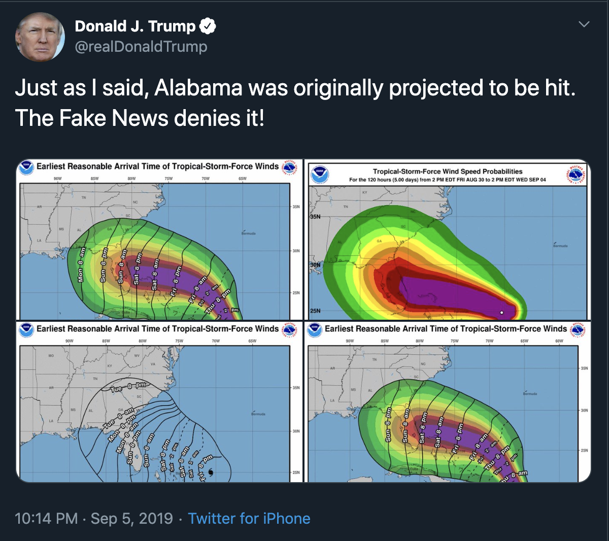
```

For more "fun" click [here](https://medium.com/nightingale/the-day-i-thought-i-misled-the-president-of-the-united-states-a-comedic-visualization-tale-5614eeed6d5c).

## An example from Emarsys

```{r, echo=FALSE, out.width='100%', fig.align='center'}
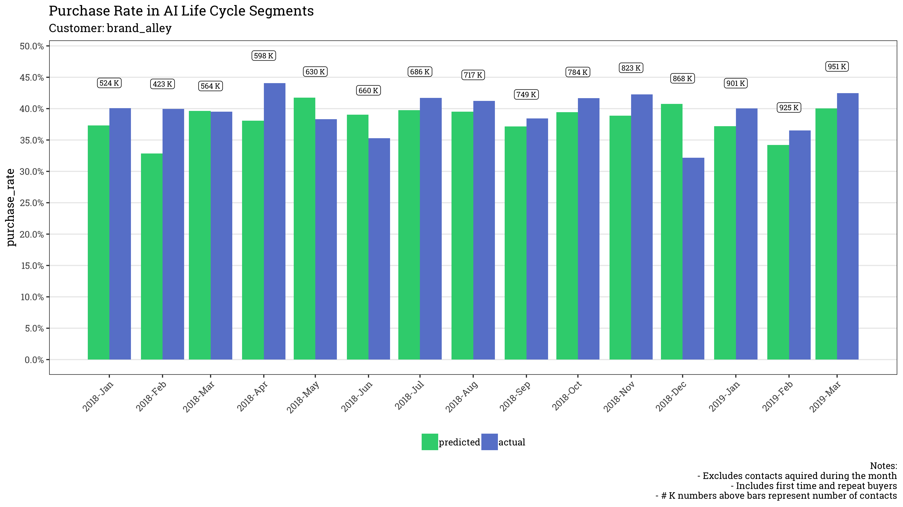
```

# Why does data visualization matter?

## _Tables_ vs charts

```{r, echo=FALSE}
dt <- data.table(
    Year = c(1:6),
    A = c(0.15, 0.22, 0.42, 0.40, 0.36, 0.20),
    B = c(0.35, 0.17, 0.34, 0.30, 0.29, 0.26),
    C = c(0.55, 0.30, 0.58, 0.11, 0.25, 0.49)
)

knitr::kable(dt)
```

## Tables vs _charts_
```{r, echo=FALSE, out.width='85%', fig.align='center'}
dt %>%
  melt(measure.vars = c("A", "B", "C"), id.vars = "Year", variable.name = "Company") %>%
  ggplot(aes(x = Year, y = value, fill = Company, color = Company)) +
  geom_point(size = 3.5) +
  geom_line(size = 1.5) +
  scale_x_continuous(breaks = scales::pretty_breaks(n = 6)) +
  scale_y_continuous(labels = scales::percent) +
  labs(
    title = "Stock returns over the last 6 years",
    y = ""
  ) +
  theme_minimal() +
  theme(text = element_text(size = 20))
```

## Anscombe's quartet

If it's about summarizing information, why are summary statistics insufficient?
The [below datasets](https://en.wikipedia.org/wiki/Anscombe%27s_quartet) have the same means, variances and correlations between X and Y.
```{r, echo=FALSE, out.width='65%', fig.align='center'}
knitr::include_graphics("figures/Anscombes_quartet.png")
```

## Why R for data visualization?

- Reproducibility
```{r, echo=FALSE, out.width='80%', fig.align='center'}
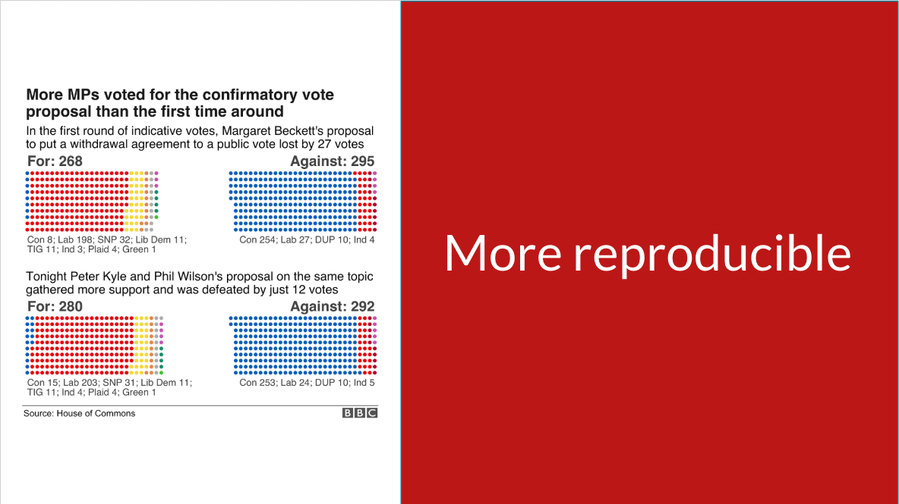
```
[Source: EARL London, 2019 - How the BBC uses R for data visualisation](https://docs.google.com/presentation/d/1qYpQ7Iud2s6f9QzU5KBVN0vCr849dGJQpqTSPe7rgFE/edit#slide=id.p)

## Why R for data visualization?

- Reproducibility
    - BBC example
    - Data wrangling is an important step we have to do
        - If it's done e.g. in Excel, the steps might not be replicable, or they just take time to do
- Fast iteration
    - Above also means that it is easy to change something,
    - Or visualize new data in "old" ways

## Explorative vs Descriptive Data Viz

- Explorative: during research, getting to know the data
    - Interactivity! Specially when doing it for others
- Descriptive: summarizing findings, communication of results
    - Custom made
    - Know your audience: hard part. Others won't have the knowledge that you have. Right level of detail is also crucial.
    - Should show what we want it to show. Nothing more nothing less.
    - Usually 1 message / chart
    - Title, labels, etc. are all a MUST

# Visual Cues

## Why we dislike pie charts?

```{r, echo=FALSE, out.width='85%', fig.align='center'}
dt <- data.table(
    category = c("1",  "2",  "3",  "4",  "5"),
    share    = c(0.20, 0.30, 0.20, 0.05, 0.15)
)

p <- ggplot(dt, aes(x = "", fill = category, y = share)) +
  geom_bar(width = 1, stat = "identity") +
  theme_minimal() +
  theme(
    axis.text = element_blank(),
    axis.title = element_blank(),
    panel.grid = element_blank(),
    text = element_text(size = 20),
    legend.position = "top"
  )

bar_chart <- p  + ggtitle("A stacked bar chart")

pie_chart <- p + coord_polar("y", start = 0) + ggtitle("A pie chart")

patchwork::wrap_plots(bar_chart, pie_chart)
```

## Perception of quantitative information

```{r, echo=FALSE, out.height='85%', fig.align='center'}
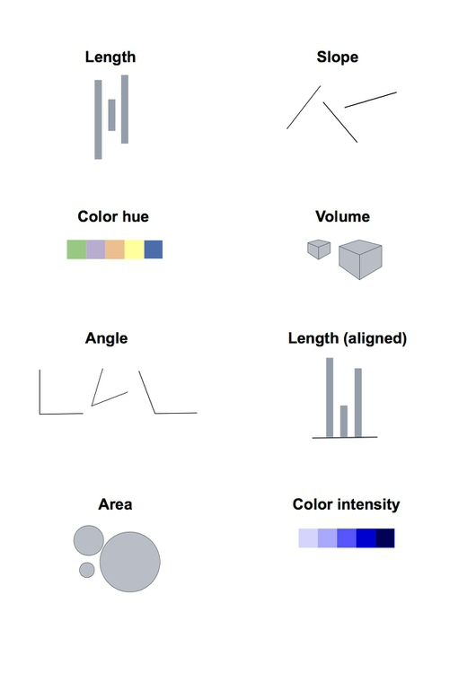
```

[Source: Data visualization: basic principles](https://paldhous.github.io/ucb/2018/dataviz/week2.html)

## Perception of quantitative information

```{r, echo=FALSE, out.height='85%', fig.align='center'}
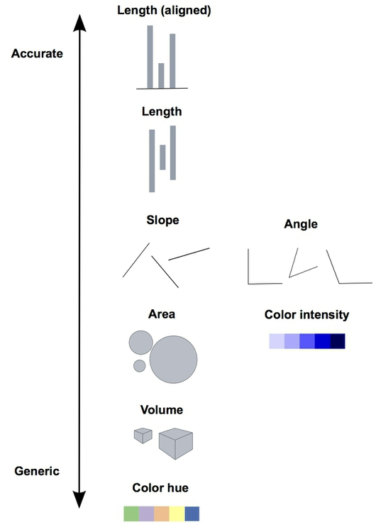
```

[Source: Data visualization: basic principles](https://paldhous.github.io/ucb/2018/dataviz/week2.html)

## Test yourself

```{r, echo=FALSE, out.width='85%', fig.align='center'}

```

[Source: Save the Pies for Dessert](https://www.perceptualedge.com/articles/visual_business_intelligence/save_the_pies_for_dessert.pdf)

## About colors - highlighting

```{r, echo=FALSE, out.width='95%', fig.align='center'}
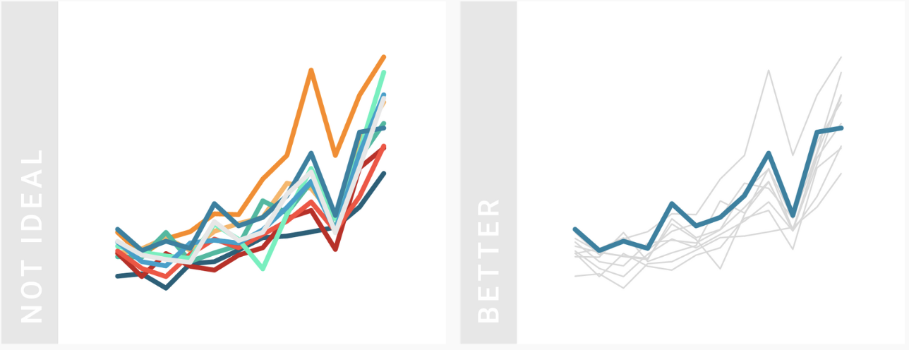
```

[Source: What to consider when choosing colors for data visualization](https://blog.datawrapper.de/colors/)

## About colors - hue - 1

```{r, echo=FALSE, out.width='95%', fig.align='center'}
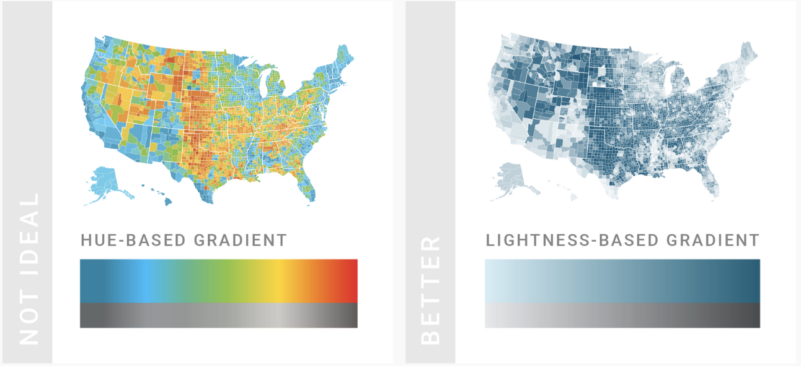
```

[Source: What to consider when choosing colors for data visualization](https://blog.datawrapper.de/colors/)

## About colors - hue - 1

```{r, echo=FALSE, out.height='85%', fig.align='center'}
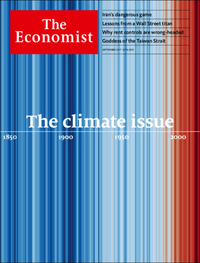
```

[Source: Economist covers](https://www.economist.com/printedition/covers/2019-09-19/ap-e-eu-la-me-na-uk)

## About colors - hue - 2

```{r, echo=FALSE, out.width='95%', fig.align='center'}
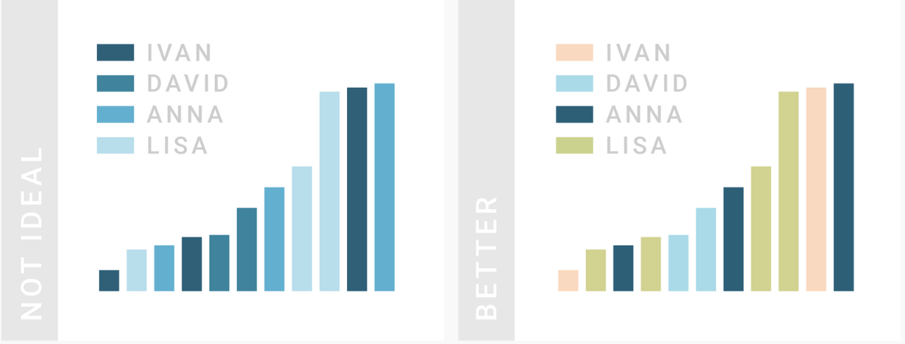
```

[Source: What to consider when choosing colors for data visualization](https://blog.datawrapper.de/colors/)

## Another pitfall - the double Y-axis trap

```{r, echo=FALSE, out.width='101%', fig.align='center'}
knitr::include_graphics("figures/double_axis.png")
```

[Source: Why you shouldn’t use pie charts - Tips for better data visualization](https://blog.funnel.io/why-we-dont-use-pie-charts-and-some-tips-on-better-data-visualizations)

# Visualizing uncertainty

## A recent example at Emarsys

List the bad (and good) things about these charts!

```{r, echo=FALSE, out.width='100%', fig.align='center'}
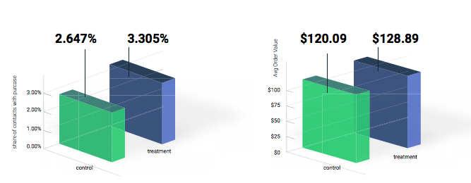
# good: starts at zero, actual numbers are shown
# bad: 3d, other plot rubbish, nothing to show significance level, etc.
```

## How we did it

```{r, echo=FALSE, out.width='100%', fig.align='center'}
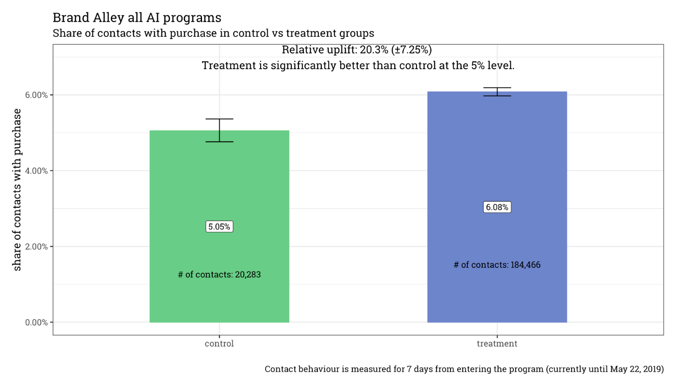
```

## Uncertainty - Ranges

```{r, echo=FALSE, out.width='100%', fig.align='center'}
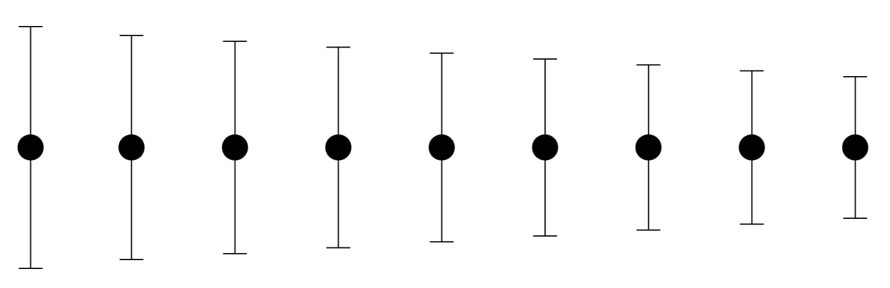
```

[Source: Visualizing the Uncertainty in Data](https://flowingdata.com/2018/01/08/visualizing-the-uncertainty-in-data/)

## Uncertainty - Distributions

```{r, echo=FALSE, out.width='100%', fig.align='center'}
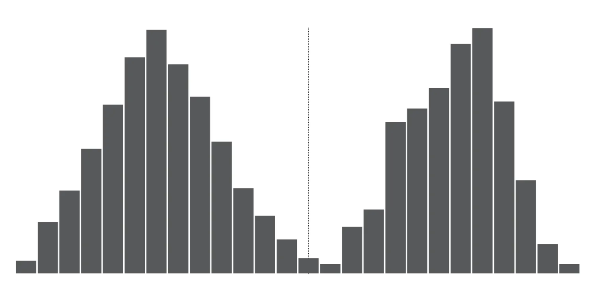
```

[Source: Visualizing the Uncertainty in Data](https://flowingdata.com/2018/01/08/visualizing-the-uncertainty-in-data/)

## Uncertainty - Timeseries

```{r, echo=FALSE, out.width='100%', fig.align='center'}
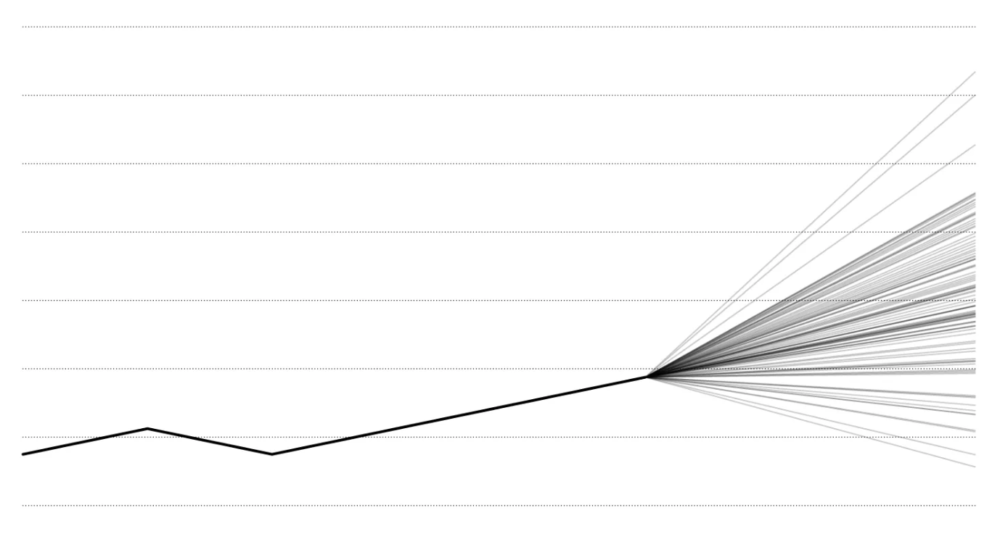
```

[Source: Visualizing the Uncertainty in Data](https://flowingdata.com/2018/01/08/visualizing-the-uncertainty-in-data/)

# ggplot & the grammar of graphics

## Why ggplot2?

- Very mature, 10+ years in the making
- Enables fast in prototyping
- But also good enough in customization
- Great set of extensions
- Just get your data in the right format
- And then apply the "grammar of graphics"

## Grammar of graphics

```{r, echo=FALSE, out.height='85%', fig.align='center'}
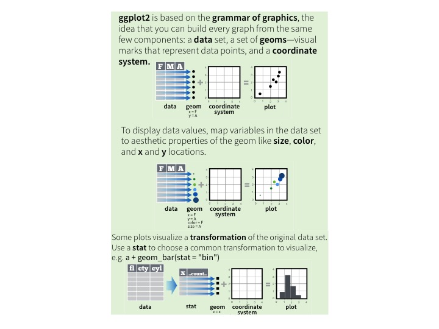
```

## A minimal plot
\footnotesize
```{r, out.height='55%', fig.align='center'}
set.seed(925)
dt <- data.table(
  name  = c(rep("A", 100),    rep("B", 100)),
  value = c(rnorm(100, 0, 1), rnorm(100, 2, 0.5))
)
ggplot(data = dt, mapping = aes(x = value)) +
  geom_density()
```

## Let's add one more aesthetic
\footnotesize
```{r, out.height='65%', fig.align='center'}
p <- ggplot(data = dt, mapping = aes(x = value)) +
  geom_density(aes(fill = name, color = name), alpha = 0.5)
p
```

## Apply some formatting
\footnotesize
```{r, out.height='65%', fig.align='center'}
p <- p + theme_minimal() +
  theme(panel.grid = element_blank(), text = element_text(size = 25))
p
```

## Add annotation
\footnotesize
```{r, out.height='65%', fig.align='center'}
p <- p + labs(
  title = "Density plot by names", x = "Value", y = ""
)
p
```

## Fix scales
\footnotesize
```{r, out.height='65%', fig.align='center'}
p + scale_x_continuous(breaks = c(-2:3)) +
  scale_color_manual(values = c("A" = "#2c7bb6", "B" = "#d7191c")) +
  scale_fill_manual(values = c("A" = "#2c7bb6", "B" = "#d7191c"))
```

## Some useful resources

- [RStudio ggplot2 cheatsheet](https://www.rstudio.com/wp-content/uploads/2016/11/ggplot2-cheatsheet-2.1.pdf)
- [Hadley Wickham: ggplot2: Elegant Graphics for Data Analysis](https://ggplot2-book.org/index.html)
- https://www.r-graph-gallery.com/
- https://coolors.co/app
- http://colorbrewer2.org/
