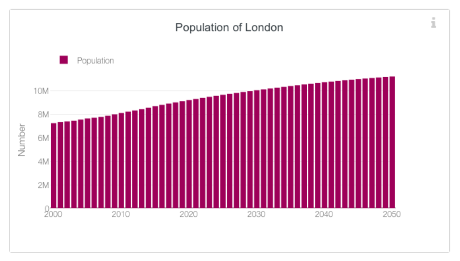
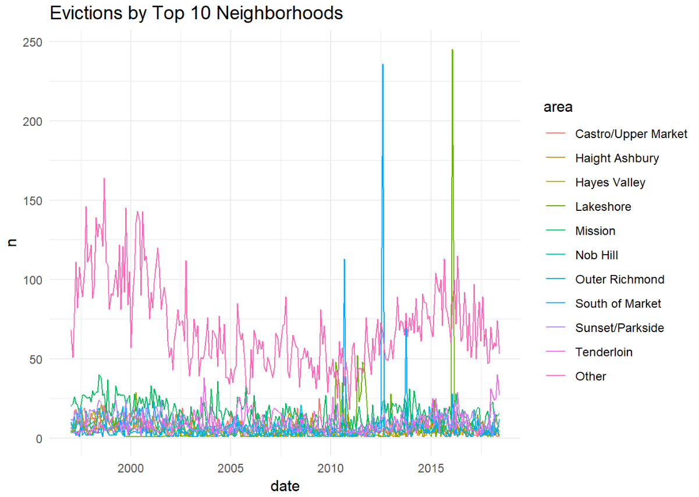
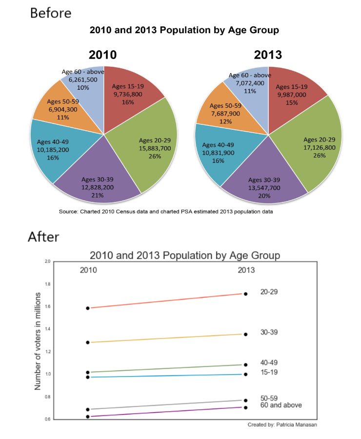
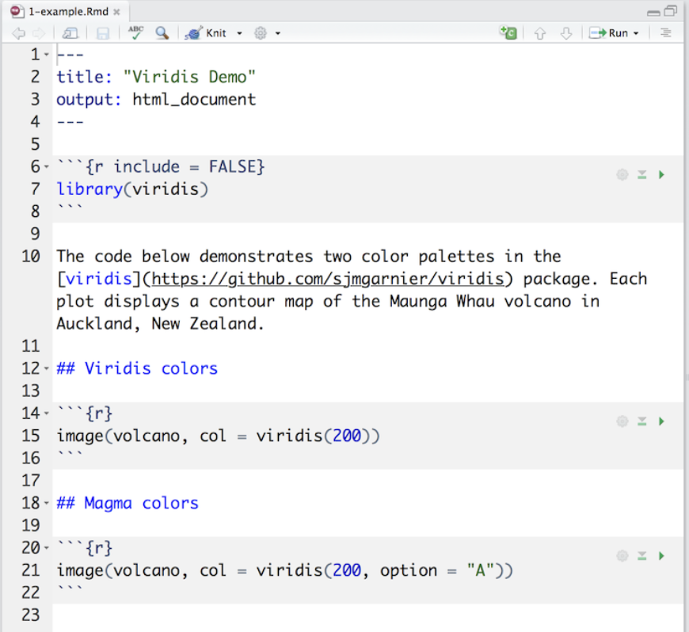
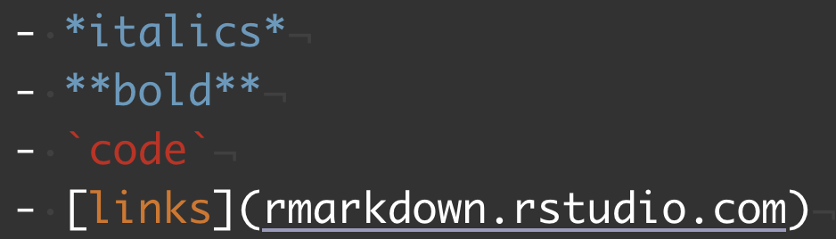

# Recap - List the issues & propose improvements!

## London's population
```{r, echo=FALSE, out.width='100%', fig.align='center'}

# Number?
# Forecast vs actual is not marked and separated
# Line-chart is probably better
# Extra legend is unnecessary
# Interesting choice of color
```

## San Francisco evictions
```{r, echo=FALSE, out.width='100%', fig.align='center'}

# "date" - do we need it? And actually it's not a date axis
# n?
# hard to read most of the lines
# what the story it wants to tell?
# Jumps - any explanation?
```

## Population by age group
```{r, echo=FALSE, out.width='100%', fig.align='center'}

# It's hard to tell how the number of voters changed
# It's actually even hard to tell how their shares have changed
# Is there a story we want to tell?
# And also everything that can be said about a pie chart
```

# QUIZ TIME

# .Rmd

## What is R Markdown?

- Authoring framework for data science
- You can use a single R Markdown file to both
  - save and execute code
  - generate high quality reports that can be shared with an audience
- R Markdown documents are fully reproducible
- They support dozens of static and dynamic output formats \linebreak \linebreak
[Source: rmarkdown.rstudio.com](https://rmarkdown.rstudio.com/lesson-1.html)

## Parts of an .Rmd file

- An (optional) YAML header surrounded by ---s
- Code chunks surrounded by ```s
- Text mixed with simple text formatting

## Parts of an .Rmd file

```{r, echo=FALSE, out.width='60%', fig.align='center'}

```

## Basics of text formatting

```{r, echo=FALSE, out.width='60%', fig.align='left'}

```

- *italics*
- **bold**
- `code`
- [links](rmarkdown.rstudio.com)


## For more, please see

- https://rmarkdown.rstudio.com/lesson-1.html
- https://bookdown.org/yihui/rmarkdown/
- [Cheatsheet](https://rmarkdown.rstudio.com/lesson-15.html)

## Cons

- Longer the analysis, the more messy it becomes (*scroll-scroll-scroll*)
- Does not facilitate good coding style
- Knit fails on error
- Reporting results is not always parallel with the code

# Interactive visualizations -- Plotly & Shiny   DEMO TIME

# Today's dataset

## Kaggle

```{r, echo=FALSE, out.width='80%', fig.align='center'}
knitr::include_graphics("figures/kaggle-logo-transparent-300.png")
```
