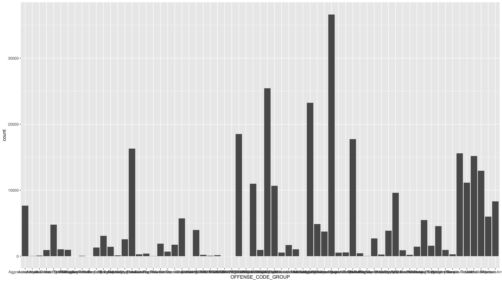

```{r setup, include=FALSE}
knitr::opts_chunk$set(echo = TRUE)
knitr::opts_chunk$set(fig.width = 12)
knitr::opts_chunk$set(fig.align = 'center')
```


```{r}
suppressPackageStartupMessages(library(data.table))
suppressPackageStartupMessages(library(ggplot2))
suppressPackageStartupMessages(library(magrittr))
suppressPackageStartupMessages(library(plotly))
suppressPackageStartupMessages(library(shiny))
```


[Download source file](https://www.kaggle.com/AnalyzeBoston/crimes-in-boston/downloads/crimes-in-boston.zip/2)
```{r}
crime_raw <- fread("data/crime.csv")
```

#### TODO: Knit this .Rmd file to HTML

#### TODO: fix month & date formatting
##### 1. Check the structure of the `crime` data.table. What class is the column `MONTH`?
```{r}
str(crime_raw)
```

##### 2. Create an ordered factor column from `MONTH`, in which column names are strings ("January", "February", ...).
```{r}
month_mapping <- data.table(
    month_code = c(1:12),
    month = factor(month.name, levels = month.name)
)

crime <- merge(
    crime_raw, month_mapping,
    by.x = "MONTH", by.y = "month_code"
) %>%
    .[, MONTH := NULL]
```

##### 3. Remove the first and last months due to incomplete data (2015 June & 2018 September)!
```{r}
crime <- crime %>%
    .[!(YEAR == 2015 & month == "June")] %>%
    .[!(YEAR == 2018 & month == "September")]
```

#### TODO: Visualize number of crimes over time (by month & year)
```{r}
crime_over_time_plot <- crime[, .N, keyby = .(YEAR, month)] %>%
    ggplot(aes(x = month, y = N)) +
    geom_line(aes(group = 1), color = "darkblue") +
    geom_point(color = "darkblue") +
    scale_y_continuous(labels = scales::comma) +
    facet_wrap(.~YEAR, nrow = 1) +
    labs(
        title = "Number of Crimes Over Time",
        caption = paste(
            "Note: 2015 June and 2018 September",
            "were removed due to incomplete data.",
            sep = "\n"
        ),
        x = "Month", y = "Number of Crimes"
    ) +
    theme_minimal() +
    theme(
        axis.text.x = element_text(angle = 90, vjust = 0.5),
        panel.grid.minor = element_blank(),
        text = element_text(size = 16)
    )

crime_over_time_plot
```

#### TODO: Why we shouldn't actually say "number of crimes" when visualizing this data?
Because it's number of reported crimes. Reporting could be biased due to many factors.
Go back and correct it on the plot as well.

#### TODO: add avg. of monthly crimes by year as horizontal lines in red.
```{r}
yearly_avgs <- crime %>% 
    .[, .(num_crime = .N), by = .(YEAR, month)] %>%
    .[, .(avg_num_crime = round(mean(num_crime))), by = .(YEAR)]
```

```{r}
crime_over_time_plot_w_avgs <- crime_over_time_plot +
    geom_hline(
        data = yearly_avgs, mapping = aes(yintercept = avg_num_crime),
        color = "red", linetype = "dotted"
    ) +
    geom_text(
        data = yearly_avgs,
        mapping = aes(y = avg_num_crime + 10, x = "January", label = avg_num_crime),
        color = "red", hjust = 0, vjust = 0
    ) +
    labs(subtitle = "Yearly averages are marked in red") +
    theme(
        plot.subtitle = element_text(color = "red"),
        plot.title = element_text(color = "darkblue")
    )

crime_over_time_plot_w_avgs
```

#### ggsave - how to save ggplot plots
```{r}
# ggsave(
#     filename = "./week 3-4/figures/ggsave_example.png",
#     plot = crime_over_time_plot_w_avgs,
#     width = 16, height = 9
# )
```

#### TODO: What would you do with this plot?
```{r, echo = FALSE}

```

##### 1. categorize less common `OFFENSE_CODE_GROUP` into "Other"
```{r}
num_crime_by_offense_group <- crime %>%
    .[, .(num_reported_crime = .N), by = OFFENSE_CODE_GROUP] %>%
    .[, num_reported_crime_rank := frank(-num_reported_crime)] %>%
    .[, offense_group := ifelse(
        num_reported_crime_rank < 20, OFFENSE_CODE_GROUP, "Other"
    )] %>%
    .[, .(num_reported_crime = sum(num_reported_crime)), by = offense_group]
```

```{r}
ggplot(
    num_crime_by_offense_group,
    aes(x = offense_group, y = num_reported_crime)
) +
    geom_col()
```

##### 2. Order categories by their occurence. Leave "Other" for last on the plot!
```{r}
ordered_offense_groups <- num_crime_by_offense_group %>%
    .[offense_group != "Other"] %>%
    .[order(num_reported_crime), offense_group]

num_crime_by_offense_group[, offense_group := factor(
    offense_group, 
    levels = c("Other", as.character(ordered_offense_groups))
)]
```

```{r}
ggplot(
    num_crime_by_offense_group,
    aes(x = offense_group, y = num_reported_crime)
) +
    geom_col() +
    labs(
        title = "Number of reported crimes by offense group",
        caption = "Categories outside the top 19 are group under `Other`",
        y = "Offense group",
        x = "Number of reported crimes"
    ) +
    scale_y_continuous(labels = scales::comma) +
    coord_flip() +
    theme_minimal()  +
    theme(text = element_text(size = 16))
```


### Uncertainty practice

#### TODO: How many crimes are happening on each weekday?
##### 1. Fix the type of column `DAY_OF_WEEK` (make it an ordered factor)
```{r}
week_days <- c("Monday",
               "Tuesday",
               "Wednesday",
               "Thursday",
               "Friday",
               "Saturday",
               "Sunday")

crime <- crime %>% 
    .[, DAY_OF_WEEK := factor(DAY_OF_WEEK, levels = week_days)]
```

##### 2. Create a column called `date`, which is derived from `OCCURED_ON_DATE`, but is actually of class `Date`
```{r}
crime[, date := as.Date(OCCURRED_ON_DATE)]
```

##### 3. Create a summary table of crimes per date (keep `DAY_OF_WEEK`!)
```{r}
daily_crime_rates <- crime %>%  
    .[, .(num_reported_crimes = .N), by = .(date, DAY_OF_WEEK)]
```

##### 4. Calculate medians in a separate `data.table`
```{r}
median_daily_crime_rates <- daily_crime_rates[, 
    .(median_num_reported_crimes = median(num_reported_crimes)), 
    by = DAY_OF_WEEK
]
```

##### 5. Draw density plots, with medians represented by vertical lines
```{r, fig.height = 10}
daily_crime_rates %>% 
    ggplot(aes(x = num_reported_crimes)) +
    geom_density(fill = "#f54e42", color = "#f54e42") +
    geom_vline(
        data = median_daily_crime_rates, 
        mapping = aes(xintercept = median_num_reported_crimes)
    ) +
    scale_x_continuous(breaks = scales::pretty_breaks()) +
    facet_wrap(.~DAY_OF_WEEK, nrow = 7) +
    labs(
        title = "Density plot of daily crime rates",
        subtitle = "Medians are marked with vertical lines",
        x = "Number of reportred crimes", y = ""
    ) +
    theme_minimal() +
    theme(
        panel.grid = element_blank(),
        axis.text.y = element_blank(),
        text = element_text(size = 16)
    )
```


#### TODO: When are crimes happening within a day?
##### 1. Filter on `YEAR` 2016 & 2017 (complete years)
```{r}
crime_full_years <- crime[YEAR %in% c(2016, 2017)]
```

##### 2. Visualize
```{r, fig.align='center'}
set.seed(1234)
crime_full_years %>% 
    .[sample(25000)] %>%
    .[, DAY_OF_WEEK := factor(DAY_OF_WEEK, levels = week_days)] %>% 
    ggplot(aes(x = DAY_OF_WEEK, y = HOUR, text = OFFENSE_CODE_GROUP)) +
        geom_jitter(alpha = 0.4, color = "#ff6459", shape = 16) +
        facet_wrap(.~DAY_OF_WEEK, ncol = 7, scales = "free_x") +
        scale_y_continuous(breaks = 0:23) +
        labs(
            title = "When crimes occur during the day",
            subtitle = "Based on a random sample of 25,000 crime reports",
            x = "", y = "Hour"
        ) +
        theme_minimal() +
        theme(panel.grid = element_blank())
```

#### plotly example
```{r, fig.width = 8, fig.align='center'}
selected_offense_groups <- c("Towed",
                             "Vandalism",
                             "Motor Vehicle Accident Response")
ggplot_plot <- crime %>%
    .[OFFENSE_CODE_GROUP %in% selected_offense_groups] %>%
    .[, .(num_reported_crime = .N), by = OFFENSE_CODE_GROUP] %>%
    ggplot(aes(x = OFFENSE_CODE_GROUP)) +
    geom_col(aes(y = num_reported_crime)) +
    theme(text = element_text(size = 16))

ggplotly(ggplot_plot)
```

#### shiny example

(To make this part work, you need to add `runtime: shiny` into the header of this file. If `shiny` is not used, then this line is not needed for R Markdown)

```{r}
sliderInput(
    inputId = "hour_slider",
    label = "Select hour range",
    min = 0, max = 23,
    value = c(0, 23)
)
```


```{r}
renderPlot({
    crime[, .(num_reported_crime = .N), by = HOUR] %>%
        .[HOUR %between% input$hour_slider] %>%
        ggplot(aes(x = HOUR, y = num_reported_crime)) +
            geom_col() +
            theme(text = element_text(size = 16))
})
```

