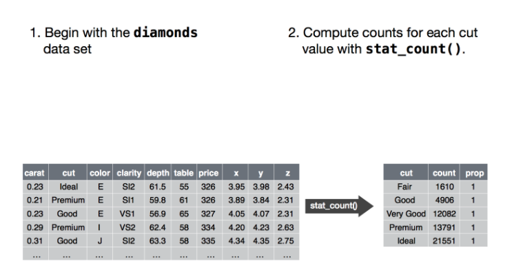
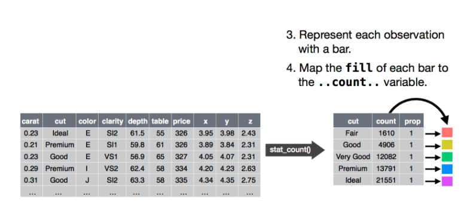
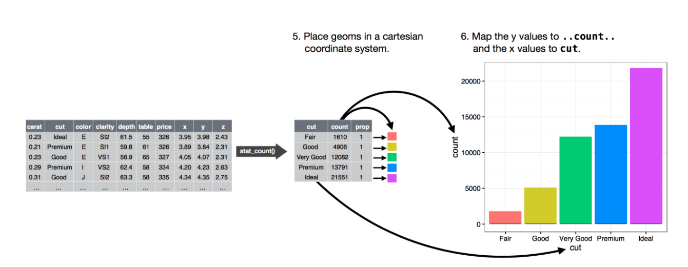

```{r setting cran mirror}
local({
  r <- getOption("repos")
  r["CRAN"] <- "https://cran.rapporter.net//"
  options(repos = r)
})
```


```{r installing packages, warning=FALSE, message=FALSE, eval=FALSE}
install.packages('data.table')
install.packages('ggplot2')
```

## Warning: remove `eval=FALSE` from above when done. Also, move the below to the above section.

```{r}
library(data.table)
library(ggplot2)
```

```{r}
mpg <- unique(as.data.table(mpg))
```

## How to load your data when you do your homework the next time (not related to this class)

### What I saw (and that's OK btw)

```{r eval=FALSE}
setwd("F:\\Dropbox\\!ELTECON BA (18'-21')\\5th Semester (39 credits)\\Data Science (Regional Economics)\\hw") # this doesn't work on a Mac (only on Windows)
dt = fread("All World Cup team summary stats.csv")
```

### What we'd like to see next time
```{r eval=FALSE}
wd <- file.path("~", "my-code-files", "my-homework.R") # this outputs the path correctly on all platforms (Mac, Windows, Linux, etc.)
setwd(wd)
my_data <- fread(file.path(wd, "my-data.csv"))
```

```{r}
print(file.path("~", "my-code-files", "my-homework.R"))
```


## Recap of the first data viz class

- ```ggplot(data = <DATA>) +
    <GEOM_FUNCTION>(mapping = aes(<MAPPINGS>))```
    - map your data columns to parts of the plot in `aes`
- [ggplot references](https://ggplot2.tidyverse.org/reference)

## The full ggplot framework

```
ggplot(data = <DATA>) + 
  <GEOM_FUNCTION>(
     mapping = aes(<MAPPINGS>),
     stat = <STAT>, 
     position = <POSITION>
  ) +
  <COORDINATE_FUNCTION> +
  <FACET_FUNCTION>
```
#### Using an example:
```{r}
ggplot(data = ggplot2::diamonds) +
    geom_bar(
        mapping = aes(x = cut, fill = cut),
        stat = "count",  # this is the default, not necessary in reality
        position = position_identity()  # not necessary in reality
    ) +
    coord_cartesian() +  # not necessary in reality
    facet_grid() # not necessary in reality
```

#### Dissecting the above example

{width=750px}
{width=750px}
{width=750px}

> [source](https://r4ds.had.co.nz/data-visualisation.html#the-layered-grammar-of-graphics)

### Missed last class

#### 1. Same thing multiple ways

Examples:

- `ggtitle(...)` vs. `labs(title = ...)`
- providing the data in `ggplot(data = ...)` or `geom_*(data = ...)`
- using `ggplot() + geom_bar(stat = 'count')` or `ggplot() + stat_count()`
- and many others...

**This can make learning harder and cause frustration. My advice is that you try to learn one way and stick to it.**

#### 2. Themes

```{r}
ggplot(data = mpg) +
    geom_point(mapping = aes(x = cty, y = hwy))
```

```{r}
ggplot(data = mpg) +
    geom_point(mapping = aes(x = cty, y = hwy)) +
    theme_minimal()
```

```{r}
ggplot(data = mpg) +
    geom_point(mapping = aes(x = cty, y = hwy)) +
    theme_dark()
```

```{r}
ggplot(data = mpg) +
    geom_point(mapping = aes(x = cty, y = hwy)) +
    theme_light()
```


```{r}
ggplot(data = mpg) +
    geom_point(mapping = aes(x = cty, y = hwy)) +
    theme_gray()
```


#### 3. Managing colors when plotting factors

```{r}
# mpg <- as.data.table(unique(ggplot2::mpg))

mpg[, class := factor(class, levels = c("midsize", "compact", "suv", "2seater", "minivan", 
"pickup", "subcompact"))]

ggplot(data = mpg) +
    geom_bar(mapping = aes(x = class, fill = class))

ggplot(data = mpg) +
    geom_bar(mapping = aes(x = class, fill = class)) +
    scale_fill_manual(values = c("blue", "green", "red", "yellow", "black", "magenta", "white"))

ggplot(data = mpg) +
    geom_bar(mapping = aes(x = class, fill = class)) +
    scale_fill_brewer(palette = "YlOrRd")
```

**Find color palettes [here](http://www.sthda.com/english/wiki/ggplot2-colors-how-to-change-colors-automatically-and-manually) for example.**

#### 4. Multiple graphs on the same plot

```{r message=FALSE}
install.packages("patchwork")
library(patchwork)
```

```{r}
p1 <- ggplot(mpg) + geom_bar(aes(x = class, fill = class)) + scale_fill_brewer(palette = "YlOrRd") + coord_flip()
p2 <- ggplot(mpg) + geom_bar(aes(x = class, fill = class)) + scale_fill_brewer(palette = "Blues") + coord_flip()

p1 + p2

p3 <- ggplot(mpg) + geom_bar(aes(x = class, fill = class)) + scale_fill_brewer(palette = "Accent")

(p1 | p2) /
 p3 + plot_annotation(title = 'Three plots, one title. Wow.')
```

**Find out more [about the package here](https://patchwork.data-imaginist.com/articles/patchwork.html)!**

#### 5.Returning layers in a function

Instead of this:
```{r, eval=FALSE}
ggplot(mpg) +
    geom_bar(aes(x = class, fill = class)) +
    scale_color_brewer(palette = 2) +
    ggtitle("Nice plot dude!") +
    coord_cartesian(ylim = c(0, 30))
    
```
You can do this:
```{r}
setPlotAesthetics <- function(palette, title, ylimmax) {
    list(scale_color_brewer(palette = palette),
         ggtitle(title),
         coord_cartesian(ylim = c(0, ylimmax))
    )
}

ggplot(mpg) +
    geom_bar(aes(x = class, fill = class)) +
    setPlotAesthetics(3, "Not bad either!", 120)
```

#### 6. The data behind the plots

```{r}
p <- ggplot(mpg, aes(hwy)) +
      geom_histogram()

pg <- ggplot_build(p)

head(pg$data[[1]])
```


### [Presentation on Sensible data visualization](https://docs.google.com/presentation/d/1OVXG1kTaztY1huhLB89ZqyDHa-cTn1eS4oXnCR5iVe4/edit?usp=sharing)

### What we didn't cover

#### Output types

- ".png" / ".jpg"
- Rmarkdown
- Plotly
- Shiny

#### Extending ggplot

Check out [this open source list of extensions](https://r4ds.had.co.nz/data-visualisation.html#geometric-objects)!

#### And a lot more :)