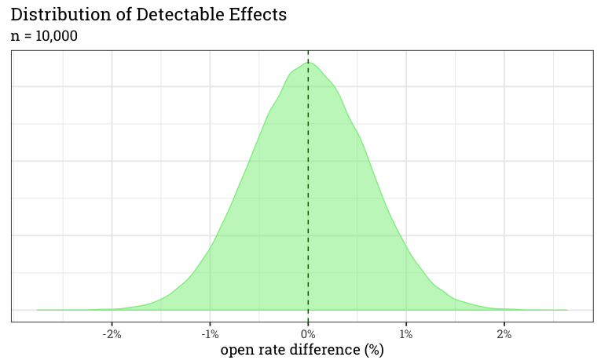
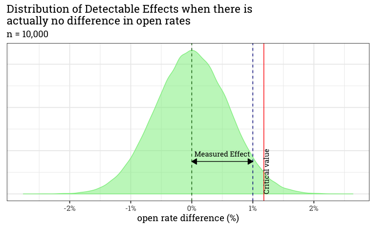
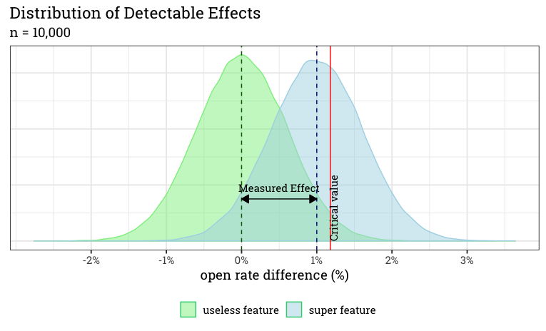
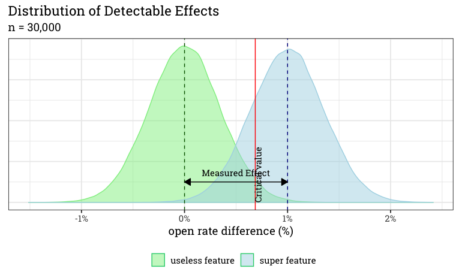
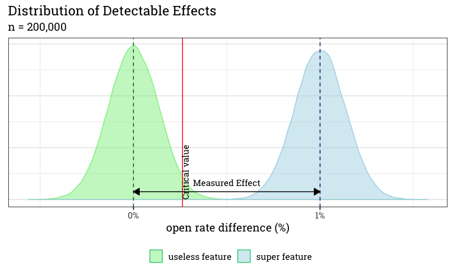
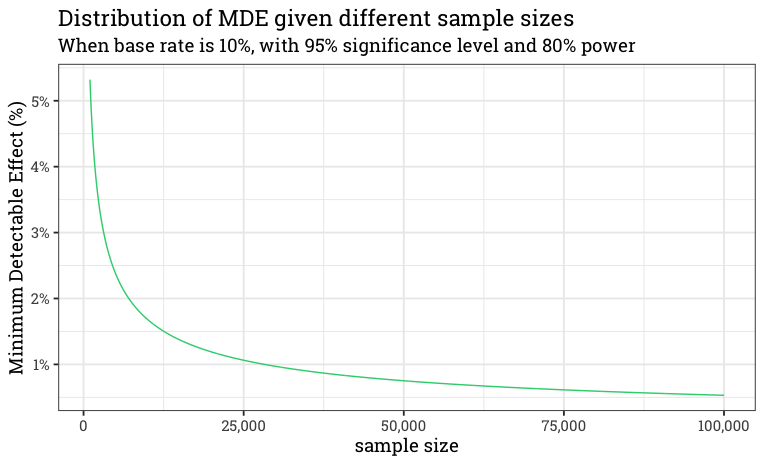

```{r setup, include=FALSE}
knitr::opts_chunk$set(echo = TRUE)
knitr::opts_knit$set(root.dir = '..')

library(knitr)
```

## About me

- Background in Economics
- Works as Data Scientist @ Emarsys

# We want to understand the effect of a new feature

Kép STO-ról gombról UI-on, meg Image pref explr Shiny app-ról

# What is an effect?

## What is an effect?

Added value of a treatment

## Why do we want to measure the effect?

To decide if our treatment works

# What to experiment on?

## What is worth experimenting?

- **Based on customer's need**
- Validated by data based research
    - Will the algo work?
    - Does it scale?
    - Cost of the feature?
- Make sure you understand your feature/algorithm!


## Measure the effect of what?

- Adding a new feature to the software
- Change in the algorithm
- Change on the website/UI
- etc.

## How can we measure the effect?

- Simulation
- Based on historical data
- **Experimenting**

# How do we experiment?

## Setup

- Define the goal
- Measure one feature at a time
- (Or control for other effects)
- Split contacts *randomly* into control and treatment group(s)
- Do not change parameters during the experiment (Simpson-paradox)

## How to calculate the effect

$$Uplift_{KPI} = \frac{KPI_{treatment}}{KPI_{control}} - 1$$

## How to aggregate the effect

$$KPI_{treatment} = \frac{\sum_{i = 1}^{n}KPI_{treatment, i} * SampleSize_{i}}{\sum_{i = 1}^{n}{SampleSize_{i}}}$$

$$KPI_{control} = \frac{\sum_{i = 1}^{n}KPI_{control, i} * SampleSize_{i}}{\sum_{i = 1}^{n}{SampleSize_{i}}}$$

$$Uplift_{KPI} = \frac{KPI_{treatment}}{KPI_{control}} - 1$$
, where *n* is the number of unit levels.

## There is always an effect...

- We can always measure something.
- Is there really an effect?

## There is always an effect...

```{r, echo=FALSE, out.width='80%', fig.align='center'}
include_graphics("figures/sto_effect.png")
```

## But not necessarily significant!

```{r, echo=FALSE, out.width='80%', fig.align='center'}
include_graphics("figures/sto_effect_with_uncertainty.png")
```

## Know your data!

```{r, echo=FALSE, out.width='80%', fig.align='center'}
include_graphics("figures/know_your_data.png")
```

## Minimum Detectable Effect

A great [blogpost](https://blog.craftlab.hu/checking-both-sides-the-minimum-detectable-effect-f34a6c0db4fb) by a great guy

## Detectable Effects for Useless Feature

```{r, echo=FALSE, out.width='80%', fig.align='center'}

```

## Hypothesis testing

```{r, echo=FALSE, out.width='80%', fig.align='center'}

```

## But what if we really have an effect?

```{r, echo=FALSE, out.width='80%', fig.align='center'}

```

## Use more data points!

```{r, echo=FALSE, out.width='80%', fig.align='center'}

```

## Or even more!

```{r, echo=FALSE, out.width='80%', fig.align='center'}

```

## We can calculate this in advance!

```{r, echo=FALSE, out.width='80%', fig.align='center'}

```

## How to present

```{r, echo=FALSE, out.width='80%', fig.align='center'}
include_graphics("figures/uplift.png")
```

# How to present: [Shiny app from Emarsys](https://rserver.service.emarsys.net/app/sto-monitoring)

