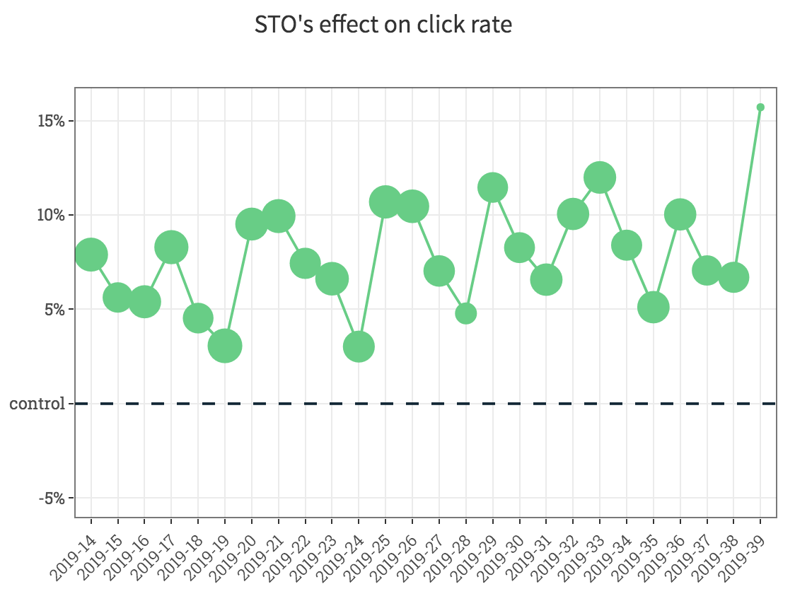

```{r setup, include=FALSE}
knitr::opts_chunk$set(echo = TRUE)
knitr::opts_knit$set(root.dir = '..')

library(knitr)
```

## About me

- Background in Economics
- Works as Data Scientist @ Emarsys

## What is an effect?

Added value of a treatment

## Why do we want to measure the effect?

To decide if our treatment works

## Measure the effect of what?

# What to measure?

## What is worth measureing?

- **Based on customer's need**
- Validated by data based research
    - Will the algo work?
    - Does it scale?
    - Cost of the feature?
- Make sure you understand your feature/algorithm!


## Measure the effect of what?

- Adding a new feature to the software
- Change in the algorithm
- Change on the website/UI
- etc.

## How can we measure the effect?

- Simulation
- Based on historical data
- Experimenting

# How do we experiment?

## Setup

- Define what is the goal of your experiment, what you want to measure
- Split contacts *randomly* into control and treatment group(s)
- Measure one feature at a time
- (Or control for other effects)
- Do not change parameters during the experiment (Simpsons-paradox)

## There is always an effect...

- We can always measure something.
- Is there really an effect?

## There is always an effect...

```{r, echo=FALSE, out.width='80%', fig.align='center'}
include_graphics("figures/sto_effect.png")
```

## But not necessarily significant!

```{r, echo=FALSE, out.width='80%', fig.align='center'}
include_graphics("figures/sto_effect_with_uncertainty.png")
```

## Know your data!

```{r, echo=FALSE, out.width='80%', fig.align='center'}

```

## Effect caused by confound factors

## Minimum Detectable Effect

- a great [blogpost](https://blog.craftlab.hu/checking-both-sides-the-minimum-detectable-effect-f34a6c0db4fb) by a great guy

