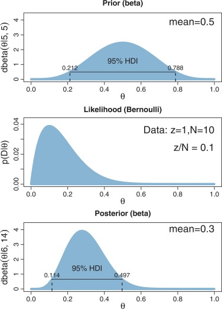

```{r setup, include=FALSE}
knitr::opts_chunk$set(echo=FALSE)
knitr::opts_chunk$set(warning=FALSE)
knitr::opts_chunk$set(message=FALSE)
# knitr::opts_knit$set(root.dir='..')

library(knitr)
library(data.table)
library(magrittr)
library(ggplot2)
library(gganimate)
library(ggtext)
library(flextable)
```

# Homeworks from last week

Nguyen Thai Duong - Szentistványi János

Kovács Ádám - Nguyen Nam Son

Bakirov, Aslan - Yatsenko, Anzhelika

# Any questions about final project?

# Measuring uncertainty

## We can always measure something from our data...

...but how sure can we be about our measurement?

## We can always measure something from our data...

```{r, out.width='80%', fig.align='center'}
include_graphics("figures/sto_effect.png")
```

## But not necessarily significant!

```{r, out.width='80%', fig.align='center'}
include_graphics("figures/sto_effect_with_uncertainty.png")
```

## Why do have uncertainty in the measurement?

- If you knew the whole population, there wouldn't be uncertainty in your measurement
- But we only see 1 'segment' of the data = we have a sample of the population

## Sampling from a population

```{r sampling-from-height-1, out.width='80%', fig.align='center'}
sample_size <- 500
set.seed(1111)
dt <- data.table(sample_id = rep(1:100, sample_size)) %>%
    .[, values_in_sample := rnorm(sample_size, mean = 178, sd = 7.5), sample_id] %>%
    .[, mean_of_sample := mean(values_in_sample), sample_id]

ggplot(dt[sample_id == 1], aes(values_in_sample)) +
    geom_histogram(aes(y = ..density..), fill = "darkgreen") +
    geom_vline(aes(xintercept = mean_of_sample)) +
    stat_function(
    	fun = dnorm,
    	args = list(mean = 178, sd = 7.5),
    	color = "red"
    ) +
    geom_vline(xintercept = 178, color = "red") +
    labs(
    	x = "Height (in cm)", y = NULL,
    	title = "Distribution of <span style = 'color: red;'>population</span> vs <span style = 'color: darkgreen;'>sample</span>"
    ) +
    theme_classic() +
    theme(text = element_text(size=20)) +
    theme(plot.title = element_markdown())
```

## Sampling from a population

```{r sampling-from-height-2, out.width='80%', fig.align='center'}
ggplot(dt[sample_id == 2], aes(values_in_sample)) +
    geom_histogram(aes(y = ..density..), fill = "darkgreen") +
    geom_vline(aes(xintercept = mean_of_sample)) +
    stat_function(
    	fun = dnorm,
    	args = list(mean = 178, sd = 7.5),
    	color = "red"
    ) +
    geom_vline(xintercept = 178, color = "red") +
    labs(
    	x = "Height (in cm)", y = NULL,
    	title = "Distribution of <span style = 'color: red;'>population</span> vs <span style = 'color: darkgreen;'>sample</span>"
    ) +
    theme_classic() +
    theme(text = element_text(size=20)) +
    theme(plot.title = element_markdown())
```

## Sampling from a population

```{r sampling-from-height, out.width='80%', fig.align='center', fig.show='animate', interval=1/20}
ggplot(dt, aes(values_in_sample)) +
    geom_histogram(aes(y = ..density..), fill = "darkgreen") +
    geom_vline(aes(xintercept = mean_of_sample)) +
    stat_function(
    	fun = dnorm,
    	args = list(mean = 178, sd = 7.5),
    	color = "red"
    ) +
    geom_vline(xintercept = 178, color = "red") +
    labs(
    	x = "Height (in cm)", y = NULL,
    	title = "Distribution of <span style = 'color: red;'>population</span> vs <span style = 'color: darkgreen;'>sample</span>"
    ) +
    theme_classic() +
    theme(text = element_text(size=20)) +
    theme(plot.title = element_markdown()) +
    transition_states(sample_id)
```

## Distribution of sample means - LLN + CLT

```{r distribution-of-sample-means, out.width='80%', fig.align='center'}
dt[, .(sample_id, mean_of_sample)] %>% unique() %>%
	ggplot(aes(mean_of_sample)) +
		geom_density(color = "darkgreen") +
        xlim(178 - 3*(7.5/sqrt(sample_size)), 178 + 3*(7.5/sqrt(sample_size))) +
        stat_function(
        	fun = dnorm,
        	args = list(mean = 178, sd = 7.5/sqrt(sample_size)),
        	color = "red"
        ) +
		geom_vline(
			xintercept = 178 - 1.96*(7.5/sqrt(sample_size)),
			color = "red"
		) +
		geom_vline(
			xintercept = 178 + 1.96*(7.5/sqrt(sample_size)),
			color = "red"
		) +
		geom_vline(xintercept = 178, color = "red") +
        labs(
	    	x = "Height (in cm)", y = NULL,
	    	title = "Distribution of <span style = 'color: darkgreen;'>sample means</span>
	    		<br> compared to <span style = 'color: red;'>normal distribution</span> with 'true' parameters
	    		<br> from population"
    	) +
        theme_classic() +
        theme(text = element_text(size=20)) +
        theme(plot.title = element_markdown())
```

## Law of Large Numbers

*The average of the results obtained from a large number of trials should be close to the expected value and will tend to become closer to the expected value as more trials are performed.*
 											- [Wikipedia](https://en.wikipedia.org/wiki/Law_of_large_numbers)

## Central Limit Theorem

*When independent random variables are added, their properly normalized sum tends toward a normal distribution (informally a bell curve) even if the original variables themselves are not normally distributed.*
 											- [Wikipedia](https://en.wikipedia.org/wiki/Central_limit_theorem)

## What we do when we check for CI

```{r calculating-ci, out.width='80%', fig.align='center'}
sample_mean_w_CI <- dt[, .(
    mean_of_sample = mean(values_in_sample),
    SD_of_sample = sd(values_in_sample),
    sample_size = .N), sample_id
] %>%
    .[, `:=`(
        CI_lower = mean_of_sample - 1.96*(SD_of_sample/sqrt(sample_size)),
        CI_higher = mean_of_sample + 1.96*(SD_of_sample/sqrt(sample_size))
    )]
ggplot(sample_mean_w_CI, aes(
	x = sample_id, y = mean_of_sample,
	color = !or(CI_lower > 178, CI_higher < 178)
)) +
    geom_point() +
    geom_errorbar(aes(ymin = CI_lower, ymax = CI_higher)) +
    geom_hline(yintercept = 178, color = "black") +
    coord_flip() +
    labs(
    	x = NULL, y = "Height (in cm)",
    	title = "Mean and CI from different samples:
    	<br> About 95% of the CIs <span style = 'color: #00BFC4;'>contains</span> the true mean,
    	<br> but 5% <span style = 'color: #F8766D;'>does not contain</span> (just by chance)"
    ) +
    theme_classic() +
    theme(legend.position = "none") +
    theme(text = element_text(size=20)) +
    theme(plot.title = element_markdown())
```

## Distribution of sample means with different distributions

```{r coin-flipping-sample-one, out.width='80%', fig.align='center'}
set.seed(1234)
sample_size <- 100
coin_flip_dt <- data.table(sample_id = rep(1:100, sample_size)) %>%
    .[, .(coin_flip = rbinom(100, 1, 0.5)), sample_id] %>%
    .[, coin_flip := ifelse(coin_flip == 1, "heads", "tails")]

ggplot(coin_flip_dt[sample_id == 1], aes(coin_flip, fill = coin_flip)) +
    geom_histogram(stat = "count") +
    labs(x = NULL) +
    theme_classic() +
    theme(text = element_text(size=20)) +
    theme(legend.position = "none")
```

## Distribution of sample means with different distributions

```{r coin-flipping-sample-two, out.width='80%', fig.align='center'}
set.seed(1234)
sample_size <- 100
coin_flip_dt <- data.table(sample_id = rep(1:100, sample_size)) %>%
    .[, .(coin_flip = rbinom(100, 1, 0.5)), sample_id] %>%
    .[, coin_flip := ifelse(coin_flip == 1, "heads", "tails")]

ggplot(coin_flip_dt[sample_id == 2], aes(coin_flip, fill = coin_flip)) +
    geom_histogram(stat = "count") +
    labs(x = NULL) +
    theme_classic() +
    theme(text = element_text(size=20)) +
    theme(legend.position = "none")
```

## Distribution of sample means with different distributions

```{r coin-flipping-simulation, out.width='80%', fig.align='center', fig.show='animate', interval=1/20}
set.seed(123)
sample_size <- 100
coin_flip_dt_small_sample <- data.table(sample_id = rep(1:100, sample_size)) %>%
    .[, .(coin_flip = rbinom(sample_size, 1, 0.5)), sample_id] %>%
    .[, coin_flip := ifelse(coin_flip == 1, "heads", "tails")]

ggplot(coin_flip_dt_small_sample, aes(coin_flip, fill = coin_flip)) +
    geom_histogram(stat = "count") +
    labs(x = NULL) +
    theme_classic() +
    theme(text = element_text(size=20)) +
    theme(legend.position = "none") +
    transition_states(sample_id)
```

## Distribution of sample means with different distributions

```{r coin-flipping-small-sample-means, out.width='80%', fig.align='center'}
coin_flip_dt_small_sample %>%
    .[, .(num_head = mean(coin_flip == "heads")), sample_id] %>%
    ggplot(aes(num_head), color = "darkgreen") +
    geom_density() +
    xlim(0.3, 0.7) +
    labs(x = "ratio of heads") +
    theme_classic() +
    theme(text = element_text(size=20))
```

## Why does sample size matter?

```{r coin-flipping-large-sample-means, out.width='80%', fig.align='center'}
set.seed(123)
sample_size <- 1000
coin_flip_dt_big_sample <- data.table(sample_id = rep(1:100, sample_size)) %>%
    .[, .(coin_flip = rbinom(sample_size, 1, 0.5)), sample_id] %>%
    .[, coin_flip := ifelse(coin_flip == 1, "heads", "tails")]

coin_flip_dt_big_sample %>%
    .[, .(num_head = mean(coin_flip == "heads")), sample_id] %>%
    ggplot(aes(num_head), color = "darkgreen") +
    geom_density() +
    xlim(0.3, 0.7) +
    labs(x = "ratio of heads") +
    theme_classic() +
    theme(text = element_text(size=20))
```

## What are the key assumptions?

- i.i.d. sampling
- finite variance / distribution is not 'long tailed'

## What if variance is infinite?

```{r sales-example}
# download from https://drive.google.com/drive/folders/1HmCp1pTpEaqta7z0p1fnCas1dN6myVxg
sales <- fread("sales_sample.csv")
ggplot(sales, aes(sales_amount)) +
	geom_density() +
	theme_classic() +
	theme(text = element_text(size=20))
# sales[, mean(sales_amount)]
```

## It stayes very skewed even if we zoom in

```{r sales-example-zoom}
ggplot(sales[sales_amount <= 1000], aes(sales_amount)) +
    geom_density() +
    theme_classic() +
    theme(text = element_text(size=20))
```

## What if variance is infinite?

```{r estimate-sales-distribution}
set.seed(1478)
# mean(rlnorm(10000, 4, 1))
ggplot(mapping = aes(rlnorm(10000, 4, 1.7))) +
	geom_density() +
	theme_classic() +
	theme(text = element_text(size=20))
```

## Distribution of avg. sales amount from samples

```{r sample-from-sales}
set.seed(1478)
sample_size <- 10000
sales_sample <- data.table(sample_id = rep(1:100, sample_size)) %>%
    .[, .(sales_amount = rlnorm(sample_size, 4, 1.7)), sample_id]

sales_sample %>%
    .[, .(avg_sales_amount = mean(sales_amount)), sample_id] %>%
    ggplot(aes(avg_sales_amount)) +
    geom_density() +
    xlim(200, 300) +
    labs(x = "Avg. sales amount") +
    theme_classic() +
    theme(text = element_text(size=20))
```

## How can we calculate the uncertainty of our measurement?

- Based on variance of known distribution
- Monte-Carlo method
- Bootstrapping
- (and other methods as well of course)

## Calculate uncertainty based on variance

```{r normal-distribution-w-2sigma, out.width='80%', fig.align='center'}
ggplot() +
	stat_function(fun = dnorm) +
	geom_vline(xintercept = -2) +
	geom_vline(xintercept = 2) +
    scale_x_continuous(
    	limits = c(-3, 3),
    	breaks = seq(-3, 3, 1)
	) +
    labs(x = NULL, y = NULL) +
    theme_classic()
```

## How to calculate uncertainty from sampling distribution

By CLT + LLN, you can add uncertainty to your point estimate, such as:

$$\bar x \pm 1.96 * \frac{s}{\sqrt{n}}$$

$\bar x$ is the sample mean,

$s$ is the standard deviation of the sample distribution,

$n$ is the sample size

## Bayesian uncertainty

Confidence Interval: If we would resample from our population, 95% of times the Confidence Interval will contain the true, unknown parameter.

Credible Interval: There is a 95% chance that this interval contains the true parameter.

## Difference in calculating uncertainty

Confidence Interval: Based on sampling distribution of means

Credible Interval: Based on data and prior belief

```{r, out.height='70%', fig.align='center'}

```

## 95% Credible interval
```{r credible-interval, out.width='80%', fig.align='center'}
set.seed(1)
sample_size <- 100
coin_flip_dt_bayes <- data.table(sample_id = rep(1:100, sample_size)) %>%
    .[, .(coin_flip = rbinom(sample_size, 1, 0.5)), sample_id] %>%
    .[, coin_flip := ifelse(coin_flip == 1, "heads", "tails")] %>%
    .[, .(num_head = sum(coin_flip == "heads")), sample_id] %>%
    .[, `:=`(
        head_ratio = num_head / sample_size,
        CI_lower = qbeta(0.025, 1 + num_head, 1 + sample_size - num_head),
        CI_higher = qbeta(0.975, 1 + num_head, 1 + sample_size - num_head)
    ), sample_id]

ggplot(coin_flip_dt_bayes, aes(
    sample_id, head_ratio, color = !or(CI_lower > 0.5, CI_higher < 0.5)
)) +
    geom_point() +
    geom_errorbar(aes(ymin = CI_lower, ymax = CI_higher)) +
    geom_hline(yintercept = 0.5, color = "black") +
    coord_flip() +
    labs(x = NULL, y = "ratio of heads") +
    theme_classic() +
    theme(legend.position = "none")

```

## Confidence Interval vs Credible Interval

- Credible Interval is easier to understand
- Credible Interval gives smaller interval if we have some prior knowledge
- With wrong prior provided, our posterior distribution is going to be wrong as well!

- With a lot of data or with non-informative priors, the two intervals are about the same

```{r conf-int-vs-cred-int, out.height='70%', fig.align='center'}
set.seed(1)
sample_size <- 100
coin_flip_dt <- data.table(coin_flip = rbinom(sample_size, 1, 0.5)) %>%
    .[, coin_flip := ifelse(coin_flip == 1, "heads", "tails")] %>%
    .[, .(
    	num_head = sum(coin_flip == "heads"),
    	head_ratio = sum(coin_flip == "heads") / sample_size
    )] %>%
    .[, `:=`(
        cred_int_lower = qbeta(0.05, 50 + num_head, 50 + sample_size - num_head),
        cred_int_higher = qbeta(0.95, 50 + num_head, 50 + sample_size - num_head),
        conf_int_lower = head_ratio - (1.96 * sqrt((head_ratio * (1 - head_ratio)) / sample_size)),
        conf_int_higher = head_ratio + (1.96 * sqrt((head_ratio * (1 - head_ratio)) / sample_size))
    )]

kable(coin_flip_dt[, .(head_ratio, cred_int_lower, cred_int_higher)])
kable(coin_flip_dt[, .(head_ratio, conf_int_lower, conf_int_higher)])
```

## How to plot uncertainty

## Calculate uncertainty over time

## Takeaways

- Always show uncertainty
- Think about your audience

