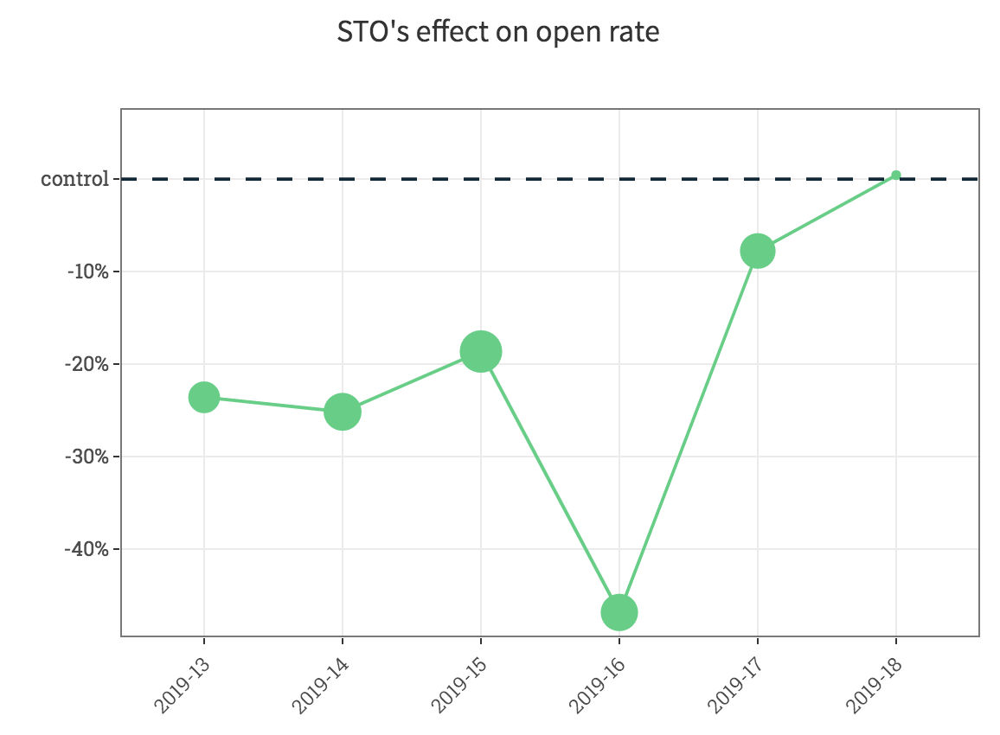
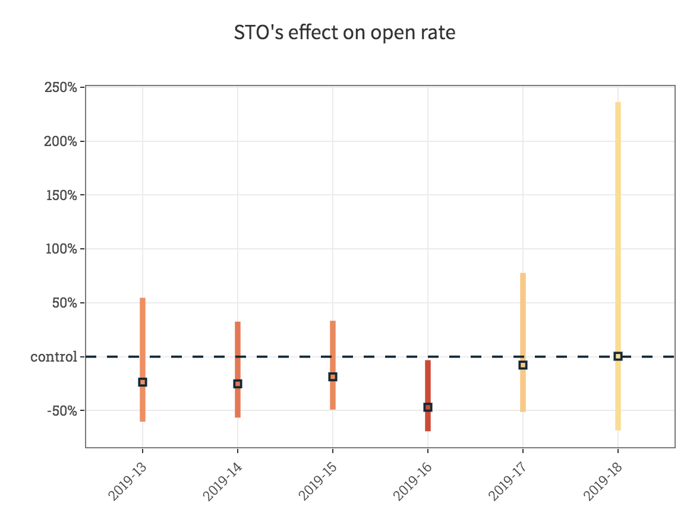

```{r setup, include=FALSE}
knitr::opts_chunk$set(echo=FALSE)
knitr::opts_chunk$set(warning=FALSE)
knitr::opts_chunk$set(message=FALSE)
knitr::opts_knit$set(root.dir='..')

library(knitr)
library(data.table)
library(ggplot2)
library(magrittr)
library(purrr)
```

## There is always an effect...

- We can always measure something.
- Is there really an effect?

## There is always an effect...

```{r, out.width='80%', fig.align='center'}

```

## But not necessarily significant!

```{r, out.width='80%', fig.align='center'}

```

## Why do have uncertainty in the measurement?

- If you knew the whole population, there wouldn't be uncertainty in your measurement
- But we only see 1 'segment' of the data = we have a sample of the population

## How can we calculate uncertainty to our measurement?

- We know the distribution --> calculate variance
- Monte-Carlo method
- Bootstrapping
- Permutation test

## Calculate uncertainty for an experiment

```{r, out.width='60%'}
dt <- fread("week 5-6/experiment_result_2.csv")
head(dt) %>% kable()
```

## Results from an experiment:

```{r}
open_rate_dt <- dt[,
	.(open_rate = sum(num_open) / sum(num_send),
	  num_send = sum(num_send)),
	by = group
]

ggplot(open_rate_dt, aes(x = group, y = open_rate)) + geom_col()
```

## Are the results significant? Calculate the variance!

- Assumption about the distribution of the data

```{r}
open_rate_dt %>%
	copy() %>%
	.[, var := open_rate * (1 - open_rate) / num_send] %>%
	.[, CI_lower := open_rate - (1.96 * sqrt(var))] %>%
	.[, CI_higher := open_rate + (1.96 * sqrt(var))] %>%
	ggplot(aes(x = group, y = open_rate)) +
		geom_col() +
		geom_errorbar(aes(ymin = CI_lower, ymax = CI_higher))
```

## Now your turn!
### 1. Calculate the click rate and the uncertainty!

```{r}
# click_rate_dt <- dt[,
# 	.(click_rate = sum(num_click) / sum(num_send),
# 	  num_send = sum(num_send)),
# 	by = group
# ] %>%
# 	.[, var := click_rate * (1 - click_rate) / num_send] %>%
# 	.[, CI_lower := click_rate - (1.96 * sqrt(var))] %>%
# 	.[, CI_higher := click_rate + (1.96 * sqrt(var))]
```

### 2. Plot the results! What do you see on the plots? Are the results significant?

```{r}
# ggplot(click_rate_dt, aes(x = group, y = click_rate)) +
# 	geom_col() +
# 	geom_errorbar(aes(ymin = CI_lower, ymax = CI_higher))
```

## Monte-Carlo method

- Pick repeatedly from a distribution(s)
- Use randomness to show uncertainty
- Useful, when you do not have a closed form to calculate the variance
- We still need to know the distribution of our variable(s)!

# How to calculate uncertainty with Monte-Carlo method

```{r, include=FALSE, echo=FALSE}
open_rate_dt <- dt[,
	.(open_rate = sum(num_open) / sum(num_send),
	  num_send = sum(num_send)),
	by = group
]

set.seed(1234)
open_rate_mc_samples <- open_rate_dt[,
	.(open_rate_mc = rbinom(100000, num_send, open_rate) / num_send,
	  mc_sample = 1:100000),
	by = group
]

open_rate_mc_samples_cast <- dcast(
	open_rate_mc_samples, mc_sample ~ group, value.var = "open_rate_mc"
)

OR_uplift_from_mc_samples <- copy(open_rate_mc_samples_cast) %>%
	.[, uplift := treatment / control - 1]
```

## Draw samples from the sampling distribution of the mean from both groups and calculate the uplift
```{r}
ggplot() +
	geom_histogram(
		data = OR_uplift_from_mc_samples[mc_sample == 1],
		mapping = aes(x = uplift),
		fill = "blue"
	) +
	xlim(-0.05, 0.5)
```

## Do it again!
```{r}
ggplot() +
	geom_histogram(
		data = OR_uplift_from_mc_samples[mc_sample == 1],
		mapping = aes(x = uplift),
		fill = "blue"
	) +
	geom_histogram(
		data = OR_uplift_from_mc_samples[mc_sample == 2],
		mapping = aes(x = uplift),
		fill = "red"
	) +
	xlim(-0.05, 0.5)
```

## Repeat it N (let's say 100 000) times!
```{r}
ggplot(OR_uplift_from_mc_samples, aes(x = uplift)) +
	geom_histogram(bins = 100) +
	geom_vline(
		xintercept = OR_uplift_from_mc_samples[mc_sample == 1, uplift],
		color = "blue", linetype = "dashed"
	) +
	geom_vline(
		xintercept = OR_uplift_from_mc_samples[mc_sample == 2, uplift],
		color = "red", linetype = "dashed"
	)
```

## Calculate the mean and the confidence intervals! Is our treatment effective based on the open rate?
```{r}
ggplot(OR_uplift_from_mc_samples, aes(x = uplift)) +
	geom_histogram(bins = 100) +
	geom_vline(
		xintercept = OR_uplift_from_mc_samples[, mean(uplift)],
		color = "blue"
	) +
	geom_vline(
		xintercept = OR_uplift_from_mc_samples[, quantile(uplift, 0.025)],
		color = "red"
	) +
	geom_vline(
		xintercept = OR_uplift_from_mc_samples[, quantile(uplift, 0.975)],
		color = "red"
	)
```

## Your turn!
### 3. Calculate uncertainty of effect on the click rate with Monte-Carlo method

```{r}
# click_rate_dt <- dt[,
# 	.(click_rate = sum(num_click) / sum(num_send),
# 	  num_send = sum(num_send)),
# 	by = group
# ]

# set.seed(1234)
# click_rate_mc_samples <- click_rate_dt[,
# 	.(click_rate_mc = rbinom(100000, num_send, click_rate) / num_send,
# 	  mc_sample = 1:100000),
# 	by = group
# ]

# click_rate_mc_samples_cast <- dcast(
# 	click_rate_mc_samples, mc_sample ~ group, value.var = "click_rate_mc"
# )

# CR_uplift_from_mc_samples <- copy(click_rate_mc_samples_cast) %>%
# 	.[, uplift := treatment / control - 1]
```

### 4. Plot and interpret the results!

```{r}
# ggplot(CR_uplift_from_mc_samples, aes(x = uplift)) +
# 	geom_histogram(bins = 100) +
# 	geom_vline(
# 		xintercept = CR_uplift_from_mc_samples[, mean(uplift)],
# 		color = "blue", linetype = "dashed"
# 	) +
# 	geom_vline(
# 		xintercept = CR_uplift_from_mc_samples[, quantile(uplift, 0.025)],
# 		color = "red", linetype = "dashed"
# 	) +
# 	geom_vline(
# 		xintercept = CR_uplift_from_mc_samples[, quantile(uplift, 0.975)],
# 		color = "red", linetype = "dashed"
# 	)
```

# How would we do the same if we do not know the distribution?

## Bootstrapping

- resampling with replacement
- quantify the uncertainty associated with a given estimator
- computationally heavy calculation

# How bootstrapping works

## Sample with replacement from original data

```{r, echo=TRUE}
dt[sample(.N, .N, replace = TRUE)]
```

## Calculate your statistic for bootstrap sample
```{r}
set.seed(1)
single_sample <- dt[sample(.N, .N, replace = TRUE)] %>%
	.[,
		.(bootstrap_id = 1,
		  open_rate = sum(num_open) / sum(num_send),
		  num_send = sum(num_send)),
		by = group
	] %>%
		dcast(bootstrap_id ~ group, value.var = "open_rate") %>%
		.[, uplift := treatment / control - 1]

ggplot() +
	geom_histogram(
		data = single_sample,
		mapping = aes(x = uplift),
		fill = "red"
	) +
	xlim(c(-0.12, 0.5))
```

## Create another bootstrap sample and calculate statistic
```{r}
set.seed(2)
another_sample <- dt[sample(.N, .N, replace = TRUE)] %>%
	.[,
		.(bootstrap_id = 2,
		  open_rate = sum(num_open) / sum(num_send),
		  num_send = sum(num_send)),
		by = group
	] %>%
		dcast(bootstrap_id ~ group, value.var = "open_rate") %>%
		.[, uplift := treatment / control - 1]

ggplot() +
	geom_histogram(
		data = single_sample,
		mapping = aes(x = uplift),
		fill = "red"
	) +
	geom_histogram(
		data = another_sample,
		mapping = aes(x = uplift),
		fill = "blue"
	) +
	xlim(c(-0.12, 0.5))
```

## Repeat it N times (let's say N=1000)...
```{r, echo=TRUE}
set.seed(1234)
bootstrapped_stats <- map_df(1:10000, ~{
	dt[sample(.N, .N, replace = TRUE)] %>%
		.[,
			.(bootstrap_id = .x,
			  open_rate = sum(num_open) / sum(num_send),
			  num_send = sum(num_send)),
			by = group
		]
})
```

## ...so we could get a distribution of uplifts
```{r}
bs_uplift <- dcast(bootstrapped_stats, bootstrap_id ~ group, value.var = "open_rate") %>%
	.[, uplift := treatment / control - 1]

bs_uplift %>% .[]
```

## Distribution of uplifts
```{r}
ggplot(bs_uplift, aes(x = uplift)) + geom_histogram()
```

## Calculate confidence intervals from distribution
```{r, echo=TRUE}
CI_from_bs <- bs_uplift[, .(
	CI_lower = quantile(uplift, 0.025),
	CI_higher = quantile(uplift, 0.975)
)]
CI_from_bs
```

## Calculate confidence intervals from distribution
```{r}
ggplot(bs_uplift, aes(x = uplift)) +
	geom_histogram(bins = 100) +
	geom_vline(xintercept = CI_from_bs[, CI_lower], color = "red") +
	geom_vline(xintercept = CI_from_bs[, CI_higher], color = "red")
```

## Your turn!
### 5. Calculate the uncertainty of effect with bootstrapping for 'sales amount per contact'

```{r}
# set.seed(1234)
# bs_uplift <- map_df(1:1000, ~{
# 	dt[sample(.N, .N, replace = TRUE)] %>%
# 		.[,
# 			.(sales_amount_per_contact = mean(sales_amount),
# 			  bootstrap_sample_id = .x),
# 			by = group
# 		]
# }) %>%
# 	dcast(bootstrap_sample_id ~ group, value.var = "sales_amount_per_contact") %>%
# 	.[, uplift := (treatment / pmax(control, 0.05)) - 1]
```

### 6. Plot the results!
```{r}
# ggplot(bs_uplift, aes(x = uplift)) +
# 	geom_histogram(bins = 100) +
# 	geom_vline(
# 		xintercept = bs_uplift[, mean(uplift)],
# 		color = "blue"
# 	) +
# 	geom_vline(
# 		xintercept = bs_uplift[, quantile(uplift, 0.025)],
# 		color = "red"
# 	) +
# 	geom_vline(
# 		xintercept = bs_uplift[, quantile(uplift, 0.975)],
# 		color = "red"
# 	)
```
