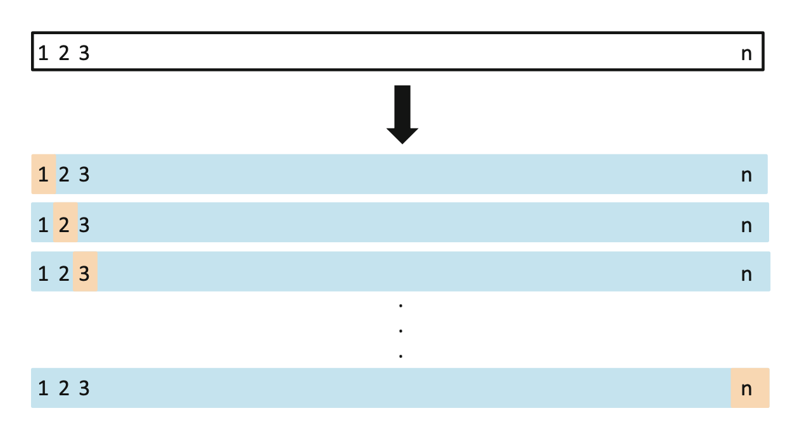
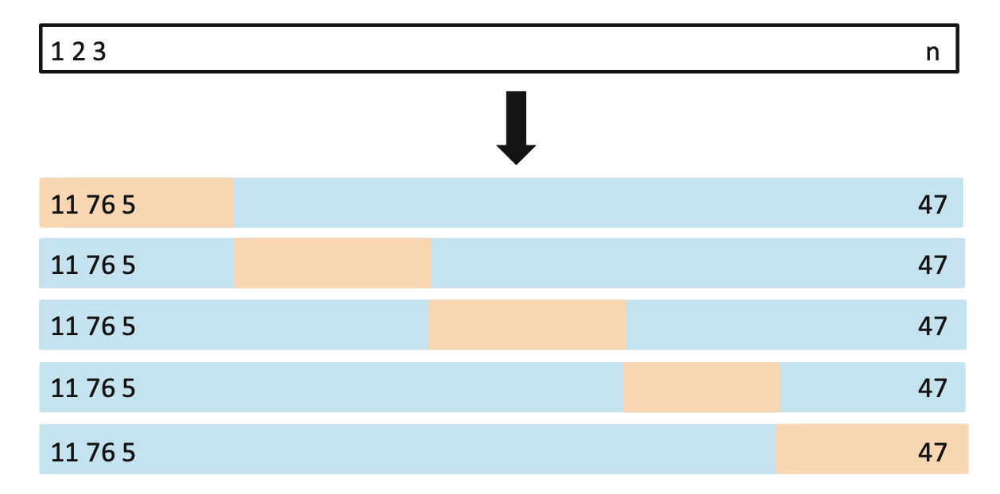

```{r setup, include=FALSE}
knitr::opts_chunk$set(echo = TRUE)
knitr::opts_chunk$set(message = FALSE)
# knitr::opts_knit$set(root.dir = '..')
knitr::opts_chunk$set(fig.height = 3, fig.width = 7)
knitr::opts_chunk$set(fig.pos='H')

library(data.table)
library(ggplot2)
library(magrittr)
library(glue)
library(purrr)
library(viridis)
library(caret)
library(kableExtra)
```

## Goal of the lesson

- cover the basics of theory of model selection
- train and assess the quality of linear/logistic regression models in `R` 

# Model Selection in Theory

## How to Select the Best Model

 **Goal**: Good generalisation i.e.: best predictive performance on new data
 
 What if I choose the one with the lowest error (RSE)/ best fit (R^2)?
 
 How to select the best type of model for our application?
 
## How to Select the Best Model
 
```{r, echo=FALSE}
set.seed(1337)
n <- 50
x <- runif(n, min = 0, max = 1)
e <- rnorm(n, 0, 0.1)
y <- sin(2*pi*x) + e

x_range <- seq(0,1,0.01)
f <- sin(2*pi*x_range)

data <- data.table(x = x, y = y)

train_proportion <- 0.7
train_index <- sample(1:n, floor(n*train_proportion))
# train_index <- createDataPartition(data$y, p=train_index, list=FALSE)

data_train <- data[train_index,]
data_test <- data[-train_index,]
data_range <- data.table(x = x_range, y = f)

p <- ggplot(data_train, aes(x, y)) +
    geom_point()  + 
    # geom_line(data = data_range, aes(x, y)) +
    theme_minimal() +
    xlim(0, 1) + ylim(-1.4, 1.4)

p
```

## The Loss Function

Common choice for regression problem is the **squared loss**:
 $$L(f(x),y) = (f(x) - y)^2$$

Goal is to choose $f(x)$ that **minimises the expected loss**: 
$$E[L(f)] = E[(f(x) - y)^2]$$

On can show that the:
$$f^*(x) = argmin_{f(x)} E[L(f(x),y)] = E[y|x]$$

## The Empirical Loss Minimiser

Assume you choose to approximate the relationship with a linear function with $k$ variables.

The **empirical loss** of the fitted model:
$$\hat L(f_k) = \frac{1}{n} \sum (f_k(x) - y)^2$$
Is this a good estimate of the expected loss of $f_k(x)$? Beware of overfitting!

## The Empirical Loss Minimiser

```{r, warning = FALSE, echo=FALSE}
k <- c(0, 1, 5, 30)

for (i in k) {
    if (i == 0) {
        model <- lm(y ~ 1, data = data_train)
    } else {
        model <- lm(y ~ poly(x, i, raw = TRUE), data = data_train)
    }
    colname <- paste0("k_",i)
    data_range <- data_range[, eval(colname):=predict(model, newdata = data_range)]
}

data_range_long <- melt(data_range, id.vars = c("x", "y"))

p +
    geom_line(data = data_range_long, aes(x, value)) +
    labs(color = "") + 
    facet_wrap(~variable)

```

## The Empirical Loss Minimiser

```{r, warning = FALSE, echo=FALSE}

p +
    geom_line(data = data_range_long, aes(x, value)) +
    labs(color = "") +
    geom_point(data = data_test, aes(x, y), color = "red") + 
    facet_wrap(~variable)

```

## What is overfitting

Among a set of possible models we choose one with poor generalisation properties. 

**Why?** Because we have an incorrect estimate of its expected loss.

**Overfitting error**:
$$E[L(f_k)] - \hat L(f_k)$$

## Model complexity

How to avoid overfitting?

Find the ideal level of **model complexity** within a given model type (e.g.: choose k for linear regression) for a **given set of data**.

$$ E[L(f_k)] - E[L(f^*)] = \underbrace{[E[L(f_k)] -  E[L(f_k^*)]]}_\text{estimation error} + \underbrace{[E[L(f_k^*)] -  E[L(f^*)]]}_\text{approximation error} $$
where $f_k^*$ is the best estimator among models with complexity k.

# Model Selection in Practice

## Train vs. Test Error

**Idea:** have an independent sample to estimate the performance of the fitted model

**Training set:** $N$ observations of labeled data used to tune the parameters of the model (e.g.: estimate coefficients of linear regression)

**Validation set/Test set:** $M$ observations of data used to optimize model complexity and/or choose between different types of models

## Train vs. Test Error

$$ MSE = \frac{1}{n} \sum (\hat f(x) - y)^2$$

```{r, warning = FALSE, echo=FALSE}
MSE <- function(y, pred) {
    mean((y - pred)**2)
}

mse_train <- list()
mse_test <- list()
for (i in k) {
    if (i == 0) {
        model <- lm(y ~ 1, data = data_train)
    } else {
        model <- lm(y ~ poly(x, i, raw = TRUE), data = data_train)
    }
    colname <- paste0("pred",i)
    data_train <- data_train[, eval(colname):=predict(model, newdata = data_train)]
    mse_train[[colname]] <-  MSE(data_train[, y], data_train[, get(colname)])
    data_test <- data_test[, eval(colname):=predict(model, newdata = data_test)]
    mse_test[[colname]] <-  MSE(data_test[, y], data_test[, get(colname)])
}

evals <- cbind("train MSE" = unlist(mse_train), "test MSE" = unlist(mse_test))
kable(evals, digits = 2 )
```

## Train vs. Test Error

**Advantages:**

- Simple approch

**Disadvantages:**

- Loss of valuable training data
- Small validation set gives noisy estimate of predictive performance

Overfitting to the validation set??? Possible!

One may want to set aside a third set of data to assess the performance of the final model.

## Cross validation

**Idea:** Instead of having a single validation set spli the data multiple times to estimate the performance of the fitted model

**Leave-one-out:** split tha data $N$ times, always leave one observation out for testing

```{r, out.height = "100px", echo = FALSE}

```

## Cross validation

**K-fold:** split the data into $k$ sub-samples of equal size and leave one out for testing

```{r, out.height = "100px", echo = FALSE}

```

**How to choose k?** Larger k results in larger variance in the error estimation but provides nearly unbiased estimate of the performance of the fitted model. ($k = 5$ is a common choice)

## Cross validation

$$ CV_k = \frac{1}{k} \sum MSE_i$$

```{r, warning = FALSE, echo=FALSE}

mse_cross <- list()
data <- data[, constant := 1]
train_control <- trainControl(method="cv", number=5)
for (i in k) {
    if (i == 0) {
        model <- train(y ~ constant, 
               data=data, 
               trControl=train_control, 
               method="lm", 
               tuneGrid  = expand.grid(intercept = FALSE) )
    } else {
        formula <- as.formula(paste0("y ~ ", paste(paste0(paste0("I(x^",1:i),")"), collapse = " + ")))
        model <- train(formula, 
               data=data, 
               trControl=train_control, 
               method="lm")
    }
    mse_cross[[paste0("k_",i)]] <-  model$results$RMSE**2
}

evals <- cbind("train MSE" = unlist(mse_train), "test MSE" = unlist(mse_test), "CV MSE" = unlist(mse_cross))
kable(evals, digits = 2)
```

## Cross validation

**Advantages:**

- utilizes all the data

**Disadvantages:**

- computationally expensive

## Information criteria

**Idea**: Penalize model complexity by adding a penalty term.

Definition:

- **BIC** (Bayesian approach): $$ -\text{ln}(\hat L) + \frac{1}{2}k\text{ln}(N) $$
- **AIC** (Information theory): $$ -2\text{ln}(\hat L) + 2k$$

where $k$ is the number of parameters, $N$ is the number of data points and $\hat L$ is the maximal value of the likelihood function. 

## Information criteria

**Advantages:**

- No need to set aside data for validation
- No need to train models multiple times

**Disadvantages:**

- Rely on assumptions that are often invalid in practice 
- In practice, they tend to favor overly simple models


## Information criteria

```{r, warning = FALSE, echo=FALSE}
aic <- list()
bic <- list()
for (i in k) {
    if (i == 0) {
        model <- lm(y ~ 1, data = data_train)
    } else {
        model <- lm(y ~ poly(x, i, raw = TRUE), data = data_train)
    }
    colname <- paste0("pred",i)
    aic[[colname]] <-  AIC(model)
    bic[[colname]] <-  BIC(model)
}

kable(cbind(evals, "AIC" = unlist(aic), "BIC" = unlist(bic)), digits = 2)
```

## Regularisation

**Idea:** Add a penalty term to the error function to discourage the coefficients from reaching large values. 

$$E(w) = E_D(w) + \lambda E_W(w) $$

where $E_D(w)$ is the data-dependent error, $E_W(w)$ regularisation term and $\lambda$ is the regularisation parameter that controls the relative importance of these two terms. 

## Regularisation

**Advantages:**

- allows to train complex models on limited size data
- computationally cheap (not always true)

**Disadvantages:**

- not clear how to choose $\lambda$

More on ridge, LASSO, the Bias-Variance trade-off later...

## Resources
