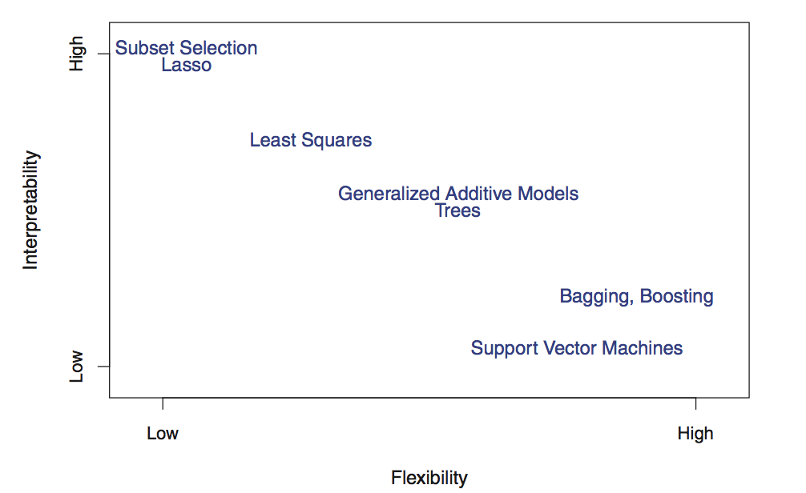
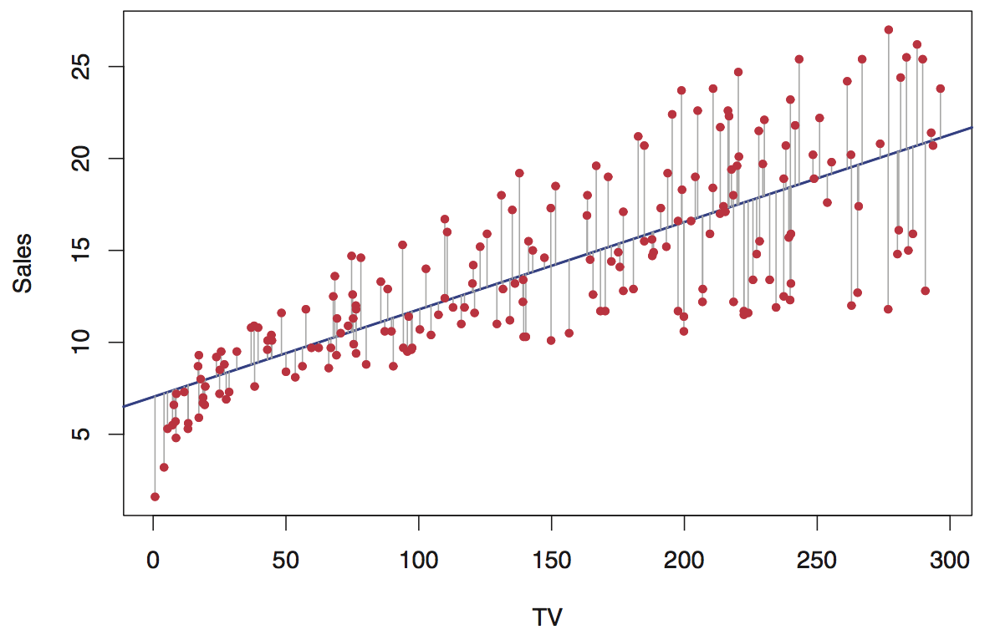
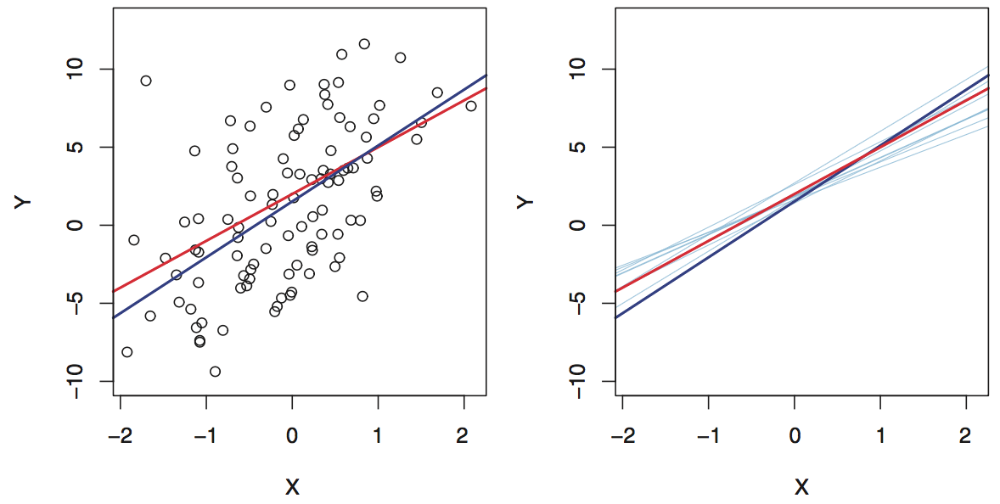

```{r setup, include=FALSE}
knitr::opts_chunk$set(echo = TRUE)
knitr::opts_chunk$set(message = FALSE)
knitr::opts_knit$set(root.dir = '..')

library(data.table)
library(ggplot2)
library(magrittr)
```

## About me
- Eltecon BSc
- University of Amsterdam MSc in Economics
- Last 6+ years working with data
    - 2.5 year @ Emarsys as a Data Scientist
- <lukacs.peter.andras@gmail.com>

## Goal of the lesson

# Statistical Learning in General

## Introduction to Statistical Learning

- tell about the book and what chapters are covered

## What is Statistical Learning


## What is Statistical Learning
>  "**Machine learning** is all about results, it is likely working in a company where your worth is characterized solely by your performance. Whereas, **statistical modeling** is more about finding relationships between variables and the significance of those relationships, whilst also catering for prediction"  

_**[source](https://towardsdatascience.com/the-actual-difference-between-statistics-and-machine-learning-64b49f07ea3)**_

## What is Statistical Learning
**Assumption:**
$$Y = f(X) + \epsilon$$

- We **assume** a systematic relationship between $X$ and $Y$
- $f$ is generally unknown
- **Statistical Learning refers to a set of approaches for estimating $f$ based on the available observations ($X$)**

## What is Statistical Learning
**Assumption:**
$$Y = f(X) + \epsilon$$

- $\epsilon$ is assumed to have mean $0$
- $\epsilon$ is assumed to be independent of $X$  
$\Rightarrow$ **otherwise** could be modeled through $f$

## Why estimate $f$?
- Causality/Inference (more in Econ, e.g. What drives unemployment?)
- Prediction (more in Business, e.g. How much Happy Socks are we selling next month?)

## Prediction: Reducible error/Irreducible error
$$Y = f(X) + \epsilon$$

$$\begin{aligned}
E(Y-\hat{Y}) &= E[f(X) + \epsilon - \hat{f}(X)]^2 \\
             &= \underbrace{[f(X) - \hat{f}(X)]^2}_\text{reducible error} + 
             \underbrace{Var(\epsilon)}_\text{irreducible error}
\end{aligned}$$

- the aim is to estimate $f$ by reducing the reducible error
- What about the irreducible error? Can't do anything about that.
    - Didn't measure :(
    - Can't measure: e.g. mood of a buyer on the day she's buying the house


## How to estimate $f$?
- parametric models
    **+** less parameters to learn (needs less training data)
    **-** can erroneously assume $f$
- non-parametric models
    **+** more flexible
    **-** more parameters to learn (needs more training data)
    **-** can overfit the data

## Prediction Accuracy vs. Model Interpretability
```{r, out.height = "190px", echo=FALSE}

```

_**source:**_ ISLR, p.25.

## Supervised vs. Unsupervised Learning
- Supervised: has response variable ($Y$)
    - linear reg., logistic reg., GAM, SVC
- Unsupervised: no supervisor response variable
    - cluster analysis

## Regression vs. Classification
- Regression: quantitative response (e.g. market price prediction)
- Classification: qualitative response (e.g. male/female based on purchase patterns)

## Statistical Learning Dimensions Summarized
- Goal: inference vs. prediction
- Model interpretability vs. Prediction Accuracy
- Supervised vs. Unsupervised
- Regression vs. Classification

## Other model selection decision points
```{r, out.height = "190px", echo=FALSE}
knitr::include_graphics("./ml_map.png")
```
[_**source**_](https://scikit-learn.org/stable/tutorial/machine_learning_map/index.html)

# Linear Regression

## Simple Linear Regression Formula
- assumes an approximate linear relationship between $X$ and $Y$
$$ Y \approx \beta_0 + \beta_1 X $$

## Estimating Coefficients
We want to find the coefficients so that the resulting line is as "close" to the observations as possible.

```{r, out.height = "150px", echo=FALSE}

```

_**source:**_ ISLR, p.62.

## Estimating Coefficients: Least Squares

- Minimize the *Residual Sum of Squares* (*RSS*)

$$RSS = (y_1 - \hat{\beta_0} - \hat{\beta_1} x_1)^2 +
        (y_2 - \hat{\beta_0} - \hat{\beta_2} x_2)^2 + ... +
        (y_n - \hat{\beta_0} - \hat{\beta_n} x_n)^2$$

## Assessing the Coefficient Estimation Accuracy
```{r, out.height = "140px", echo=FALSE}

```

_**source:**_ ISLR, p.64.

- Data Generated: $f(X) = 2 + 3X + \epsilon$
- Population regression line (red): $f(X) = 2 + 3X$
- Least Squares regression line (blue)

# Binary Classification

# Hands on Exercises

# Great resources

- Casuality: http://nickchk.com/causalgraphs.html
