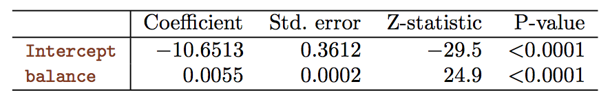

```{r setup, include=FALSE}
knitr::opts_chunk$set(echo = TRUE)
knitr::opts_chunk$set(message = FALSE)
# knitr::opts_knit$set(root.dir = '..')
knitr::opts_chunk$set(fig.height = 3, fig.width = 7)
knitr::opts_chunk$set(fig.pos='H')

library(data.table)
library(ggplot2)
library(magrittr)
library(glue)
library(purrr)
```

## About me
- Eltecon BSc
- University of Amsterdam MSc in Economics
- Last 6+ years working with data
    - 2.5 year @ Emarsys as a Data Scientist
- <lukacs.peter.andras@gmail.com>

## Goal of the lesson

- touch on stat learning basic theory (with examples!)
- see/try basic `R` linreg and classification syntax
- give you resources to reach for when you'll need it

# Statistical Learning in General

## Introduction to Statistical Learning

```{r, out.height = "100px", echo = FALSE}

```

- What is Statistical Learning? [pp. 15 - 28]
- Simple Linear Regression [pp. 61 - 70]
- Multiple Linear Regression [pp. 71 - 81]
- Classification [pp. 128 - 137]
- Plus `Lab` from the end of the chapters

## What is Statistical Learning?


## What is Statistical Learning?
>  "**Machine learning** is all about results, it is likely working in a company where your worth is characterized solely by your performance. Whereas, **statistical modeling** is more about finding relationships between variables and the significance of those relationships, whilst also catering for prediction"  

_**[source](https://towardsdatascience.com/the-actual-difference-between-statistics-and-machine-learning-64b49f07ea3)**_

## What is Statistical Learning?
**Assumption:**
$$Y = f(X) + \epsilon$$

- We **assume** a systematic relationship between $X$ and $Y$
- $f$ represents the systematic information that $X$ provides about $Y$ and is generally unknown
- **Statistical Learning refers to a set of approaches for estimating $f$ based on the available observations ($X$)**

## What is Statistical Learning?
**Assumption:**
$$Y = f(X) + \epsilon$$

- $\epsilon$ is assumed to have mean $0$
- $\epsilon$ is assumed to be independent of $X$   
   
$\Rightarrow$ **otherwise** could be modeled through $f$

## What is Statistical Learning?: Reducible error/Irreducible error
$$Y = f(X) + \epsilon$$

$$\begin{aligned}
E(Y-\hat{Y}) &= E[f(X) + \epsilon - \hat{f}(X)]^2 \\
             &= \underbrace{[f(X) - \hat{f}(X)]^2}_\text{reducible error} +
             \underbrace{Var(\epsilon)}_\text{irreducible error}
\end{aligned}$$

- the aim is to estimate $f$ by reducing the reducible error
- What about the irreducible error? Can't do anything about that.
    - Didn't measure :(
    - Can't measure: e.g. mood of a buyer on the day she's buying the house

## Why estimate $f$?
- Causality/Inference (more in Econ, e.g. What drives unemployment?)

- Prediction (more in Business, e.g. How much Happy Socks are we selling next month?)

## How to estimate $f$?
- parametric models   
    **+** less parameters to learn (needs less training data)   
    **-** can erroneously assume $f$   
- non-parametric models   
    **+** more flexible   
    **-** more parameters to learn (needs more training data)   
    **-** can overfit the data   

## Prediction Accuracy vs. Model Interpretability
```{r, out.height = "190px", echo = FALSE}
knitr::include_graphics("./figures/flexibility_vs_interpretability.png")
```

_**source:**_ ISLR, p.25.

## Supervised vs. Unsupervised Learning
- Supervised: has response variable ($Y$)
    - linear reg., logistic reg., GAM, SVC
- Unsupervised: no supervisor response variable
    - cluster analysis

```{r, out.height = "160px", echo = FALSE}

```

## Regression vs. Classification
- Regression: quantitative response (e.g. market price prediction)
- Classification: qualitative response (e.g. male/female based on purchase patterns)

```{r, out.height = "160px", echo = FALSE}

```

## Statistical Learning Dimensions Summarized
- Goal: inference vs. prediction
- Model interpretability vs. Prediction Accuracy
- Supervised vs. Unsupervised
- Regression vs. Classification

## Other model selection decision points
```{r, out.height = "190px", echo = FALSE}
knitr::include_graphics("./figures/ml_map.png")
```
[_**source**_](https://scikit-learn.org/stable/tutorial/machine_learning_map/index.html)

# Linear Regression

## Simple Linear Regression Formula
- assumes an approximate linear relationship between $X$ and $Y$
$$ Y \approx \beta_0 + \beta_1 X $$


## Simple Linear Regression: Advertising Data
```{r, warnings = FALSE}
adv <- fread("./data/advertising_data.csv")
ggplot(adv, aes(tv, sales)) + geom_point() + theme_minimal()
```

## Estimating Coefficients
We want to find the coefficients so that the resulting line is as "close" to the observations as possible.

```{r, out.height = "150px", echo = FALSE}
knitr::include_graphics("./figures/simple_reg_fit.png")
```

_**source:**_ ISLR, p.62.

## Estimating Coefficients: Least Squares

- Minimize the *Residual Sum of Squares* (*RSS*)

$$RSS = (y_1 - \hat{\beta_0} - \hat{\beta_1} x_1)^2 +
        (y_2 - \hat{\beta_0} - \hat{\beta_2} x_2)^2 + ... +
        (y_n - \hat{\beta_0} - \hat{\beta_n} x_n)^2$$

```{r}
slm <- lm(formula = sales ~ tv, data = adv)
slm$coefficients
```
Type `names(slm)` to the console to see `slm`'s other attributes

## Estimating Coefficients: Least Squares

```{r}
int <- slm$coefficients["(Intercept)"]
b1  <- slm$coefficients["tv"]
ggplot(adv, aes(tv, sales)) + geom_point() +
geom_smooth(method = "lm") + labs(subtitle = glue(
        "B0: {round(int, digits = 3)}\n",
        "B1: {round(b1, digits=3)}"
    )) + theme_minimal()
```

## Assessing the Coefficient Estimation Accuracy
```{r, out.height = "140px", echo = FALSE}
knitr::include_graphics("./figures/pop_reg_line_vs_least_sq_reg_line.png")
```

We only have one data set, and so what does it mean that two different lines describe the relationship between the predictor and the response?

_**source:**_ ISLR, p.64.

## Assessing the Coefficient Estimation Accuracy
```{r, out.height = "120px", echo = FALSE}
knitr::include_graphics("./figures/pop_reg_line_vs_least_sq_reg_line.png")
```

- Data Generated: $f(X) = 2 + 3X + \epsilon$
- Population regression line (red): $f(X) = 2 + 3X$
- Least Squares regression line (blue)
- Unbiased estimation

## Assessing the Coefficient Estimation Accuracy: Standard Error

$$ SE(\hat{\beta_0})^2 = \sigma^2 \left(\frac{1}{n} + \frac{\bar{x}^2}{\sum_{i=1}^n(x_i - \bar{x})^2}\right)$$

$$ SE(\hat{\beta_1})^2 = \frac{\sigma^2}{\sum_{i=1}^n(x_i - \bar{x})^2}$$

$$ \sigma^2 = Var(\epsilon) $$

$$ \hat{\sigma} = RSE = \sqrt{RSS/(n-2)} $$

## Assessing the Coefficient Estimation Accuracy: Confidence Intervals

- A 95% confidence interval is defined as a range of values such that with 95% probability, the range will contain the true unknown value of the parameter
- For linear regression, the 95% confidence interval for $\beta_1$
approximately takes the form

$$ \hat{\beta_1} \pm 2 \cdot SE(\hat{\beta_1}) $$

## Assessing the Coefficient Estimation Accuracy: Hypothesis test

$$ H_0: \hat{\beta}_1 = 0 $$
$$ H_a: \hat{\beta}_1 \neq 0 $$
$$ t = \frac{\hat{\beta}_1 - 0}{SE(\hat{\beta}_1)} $$

- $t$ measures the number of standard deviations that $\beta_1$ is away from $0$
- the $p$ value tells you how likely it is to observe such $t$ value given $\hat{\beta_1} = 0$

## Assessing the Coefficient Estimation Accuracy: Hypothesis test

```{r, out.height = "50px", echo = FALSE}

```
_**source:**_ ISLR, p.68.

## Assessing the Accuracy of the Model: Residual Standard Error (RSE)

- $RSE = \hat{\sigma} = \sqrt{RSS/(n-2)}$
- Roughly speaking, it is the average amount that the response will deviate from the true regression line
- Sales in each market deviate from the true regression line by approximately 3,260 units, on average
- The RSE is considered a measure of the lack of fit of the model to the data

## Assessing the Accuracy of the Model: $R^2$

$$ R^2 = \frac{TSS - RSS}{TSS} = 1 - \frac{RSS}{TSS} $$

- where $TSS = \sum(y_i - \bar{y})^2$ is the *total sum of squares*
- $R^2$ measures the proportion of variability in Y that can be explained using X

```{r, out.height = "130px", echo = FALSE}

```

## `R` syntax: Multiple Linear Regression

- example: median Boston house prices

```{r, eval = FALSE}
?MASS::Boston
boston <- MASS::Boston
names(boston)
mlm <- lm(medv ~ lstat, data = boston)
mlm <- lm(medv ~ lstat + age, data = boston)
summary(mlm)
mlm <- lm(medv ~ ., data = boston)
mlm <- lm(medv ~ . - indus -age, data = boston)
mlm <- lm(medv ~ . + zn*chas - indus -age, data = boston)
mlm <- lm(medv ~ . + I(lstat^2) - indus -age, data = boston)
```

## `R` syntax: Regression w/ quantitative var.

```{r, eval = FALSE}
car <- ISLR::Carseats
summary(lm(Sales ~ ShelveLoc, data = car))
contrasts(car$ShelveLoc)
```

## `R` syntax: Correlation
```{r}
boston <- MASS::Boston
cor(boston)
```

## `R` syntax: Residuals
```{r}
boston <- MASS::Boston
mlm <- lm(medv ~ . - indus -age, data = boston)
residuals <- data.table(residuals = mlm$residuals, fitted = mlm$fitted.values)
ggplot(residuals, aes(fitted, residuals)) +
    geom_point(alpha = .3) +
    theme_minimal()
```

# Binary Classification

## Why not Linear Regression?

- Encoding output with numbers would suggest ordering and distance (e.g. 0 - epileptic seizure, 1 - stroke, 2 - drug overdose)
- Shuffling the encoding would result in different predictions
- Logistic regression models the probability if $Y$ belongs to group, instead of modeling it’s value directly. $\Rightarrow p(X) = Pr(Y=1|X)$

```{r, out.height = "110px", echo = FALSE}

```

_**source:**_ ISLR, p.131.

## Logistic Regression

Instead of the linear approach we use the *logistic function* so that all our predictions will be between 0 and 1. This is useful if we are talking about probabilities.

$$ p(X) = \frac{e^{\beta_0 + \beta_1 X}}{1 + e^{\beta_0 + \beta_1 X}} $$

Estimate the coefficients with the *log likelihood* method

## `R`'s `glm` function

```{r, eval = FALSE}
default <- data.table(ISLR::Default)
glm(default ~ balance, data = default, family = "binomial")
```
```{r, out.height = "110px", echo = FALSE}

```

_**source:**_ ISLR, p.134.

## How to interpret the model: Log-likelihood (Logit)

The problem with the logistic regression is that it's hard to interpret its coefficients. (See the plot above.) For easy interpretation we need a linear formula.

$$\begin{aligned}
p(X) &= \frac{e^{\beta_0 + \beta_1 X}}{1 + e^{\beta_0 + \beta_1 X}} & (logistic) \\
\frac{p(X)}{1 - p(X)} &= e^{\beta_0 + \beta_1 X} & (odds) \\
\log\left(\frac{p(X)}{1 - p(X)}\right) &= \beta_0 + \beta_1 X & (log-odds)
\end{aligned}$$

- What does it mean to have odds of 4 to win the horse race?
- How do you calculate your chance of winning the horse race when $X=8$?
- How do you interpret if $\beta_1 = 2$?

## `R` syntax: Classification

```{r, results = "hide"}
default <- data.table(ISLR::Default)
# simple binary model
sbm <- glm(default ~ balance, data = default,
    family = "binomial")
pred_prob <- predict(sbm, type = "response")
# type = "response" -> P(Y = 1 | X) otherwise logit
contrasts(default$default)
pred_response <- rep("No", length(pred_prob))
pred_response[pred_prob > .5] <- "Yes"
```
## `R` syntax: Evaluation

```{r}
table(pred_response, default$default)
mean(pred_response == default$default)
```

## `R` syntax: Classification

```{r}
pred <- data.table(
    p_default = pred_prob, balance = default$balance)
ggplot(pred) +
    geom_point(aes(balance, p_default))
```

# Hands on Exercises

## Now your turn!

1. Either use your project data or find Something on [Kaggle](https://www.kaggle.com/)
2. Find a good research/business question that involves prediction (either ) and write it down
3. Answer your question using what we've learned previously and today
    a. Use at least one graph to see variable interdependence (use `geom_smooth`)
    a. Look at variable correlations
    b. See what do residuals look like. Is it random? Why? Why not?
    c. Run a regression
    d. Add/Remove variables based on the result, rerun the regression
    e. Try adding an interaction
    f. Describe how well the model fits your data. Try to reason why is it week if so?
    g. Try answering your question with your words

## Finish at home!

Thanks for being here!

## Great resources (click the links!)

- [Free Intro to Stat Learning textbook](http://faculty.marshall.usc.edu/gareth-james/ISL/)
- Casuality: [http://nickchk.com/causalgraphs.html](http://nickchk.com/causalgraphs.html)
- Two Stat blogs: [1](https://www.countbayesie.com/) and [2](http://varianceexplained.org/)
- [Online Stat](http://onlinestatbook.com/2/index.html)
- MOOCS:
    - [Machine Learning @ Coursera](https://www.coursera.org/learn/machine-learning/home/welcome)
    - [Deep Learning @ Coursera](https://www.coursera.org/learn/neural-networks-deep-learning/home/welcome)
    - [Statistics @ Edx](https://www.edx.org/course/subject/data-analysis-statistics)

# Interesting Stuff

## Assessing the Coefficient Estimation Accuracy: hands on

```{r, echo = FALSE}
linTransform <- function(x, i, b, seed = 666) {
    set.seed(seed)
    sapply(x, function(x) i + b * x) + rnorm(length(x), sd = length(x))
}

genLinData <- function(n, i, b, seed = 666) {
    set.seed(seed)
    x <- runif(n, min = 0, max = n * 3)
    data.table(x, y = linTransform(x, i, b, seed))
}

plotLinData <- function(n, i, b, seed = 666) {
    set.seed(seed)
    myData <- genLinData(n, i, b, seed)
    ggplot(myData, aes(x, y)) +
        geom_point() +
        geom_abline(intercept = i, slope = b, color = "red")
}
```

```{r}
p <- plotLinData(50, i = 0, b = 2)
p + geom_smooth(method = lm, se = FALSE)
```

## Assessing the Coefficient Estimation Accuracy: hands on (1)

```{r, eval = FALSE}
ls_lines <- map(1:20, ~{
    adv_s <- adv[sample(.N, 10)]
    stat_smooth(data = adv_s, mapping = aes(tv, sales), method = lm,
        se = FALSE, alpha = .3, geom = 'line', color = "blue")
})

ggplot(adv, aes(tv, sales)) +
    geom_point(alpha = .5) +
    geom_smooth(method = lm, color = "red", se = FALSE) +
    ls_lines
```

## Assessing the Coefficient Estimation Accuracy: hands on (2)

```{r}
ls_betas <- map(1:1000, ~{
    adv_s <- adv[sample(.N, 20)]
    lm <- lm(sales ~ tv, data = adv_s)
    lm$coefficients["tv"]
}) %>% unlist()

true_beta <- lm(sales ~ tv, data = adv)$coefficients["tv"]

ggplot(data.table(betas = ls_betas), aes(betas)) +
    geom_histogram(bins = 40) +
    geom_vline(xintercept = true_beta, color = "red")
```
