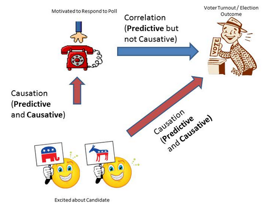
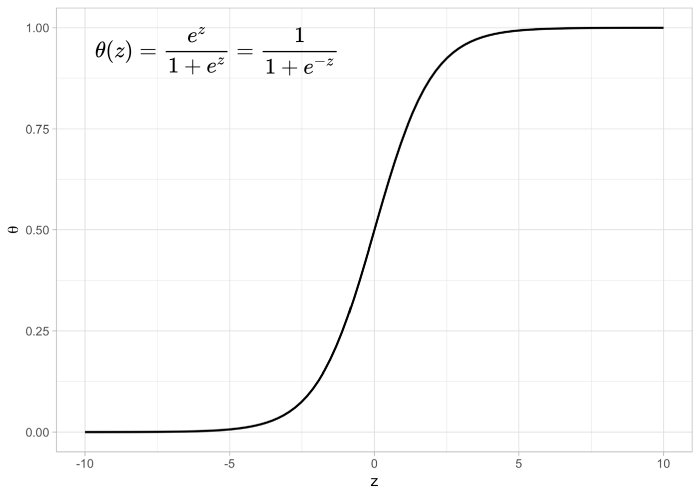

```{r setup, include=FALSE}
knitr::opts_chunk$set(echo = FALSE)
knitr::opts_chunk$set(warning = FALSE)
knitr::opts_chunk$set(message = FALSE)
knitr::opts_chunk$set(out.width = '65%')
knitr::opts_chunk$set(fig.align = 'center')
# knitr::opts_knit$set(root.dir = '..')

library(knitr)
library(data.table)
library(magrittr)
library(ggplot2)
library(ggtext)
```

## Homeworks from last week

* Im Seongwon - Kim Yeonggyeong
* Szőnyi Máté - Tran, Dung
* Sármány Áron - Schmall Róbert

## Goal of the lesson

- Understand what _prediction_ is, and how it differs from _causal inference_
- Try basic `R` commands for fitting & evaluating simple regression and classification models

# What is prediction?

You have an assumed relationship:

$$Y \approx f(X) + \epsilon$$

where:

- $Y$ is your target variable
- $X$ are your predictors
- $f()$: is the relationship between $X$ and $Y$
- $\epsilon$: is the irreducible error

**Prediction is**:

- estimating $f()$ based on the available observations ($X$) ...
- **... to minimize the error of $Y$ vs $\hat{Y}$**

## Error metric: RMSE

* Root Mean Square Error (RMSE)
* It is the standard deviation of the residuals i.e. prediction errors
* RMSE penalizes the model for large errors

$$ RMSE = \sqrt{\frac{\sum_{i=1}^n (\hat{y_i}-y_i)^2}{n}} $$

## Bike rental - the dataset

* Source: [Kaggle](https://www.kaggle.com/c/bike-sharing-demand/overview/description)
* Goal: Predict the total count of bikes rented during each hour

\tiny
```{r}
bike_sharing_train <- fread("bike_sharing_train.csv")

knitr::kable(head(
  bike_sharing_train[, -c("weather_3", "weather_4", "season_3", "season_4")]
))
```
\normalsize

## Bike rental - variables

\small
```{r}
fread("bike_sharing_data_fields.csv", sep = ";") %>%
    .[field %in% c("count", "season", "holiday", "workingday",
                   "weather", "temp", "atemp", "humidity", "windspeed")
    ] %>%
    knitr::kable()
```
\normalsize

## Benchmark "model"

```{r, echo = TRUE}
calculateRMSE <- function(actual, predictions) {
  sqrt(mean((actual - predictions) ^ 2))
}
```

\small
```{r, echo = TRUE}
predictions_benchmark_model <- rep(
  bike_sharing_train[, mean(count)], bike_sharing_train[, .N]
)

bike_sharing_benchmark_model_rmse <- calculateRMSE(
  actual = bike_sharing_train$count,
  predictions = predictions_benchmark_model
)

bike_sharing_benchmark_model_rmse
```
\normalsize

# Regression

## Linear regression

When to use it:

* We want to estimate a numerical target (e.g. price)
* Assuming an approximate linear relationship between $X$ and $Y$

Simple linear regression formula:

$$ \hat{Y} = \beta_0 + \beta_1 X $$

The OLS estimation of $\beta$ will conveniently minimize RMSE for given $X$!

## (So what is Machine Learning?)

_“A computer program is said to **learn from experience** E with respect to some class of tasks T and performance measure P, **if its performance** at tasks in T, as measured by P, **improves with experience** E.”_
(Tom Mitchell)

## Bike rental - minimal model

```{r, echo = TRUE}
bike_sharing_min_model <- glm(
  formula = count ~ atemp,
  family = gaussian,
  data = bike_sharing_train
)
```


## Bike rental - minimal model

\tiny
```{r, echo = TRUE}
summary(bike_sharing_min_model)
```
\normalsize

## Bike rental - minimal model - coefficients

```{r, echo = TRUE}
str(bike_sharing_min_model$coefficients)
```

```{r, echo = TRUE}
intercept <- bike_sharing_min_model$coefficients[1]
slope <- bike_sharing_min_model$coefficients[2]
```

## Bike rental - minimal model - predictive fit

```{r}
ggplot(bike_sharing_train, aes(x = atemp, y = count)) +
    geom_point() +
    geom_abline(intercept = intercept, slope = slope, color = "red") +
    geom_hline(yintercept = mean(predictions_benchmark_model), color = "grey") +
    labs(
      title = "Minimal model fit for bike rentals",
      subtitle = "<span style = 'color: grey;'>Benchmark</span> vs <span style = 'color: red;'>Minimal Model</span>"
    ) +
    theme_classic() +
    theme(text = element_text(size = 20)) +
    theme(plot.subtitle = ggtext::element_markdown())
```

## Bike rental - minimal model - prediction error

```{r, echo = TRUE}
predictions_min_model <- predict.glm(
  bike_sharing_min_model, newdata = bike_sharing_train
)

predictions_min_model[1:5]
bike_sharing_train[1:5, count]
```

## Bike rental - minimal model - prediction error

```{r, echo = TRUE}
calculateRMSE <- function(actual, predictions) {
  sqrt(mean((actual - predictions) ^ 2))
}
```

```{r, echo = TRUE}
bike_sharing_min_model_rmse <- calculateRMSE(
  actual = bike_sharing_train[, count],
  predictions = predictions_min_model
)

bike_sharing_min_model_rmse
```

## Bike rental - improving predictions

\small
```{r, echo = TRUE}
bike_sharing_2nd_model <- glm(
  formula = count ~ atemp + humidity,
  data = bike_sharing_train
)

predictions_2nd_model <- predict.glm(
  bike_sharing_2nd_model, newdata = bike_sharing_train
)

calculateRMSE(
  actual = bike_sharing_train[, count],
  predictions = predictions_2nd_model
)
```
\normalsize

## Practice time

* Task: improve the model to be as accurate as possible!
* Share your regression formula + achieved RMSE in [Socrative](https://www.socrative.com/#login)!
* You have 20 minutes - feel free to take a break if needed.


## Practice time

DEMO

```{r, eval = FALSE}
ggplot(bike_sharing_train, aes(x = hour, y = count)) +
    geom_point() +
    geom_smooth(method = "gam", color = "blue") +
    labs(
      title = "Minimal model fit for bike rentals",
      subtitle = "<span style = 'color: blue;'>loess smoothing</span>; 1 denotes working days"
    ) +
    facet_wrap(.~workingday) +
    theme_classic() +
    theme(text = element_text(size = 20)) +
    theme(plot.subtitle = ggtext::element_markdown())

bike_sharing_improved_model <- glm(
  formula = count ~ windspeed + temp + poly(hour, 3) + workingday,
  data = bike_sharing_train
)

predictions_improved_model <- predict.glm(
  bike_sharing_improved_model, newdata = bike_sharing_train
)

calculateRMSE(
  actual = bike_sharing_train[, count],
  predictions = predictions_improved_model
)
```

## Don't worry about Confounding!

```{r, echo=FALSE, fig.align='center'}

```

## Don't worry about Confounding!

```{r}
ggplot(bike_sharing_train, aes(x = temp, y = atemp)) +
    geom_point() +
    ggtitle("Temperature vs 'Feels Like' Temperature") +
    theme_classic() +
    theme(text = element_text(size = 20))
```

## Why should you still care about model inputs?

<!-- https://stats.stackexchange.com/questions/271694/confounding-variables-in-machine-learning-predictions -->

* Model explainability is often desirable in business (and other applications)
* Example: [Google Flu Trends](https://www.wired.com/2015/10/can-learn-epic-failure-google-flu-trends/)
* In Emarsys: all models are retrained every 30 days
  * This ensures that any shifts in user behavior are promptly captured
  * E.g. before / after Black Friday

# Classification

## Binary classification

* Binary: target can take on two values (0 or 1)
* Typical example is predicting if an event is happening or not
* Examples:
  * Patient has a medical condition or not
  * Loan will be repaid in full
  * User will make a purchase in the next 30 days (BPS - Buying Probability Score)

## Question time

* __Why should we not use linear regression for binary classification__?
* Please record your answers in [Socrative](https://www.socrative.com/#login)!
* You have 5 minutes

## Logistic regression

* A linear model makes continuous predictions that are unbounded.
* In classification, we are interested in the probability of an outcome occurring
* So we want **predictions that are bounded between 0 and 1.**

<!-- + Predicting binary outcomes with a linear model violates the assumption of normal residuals, distorting inferences made on regression coefficients.
 -->

$$ Pr(Y_i=1|X_i) = {\frac{exp(\beta_0 + \beta_1X_i)}{1 + exp (\beta_0 + \beta_1X_i)}} $$

## The sigmoid function

```{r, echo=FALSE, fig.align='center', fig.='50%'}

```

## The Titanic dataset


```{r, eval = FALSE, echo = TRUE}
install.packages("titanic")
library(titanic)
head(titanic_train)
```

\tiny
```{r}
library(titanic)
knitr::kable(head(titanic_train))
```
\normalsize

## Example - binary model

```{r, echo = TRUE}
model <- glm(
    Survived ~ Fare,
    data = titanic_train,
    family = binomial(link = "logit")
)
```

## Making predictions

```{r, echo = TRUE}
predicted_prob <- predict.glm(
  model,
  newdata = titanic_train,
  type = "response"
)

predicted_prob[1:5]
```

## Predictive fit

```{r}
titanic_train %>%
    as.data.table() %>%
    copy() %>%
    .[, predicted_prob := predicted_prob] %>%
    ggplot(aes(x = Fare)) +
        geom_point(aes(y = Survived)) +
        geom_point(aes(y = predicted_prob), color = "red") +
        labs(
          title = "Model fit for Titanic survival",
          subtitle = "<span style = 'color: black;'>Actual</span> vs <span style = 'color: red;'>Predicted Probability</span>"
        ) +
        theme_classic() +
        theme(text = element_text(size = 20)) +
        theme(plot.subtitle = ggtext::element_markdown())
```

## Converting probabilities to predictions

```{r, echo = TRUE}
titanic_train[1:5, "Survived"]
```

__Using `cutoff = 0.5`:__

```{r, echo = TRUE}
predicted_class <- ifelse(predicted_prob > 0.5, 1, 0)
predicted_class[1:5]
```

## Evaluating binary models - Accuracy

```{r, echo = TRUE}
calculateAccuracy <- function(actual, predicted) {
    N <- length(actual)
    accuracy <- sum(actual == predicted) / N

    return(accuracy)
}
```

```{r, echo = TRUE}
calculateAccuracy(titanic_train$Survived, predicted_class)
```

## Evaluating binary models - Confusion Matrix

```{r, echo = TRUE}
table(
  titanic_train$Survived,
  predicted_class,
  dnn = c("actual", "predicted")
)
```

## Practice time

* Task: improve the model to be as accurate as possible!
* Share your regression formula + achieved Accuracy & Confusion Matrix in [Socrative](https://www.socrative.com/#login)!
* You have 20 minutes - feel free to take a break if needed.

## Practice time

DEMO

```{r, eval = FALSE}
str(titanic_train)
titanic <- data.table(titanic_train)

titanic[, sum(Survived) / .N]
titanic[, sum(Survived) / .N, by = "Sex"]
titanic[, sum(Survived) / .N, by = "Pclass"]
titanic[, sum(Survived) / .N, by = .(under_18 = Age < 18)]

titanic[, age_under_18 := ifelse(is.na(Age), 'Unknown', Age < 18)]

improved_model <- glm(
    Survived ~ Sex + Fare + age_under_18 + Pclass,
    data = titanic,
    family = binomial
)

predicted_prob <- predict.glm(
  improved_model,
  newdata = titanic,
  type = "response"
)

predicted_class <- ifelse(predicted_prob > 0.5, 1, 0)

calculateAccuracy(titanic_train$Survived, predicted_class)
table(
  titanic_train$Survived,
  predicted_class,
  dnn = c("actual", "predicted")
)
```

# Generalization performance

## Why do we care?

* It's easy to predict something we already know...
* Actually, it would be silly to build predictive models to predict what we already know!

* What we are after is **out-of-sample** performance

## Example on the Bike Sharing dataset

```{r, echo = TRUE}
simple_model <- glm(
  count ~ hour + temp + workingday,
  data = bike_sharing_train
)
```

## Accuracy on our training data

```{r, echo = TRUE}
simple_model_predictions <- predict.glm(
  simple_model,
  newdata = bike_sharing_train
)

calculateRMSE(bike_sharing_train$count, simple_model_predictions)
```

## Accuracy out-of-sample

```{r, echo = TRUE}
bike_sharing_test <- fread("bike_sharing_test.csv")

simple_model_predictions <- predict.glm(
  simple_model,
  newdata = bike_sharing_test
)

calculateRMSE(bike_sharing_test$count, simple_model_predictions)
```

# Homework

## Homework - Final project

* __Have a high level outline of how you plan to answer your research question__
* Should be around half a page
* Can be in bullet point format: our goal is to make sure you have a question and some idea how to answer it
* Please send it email to us - no need to present next week

## Homework - prediction

* If you haven't finished the binary classification practice, do so.
  * Create at least two models to predict Titanic Survival
  * Show your Logit formulas, and the achieved Accuracy & Confusion Matrix!
  * Reason why you would use one model or another if you had to perform an out-of-sample prediction
  * (No right or wrong answers!)
* Presenters:
  * Alexandrov Dániel - Földesi Attila
  * Nguyen Thai Duong - Szentistványi János
  * Kovács Ádám - Nguyen Nam Son
