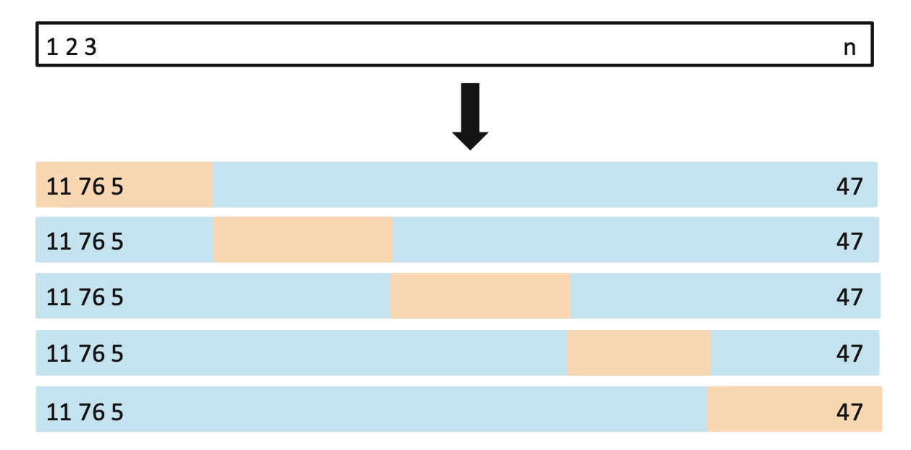

```{r setup, include=FALSE}
knitr::opts_chunk$set(echo = TRUE)
knitr::opts_chunk$set(message = FALSE)
# knitr::opts_knit$set(root.dir = '..')
knitr::opts_chunk$set(fig.height = 3, fig.width = 7)
knitr::opts_chunk$set(fig.pos='H')

library(data.table)
library(ggplot2)
library(magrittr)
library(glue)
library(purrr)
library(caret)
library(knitr)
```

## Homeworks

* Presenters:
  * Alexandrov Dániel - Földesi Attila
  * Nguyen Thai Duong - Szentistványi János
  * Kovács Ádám - Nguyen Nam Son

## Goal of the lesson

- Intro to the **theory of model selection**, model complexity, overfitting, etc.
- Understand the concept through real life examples
- Cover most commonly used **practical solutions** to the model selection problem
- Get some hands-on experience

# Model Selection in Theory

## How to Select the Best Model

 **Goal**: Good generalisation i.e.: best predictive performance on new data
 
 What if I choose the one with the lowest error ($RMSE$)/ best fit ($R^2$)?
 
 How to select the best type of model for our application?
 
## How to Select the Best Model
 
```{r, echo=FALSE}
set.seed(1337)
n <- 50
x <- runif(n, min = 0, max = 1)
e <- rnorm(n, 0, 0.1)
y <- sin(2*pi*x) + e

x_range <- seq(0,1,0.01)
f <- sin(2*pi*x_range)

data <- data.table(x = x, y = y)

train_proportion <- 0.8
train_index <- sample(1:n, floor(n*train_proportion))

data_train <- data[train_index,]
data_test <- data[-train_index,]
data_range <- data.table(x = x_range, y = f)

p <- ggplot(data_train, aes(x, y)) +
    geom_point()  + 
    # geom_line(data = data_range, aes(x, y)) +
    theme_minimal() +
    # xlim(0, 1) + ylim(-1.4, 1.4)
    coord_cartesian(xlim =c(0, 1), ylim = c(-1.4, 1.4))

p
```

## The Loss Function

Common choice for regression problem is the **squared loss**:
 $$L(f(x),y) = (f(x) - y)^2$$

Goal is to choose $f(x)$ that **minimises the expected loss**: 
$$E[L(f)] = E[(f(x) - y)^2]$$

## The Empirical Loss Minimiser

Assume you choose to approximate the relationship with a linear function with $k$ variables ($f_k$).

The **empirical loss** of the fitted model:
$$\hat L(f_k) = \frac{1}{n} \sum (f_k(x) - y)^2$$
Is this a good estimate of the expected loss of $f_k(x)$? Beware of overfitting!

## The Empirical Loss Minimiser

```{r, warning = FALSE, echo=FALSE}
k <- c(0, 1, 5, 30)

for (i in k) {
    if (i == 0) {
        model <- lm(y ~ 1, data = data_train)
    } else {
        model <- lm(y ~ poly(x, i, raw = TRUE), data = data_train)
    }
    colname <- paste0("k_",i)
    data_range <- data_range[, eval(colname):=predict(model, newdata = data_range)]
}

data_range_long <- melt(data_range, id.vars = c("x", "y"))

p +
    geom_line(data = data_range_long, aes(x, value)) +
    facet_wrap(~variable)

```

## The Empirical Loss Minimiser

```{r, warning = FALSE, echo=FALSE}

p +
    geom_line(data = data_range_long, aes(x, value)) +
    geom_point(data = data_test, aes(x, y), color = "red") + 
    facet_wrap(~variable)

```

## What is overfitting

Among a set of possible models we choose one that is <em>too complex<em> and has poor generalisation properties. 

**Why?** Because we have an incorrect estimate of its expected loss.

**Overfitting error**:
$$E[L(f_k)] - \hat L(f_k)$$

```{r, warning = FALSE, echo=FALSE}

generate_dependence <- function(n, small_n, seed_c) {
  set.seed(seed_c)
  x <- runif(n, min = -1, max = 1)
  e <- rnorm(n, mean = 0, sd = .25)
  y <- sin(2*pi*x) + e
  
  daf <- data.frame(x = x, e = e, y = y)
  daf_restrict <- daf[sample.int(nrow(daf), small_n),]
  return(list(complete_data = daf, restricted_data = daf_restrict))
}

# Model family
# Assume that we have the polynomial model family with which we want to estimate 

generate_formula <- function(k, symbol) {
  ret <- as.character()
  for(i in 1:k) {
    ret <- c(ret, paste0("I(",symbol, "^", i,")"))
  }
  return(paste0("y~",paste(ret, collapse = "+")))
}

estimate_model_family <- function(inp_dat, k_max) {
  ret <- list()
  for(i in 1:k_max) {
    ret[[i]] <- lm(as.formula(generate_formula(i, "x")), inp_dat)
  }
  return(ret)
}

predict_family <- function(inp_dat, fam) {
  
  for(i in 1:length(fam)) {
    inp_dat[, paste0("pred_",i)] <- predict(fam[[i]], inp_dat)
    inp_dat[, paste0("err_",i)] <- inp_dat[, paste0("pred_",i)] - inp_dat$y
  }
  return(inp_dat)
}

calculate_error <- function(inp_dat, fam, fieldname) {
  for(i in 1:length(fam)) {
    fam[[i]][[fieldname]] <- sum(inp_dat[, paste0("err_",i)]^2) / nrow(inp_dat)
  }
  return(fam)
}

summarise_result <- function(fam, fieldname) {
  daf <- data.frame(degree = 1:length(fam))
  v <- rep(0, length(fam))
  for(i in 1:length(fam)) {
    v[i] <- fam[[i]][[fieldname]]
  }
  daf[, fieldname] <- v
  return(daf)
}

run_analysis <- function(sample_size, small_sample_size, seed_c, max_degree) {
  sample_data <- generate_dependence(sample_size,small_sample_size, seed_c)
  #model_family <- estimate_model_family(sample_data$dt, 20)
  model_family_rest <- estimate_model_family(sample_data$restricted_data, max_degree)
  
  sample_data_with_pred <- predict_family(sample_data$complete_data, model_family_rest)
  sample_data_with_pred_rest <- predict_family(sample_data$restricted_data, model_family_rest)
  
  model_family_err <- calculate_error(sample_data_with_pred, model_family_rest, "complete")
  model_family_err_rest <- calculate_error(sample_data_with_pred_rest, model_family_rest, "training")
  
  results <- summarise_result(model_family_err, "complete")
  results_rest <- summarise_result(model_family_err_rest, "training")
  
  res_comp <- as.data.table(merge(results, results_rest, by = c('degree')))
}
res_comp <- run_analysis(10000, 200, 2004, 17)
crs <- c("complete"="red", "training"="blue")
ggplot(res_comp) + 
  geom_line(aes(x=degree, y= complete, color = "expected loss")) +
  geom_line(aes(x=degree, y =training, color = "training loss")) +
  geom_vline(xintercept = res_comp[complete == min(complete),degree], color = "grey") +
  geom_segment(aes(x = 14, y = res_comp[degree == 14,training], 
                   xend = 14, yend = res_comp[degree == 14,complete]),
               arrow = arrow(length = unit(0.1,"cm"))) +
  geom_segment(aes(xend = 14, yend = res_comp[degree == 14,training], 
                   x = 14, y = res_comp[degree == 14,complete]),
               arrow = arrow(length = unit(0.1,"cm"))) +
  annotate("text", x = 14, y = res_comp[degree == 14,training], label = "Overfitting error", size = 3, hjust = 0, vjust =-1) +
  xlab("polynomial degree") +
  ylab("loss") +
  guides( color = guide_legend(title = "")) +
  theme(legend.position = "bottom") +
  theme_minimal()


```

## Model Complexity in Practice

 - “Classic” variable selection: Which explanatory variables should I include?
 - Functional form selection: In what form should I include my variables?
 - Tree models: How complex tree structure should I allow?
 - Deep learning: How complex neural network should I train?

## Model Complexity in Practice

Take the bike rental example from last time.

How should we incorporate the information on the time of the day?

 - include "hour" variable as it is
 - create a dummy variable for each value of hour
 - include "hour" as a third degree polynomial

**Task:** Order the listed options by model complexity. Share your results in [Socrative](https://www.socrative.com/#login)!

# Model Selection in Practice

## Model Selection in Practice

We want to find the model with the best generalisation properties but how to avoid overfitting?

Find the ideal level of **model complexity** within a given model type (e.g.: choose k for linear regression) for a **given set of data**.

Note that we have two conflicting goals:

  - have a larger set of models to choose from in order to find the best among all possible models -> increase complexity
  - have a realistic estimate of the models' preformance so we find the best model out of the set of models we consider -> decrease complexity 

## Train vs. Test Error

**Idea:** have an independent sample to estimate the performance of the fitted model

**Training set:** $N$ observations of labeled data used to tune the parameters of the model (e.g.: estimate coefficients of linear regression)

**Validation set/Test set:** $M$ observations of data used to optimize model complexity and/or choose between different types of models

Watch out for use-cases where random assignment does not work!

## Train vs. Test Error

```{r, warning = FALSE, echo=FALSE}

p +
    geom_line(data = data_range_long, aes(x, value)) +
    geom_point(data = data_test, aes(x, y), color = "red") + 
    annotate("text", x = 0.9, y = 1, label = "Test data", color="red") +
    annotate("text", x = 0.9, y = 1.3, label = "Train data") +
    facet_wrap(~variable)

```

## Train vs. Test Error

$$ RMSE = \sqrt{\frac{1}{n} \sum (\hat f(x) - y)^2}$$


```{r echo=FALSE, warning=FALSE, results='asis'}
MSE <- function(y, pred) {
    mean((y - pred)**2)
}

mse_train <- list()
mse_test <- list()
for (i in k) {
    if (i == 0) {
        model <- lm(y ~ 1, data = data_train)
    } else {
        model <- lm(y ~ poly(x, i, raw = TRUE), data = data_train)
    }
    colname <- paste0("pred",i)
    data_train <- data_train[, eval(colname):=predict(model, newdata = data_train)]
    mse_train[[colname]] <-  MSE(data_train[, y], data_train[, get(colname)])
    data_test <- data_test[, eval(colname):=predict(model, newdata = data_test)]
    mse_test[[colname]] <-  MSE(data_test[, y], data_test[, get(colname)])
}

evals <- cbind("train RMSE" = sqrt(unlist(mse_train)), "test RMSE" = sqrt(unlist(mse_test)))
kable(evals, digits = 2)
```

## SMS Spam Prediction Dataset

* Source: [Kaggle](https://www.kaggle.com/uciml/sms-spam-collection-dataset)
* Goal: Predict if SMS was a spam using text of the SMS

Pre-cleaned the data (removed stopwords, special characters etc.) and created word count variables: **spam_clean.csv**

\tiny
```{r echo=FALSE}
spam_data <- fread("spam_clean.csv")
knitr::kable(head(
  spam_data[, .(is_spam, message, nchar, nwords)]
))
```
\normalsize

 plus top 400 most frequent words.

## SMS Spam Prediction

Let's see some prediction models! **spam_pred_train_test.R**

## Practice Time

* Task: include all the available variables and compute train and test accuracy!
* Share your results in [Socrative](https://www.socrative.com/#login)!
* You have 15 minutes - feel free to take a break if needed.

## Train vs. Test Error

**Advantages:**

- Simple approach

**Disadvantages:**

- Loss of valuable training data
- Small validation set gives noisy estimate of predictive performance

Overfitting to the validation set??? Possible!

One may want to set aside a third set of data to assess the performance of the final model.

## Cross validation

**Idea:** Instead of having a single validation set split the data multiple times to estimate the performance of the fitted model

**Leave-one-out:** split tha data $N$ times, always leave one observation out for testing

```{r, out.height = "100px", echo = FALSE}
knitr::include_graphics("./figures/leave-one-out.png")
```

## Cross validation

**K-fold:** split the data into $k$ sub-samples of equal size and leave one out for testing

```{r, out.height = "100px", echo = FALSE}

```

**How to choose k?** Larger k results in larger variance in the error estimation but provides nearly unbiased estimate of the performance of the fitted model. ($k = 5$ is a common choice)

## Cross validation

$$ CV_k = \frac{1}{k} \sum MSE_i$$


```{r, warning = FALSE, echo=FALSE}

mse_cross <- list()
data <- data[, constant := 1]
train_control <- trainControl(method="cv", number=5)
for (i in k) {
    if (i == 0) {
        model <- train(y ~ constant, 
               data=data, 
               trControl=train_control, 
               method="lm", 
               tuneGrid  = expand.grid(intercept = FALSE) )
    } else {
        formula <- as.formula(paste0("y ~ ", paste(paste0(paste0("I(x^",1:i),")"), collapse = " + ")))
        model <- train(formula, 
               data=data, 
               trControl=train_control, 
               method="lm")
    }
    mse_cross[[paste0("k_",i)]] <-  model$results$RMSE**2
}

evals <- cbind("train MSE" = unlist(mse_train), "test MSE" = unlist(mse_test), "CV MSE" = unlist(mse_cross))
kable(evals, digits = 2)
```

## SMS Spam Prediction

Let's do cross-validation for our spam prediction models! **spam_pred_cv.R**

## Practice Time

* Task: Compute CV accuracy for all models we tested and compare their performance!
* Share your results in [Socrative](https://www.socrative.com/#login)!
* You have 10 minutes - feel free to take a break if needed.

## Cross validation

**Advantages:**

- utilizes all the data
- suitable for parameter tuning
- can decrease variance of the error estimation

**Disadvantages:**

- computationally expensive

## Homework

* If you haven't finished computing CV accuracies, do so.
* Choose and alternative measure to evaluate the performance of the spam analysis models (hint: think about the different types of errors summarised in the confusion matrix)
* Compute the chosen measure for two alternative model versions for train, test and with CV
* Discuss the results
 
* Presenters:
  * Bakirov, Aslan - Yatsenko, Anzhelika
  * Both Márton - Kamenár Gyöngyvér
  * Emerson, Ian - Ralbovszki Judit

## Resources

- Bishop, Christopher: Pattern Recognition and Machine Learning
- Gareth J., Witten D., Hastie T. and Tibshirani R.: An Introduction to Statistical Learning