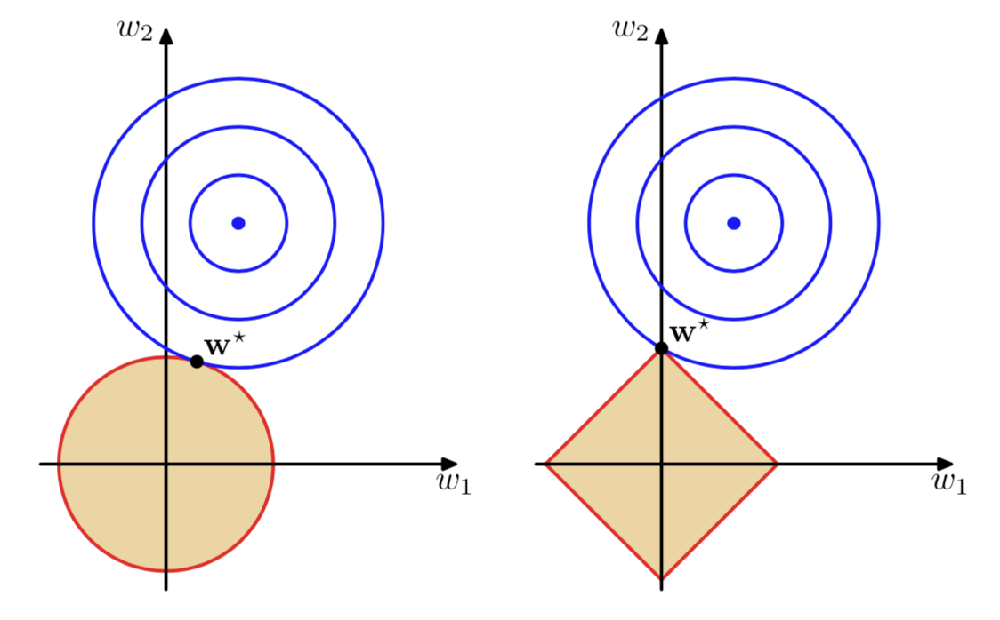

```{r setup, include=FALSE}
knitr::opts_chunk$set(echo = TRUE)
knitr::opts_chunk$set(message = FALSE)
# knitr::opts_knit$set(root.dir = '..')
knitr::opts_chunk$set(fig.height = 3, fig.width = 7)
knitr::opts_chunk$set(fig.pos='H')

library(data.table)
library(ggplot2)
library(magrittr)
library(glue)
library(purrr)
library(caret)
library(knitr)
library(glmnet)
```

## Goal of the lesson

- introduce the concept of **regularisation**
- define and try out **ridge** and **LASSO** regression
- conduct model selection on a real world example

# Regularisation
 
## Recap
 
```{r, echo=FALSE}
set.seed(1337)
n <- 50
x <- runif(n, min = 0, max = 1)
e <- rnorm(n, 0, 0.1)
y <- sin(2*pi*x) + e

x_range <- seq(0,1,0.01)
f <- sin(2*pi*x_range)

data <- data.table(x = x, y = y)
data <- data[, constant := 1]

train_proportion <- 0.7
train_index <- sample(1:n, floor(n*train_proportion))

data_train <- data[train_index,]
data_test <- data[-train_index,]
data_range <- data.table(x = x_range, y = f)

p <- ggplot(data_train, aes(x, y)) +
    geom_point()  + 
    geom_line(data = data_range, aes(x, y)) +
    theme_minimal() +
    xlim(0, 1) + ylim(-1.4, 1.4)

p
```

## Recap
 
```{r, echo=FALSE, warning = FALSE}
MSE <- function(y, pred) {
    mean((y - pred)**2)
}

k <- c(0, 1, 5, 30)
train_control <- trainControl(method="cv", number=5)

mse_train <- list()
mse_test <- list()
mse_cross <- list()
aic <- list()
bic <- list()
for (i in k) {
    if (i == 0) {
       model <- lm(y ~ 1, data = data_train)
       model_caret <- train(y ~ constant, 
             data=data, 
             trControl=train_control, 
             method="lm", 
             tuneGrid  = expand.grid(intercept = FALSE) )
    } else {
        model <- lm(y ~ poly(x, i, raw = TRUE), data = data_train)
        formula <- as.formula(paste0("y ~ ", paste(paste0(paste0("I(x^",1:i),")"), collapse = " + ")))
        model_caret <- train(formula, 
               data=data, 
               trControl=train_control, 
               method="lm")
    }
    colname <- paste0("k_",i)
    data_train <- data_train[, eval(colname):=predict(model, newdata = data_train)]
    mse_train[[colname]] <-  MSE(data_train[, y], data_train[, get(colname)])
    data_test <- data_test[, eval(colname):=predict(model, newdata = data_test)]
    mse_test[[colname]] <-  MSE(data_test[, y], data_test[, get(colname)])
    mse_cross[[colname]] <-  model_caret$results$RMSE**2
    aic[[colname]] <-  AIC(model)
    bic[[colname]] <-  BIC(model)
}

evals <- cbind("train MSE" = unlist(mse_train), "test MSE" = unlist(mse_test), "CV MSE" = unlist(mse_cross),
               "AIC" = unlist(aic), "BIC" = unlist(bic))
kable(evals, digits = 2)
```

## What is Regularisation

**Idea:** Use a different estimator to estimate the linear regression model. Add a **penalty term** to the error function to discourage the coefficients from reaching large values. 

$$E(w) = E_D(w) + \lambda E_W(w) $$

where $E_D(w)$ is the **data-dependent error**, $E_W(w)$ **regularisation term** and $\lambda$ is the **regularisation parameter** that controls the relative importance of these two terms. 

## The Ridge

Minimise the following loss function:

$$L(w) = \sum_i^N (w^Tx_i - y_i)^2 + \lambda \sum_j^k (w_j)^2 $$

Luckily, it has a **closed form solution**.

## The Ridge

```{r, echo=FALSE, warning = FALSE}

lambda <- c(1,0.1,0.001)

model_formula <- as.formula("y ~ poly(x, 30, raw = TRUE)")
X <- model.matrix(model_formula, data = data_train)[,-1]
X_range <- model.matrix(model_formula, data = data_range)[,-1]

ridge.mod <- glmnet(X, data_train$y, alpha = 0, lambda = lambda)

for (l in lambda){
  colname = paste0("lambda_",l)
  ridge.pred <- predict(ridge.mod, s = l, newx =  X_range)
  data_range <- data_range[, eval(colname):= ridge.pred]
}

lm.mod <- lm(model_formula, data = data_train)
data_range <- data_range[, "lambda_0":=predict(lm.mod, newdata = data_range)]

data_range_long <- melt(data_range, id.vars = c("x", "y"))

p +
    geom_line(data = data_range_long, aes(x, value), color = "red") +
    facet_wrap(~variable)

```


## The LASSO

Minimise the following loss function:

$$L(w) = \sum_i^N (w^Tx_i - y_i)^2 + \lambda \sum_j^k \lvert w_j \rvert $$

Unfortunately, it has **no closed form solution**. One has to use a clever algorithm to find the solution (shooting algorithm).

## The LASSO

```{r, echo=FALSE, warning = FALSE}

lambda <- c(1,0.1,0.001)

lasso.mod <- glmnet(X, data_train$y, alpha = 1, lambda = lambda)

data_range <- data.table(x = x_range, y = f)
for (l in lambda){
  colname = paste0("lambda_",l)
  ridge.pred <- predict(lasso.mod, s = l, newx =  X_range)
  data_range <- data_range[, eval(colname):= ridge.pred]
}

lm.mod <- lm(model_formula, data = data_train)
data_range <- data_range[, "lambda_0":=predict(lm.mod, newdata = data_range)]

data_range_long <- melt(data_range, id.vars = c("x", "y"))

p +
    geom_line(data = data_range_long, aes(x, value), color = "red") +
    facet_wrap(~variable)

```

## The Bias-Variance trade-off

$$MSE(\hat w) = E[(\hat w - w)^2] = \underbrace{E[(\hat w - w)]^2}_\text{bias} + \underbrace{E[(\hat w - E \hat w)^2]}_\text{variance} $$

- OLS is unbiased estimator
- ridge and LASSO are **biased but have a smaller variance** than least squares
- by optimally choosing $\lambda$ it is possible to obtain an estimator with smaller MSE

## Ridge vs. Lasso

```{r, out.height = "200px", echo = FALSE}

```

## Ridge vs. Lasso

- both are useful when $k$ is large relative to $N$
- ridge is useful when regressors are highly collinear
- LASSO when true regression parameter vector is sparse and regressors are not highly collinear
- one can use LASSO as variable selection method

## How to choose lambda?

**Cross-validate!**

```{r, echo=FALSE, warning = FALSE}

ridge_best <- cv.glmnet(X, data_train$y, alpha = 0)
bestlam <- ridge_best$lambda.min

data_range <- data.table(x = x_range, y = f)
data_range <- data_range[, "ridge_best":=predict(ridge_best, s = bestlam, newx =  X_range)]
data_train <- data_train[, "ridge_best":=predict(ridge_best, s = bestlam, newx =  X)]
X_test <- model.matrix(model_formula, data = data_test)[,-1]
data_test <- data_test[, "ridge_best":=predict(ridge_best, s = bestlam, newx =  X_test)]

lasso_best <- cv.glmnet(X, data_train$y, alpha = 1)
bestlam <- lasso_best$lambda.min

data_range <- data_range[, "lasso_best":=predict(lasso_best, s = bestlam, newx =  X_range)]
data_train <- data_train[, "lasso_best":=predict(lasso_best, s = bestlam, newx =  X)]
data_test <- data_test[, "lasso_best":=predict(lasso_best, s = bestlam, newx =  X_test)]

data_range_long <- melt(data_range, id.vars = c("x", "y"))

p +
    geom_line(data = data_range_long, aes(x, value), color = "red") +
    facet_wrap(~variable)

```

## How to choose lambda?

```{r, echo=FALSE, warning = FALSE}
for (model in c("ridge_best", "lasso_best")) {
  mse_train[[model]] <-  MSE(data_train[, y], data_train[, get(model)])
  mse_test[[model]] <-  MSE(data_test[, y], data_test[, get(model)])
  mse_cross[[model]] <-  min(get(model)$cvm)
  aic[[model]] <-  NA
  bic[[model]] <-  NA
}


evals <- cbind("train MSE" = unlist(mse_train), "test MSE" = unlist(mse_test), "CV MSE" = unlist(mse_cross))
kable(evals, digits = 2)
```

# Model Selection Example

## The Data

- Articles published from January 7 2013 to January 7 2015 on Mashable: http://archive.ics.uci.edu/ml/datasets/Online+News+Popularity
 
- **Target:** number of shares in social networks
- **Predictors:** different summary measures of article content (e.g.: links, images, videos, keywords)

## Resources

- Bishop, Christopher: Pattern Recognition and Machine Learning
- Gareth J., Witten D., Hastie T. and Tibshirani R.: An Introduction to Statistical Learning