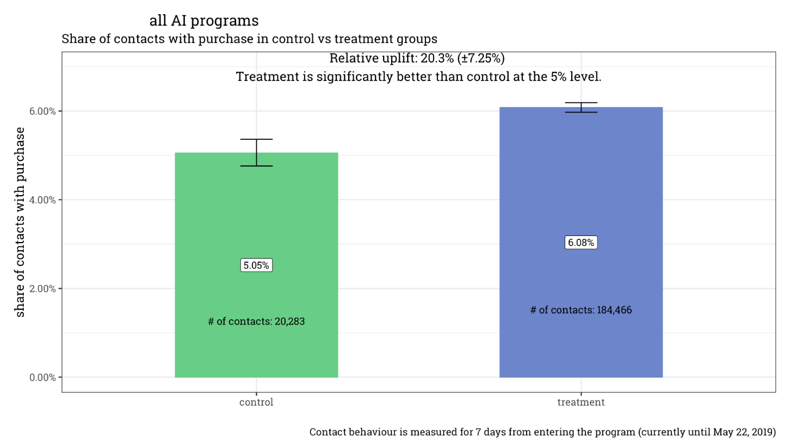
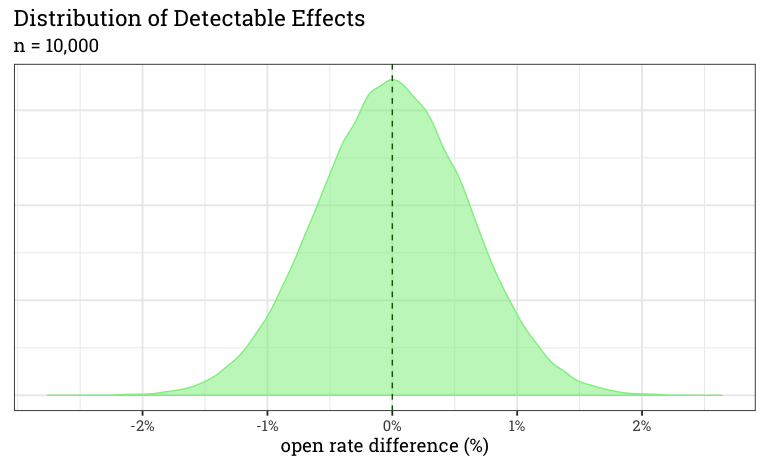
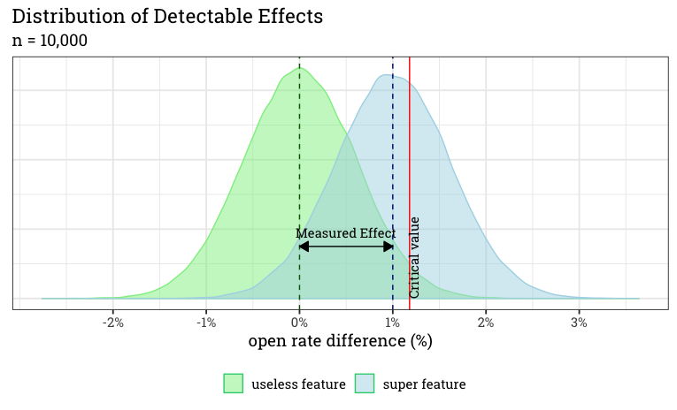
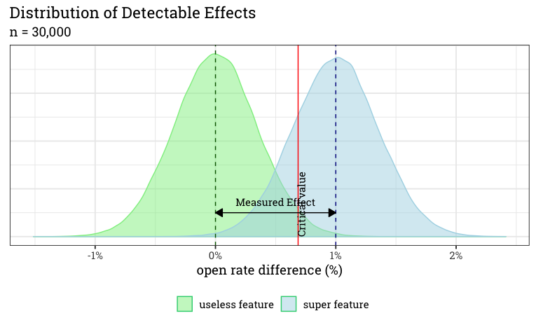
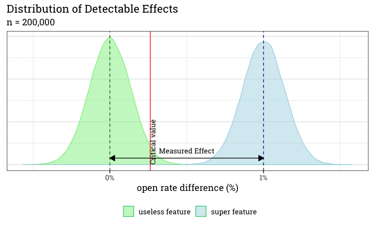
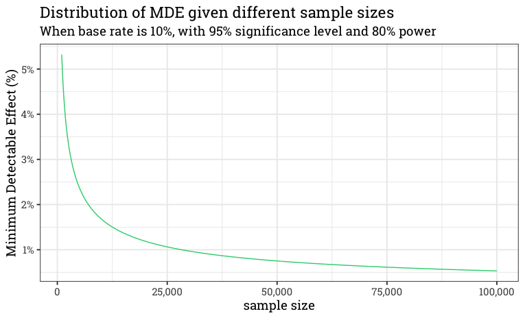

```{r setup, include=FALSE}
# knitr::opts_knit$set(root.dir = '..')
library(knitr)
library(data.table)
library(magrittr)
library(ggplot2)
```

# Why talk about effect measurement in Data Science?

## What is an effect?

Added value of a treatment (the new feature)

## How can we measure the effect?

- Simulation
- Based on historical data
- **Experimenting** (A/B test or something like that...)

# How do we experiment?

## What to experiment on?

- **Based on customer's need**
- Validated by data based research
    - Will the algo work?
    - Does it scale?
    - Cost of the feature?
- Make sure you understand your feature/algorithm!

## Setup

- Together with customer or darklaunch?
- Define the goal
    - Measure one feature at a time
- Definte KPIs
    - How much added value does it bring to the user?
- Make sure you have enough data to measure significant results
    - check the minimum effect you can measure beforehand!
- Split contacts *randomly* into control and treatment groups
- Do not change parameters during the experiment

## What are good KPIs?

Treatment receives personalized email (80% of contacs), control receives "standard" email (20% of contacs).
```{r example-for-KPIs, echo = FALSE}
data.table(
    id = c(1:6, "...", 100),
    group = c(
        "control", "treatment", "control", "treatment",
        "control", "treatment", "...", "treatment"),
    did_open = c(0, 0, 1, 0, 1, 1, "...", 1),
    did_click = c(0, 0, 1, 0, 0, 1, "...", 0),
    sales_amount = c(0, 0, 30, 0, 50, 12, "...", 0)
) %>% kable()
```

## How to calculate the effect

$$Uplift_{KPI} = \frac{KPI_{treatment}}{KPI_{control}} - 1$$

## Calculate the effect for the **first period**!

Use `experiment_results.csv`

## Calculate the effect for the **second period** and plot the results!

Use `experiment_results.csv`

When you are done with both the calculation and the plot, enter your results in the chat!

The *design* should look something like this:
```{r effect-example, echo=FALSE, out.width='50%', fig.align='center'}
dt <- data.table(
    group = c("control", "treatment"),
    open_rate = c(0.1, 0.12)
)
ggplot(dt, aes(x = group, y = open_rate)) +
    geom_col() +
    scale_y_continuous(labels = scales::percent) +
    labs(
        title = "Open rates for second period",
        subtitle = paste0("Uplift: 20%"),
        x = "", y = "Open rate"
    )
```

## Calculate the effect for the **whole period** and plot the results!

When you are done with both the calculation and the plot, enter your results in the chat!

*Do you notice anything weird?*
```{r simpsons-paradox, echo = FALSE, include = FALSE}
dt <- fread("experiment_result.csv")
dt[, .(.N, mean(did_open)), keyby = .(period, group)]
dt[, .(.N, mean(did_open)), group]
```

## What's happening here?

We have too much 'bad' control! (Let's check the code!)
```{r explaining-the-simpson-paradox, echo = FALSE, include = FALSE}
num_contact <- 100000
control_measured_value_first_period <- 0.2
control_measured_value_second_period <- 0.1
treatment_measured_value_first_period <- 0.21
treatment_measured_value_second_period <- 0.11
ratio_of_treatment_in_first_period <- 0.2
ratio_of_treatment_in_second_period <- 0.5
treatment_first_period <- num_contact * ratio_of_treatment_in_first_period
treatment_second_period <- num_contact * ratio_of_treatment_in_second_period
control_first_period <- num_contact * (1 - ratio_of_treatment_in_first_period)
control_second_period <- num_contact * (1 - ratio_of_treatment_in_second_period)
# calculate the uplift
(treatment_measured_value_first_period * treatment_first_period + treatment_measured_value_second_period * treatment_second_period) /
(control_measured_value_first_period * control_first_period + control_measured_value_second_period * control_second_period)
```

## One way to aggregate the effect

$$KPI_{treatment} = \frac{\sum_{i = 1}^{n}KPI_{treatment, i} * SampleSize_{i}}{\sum_{i = 1}^{n}{SampleSize_{i}}}$$

$$KPI_{control} = \frac{\sum_{i = 1}^{n}KPI_{control, i} * SampleSize_{i}}{\sum_{i = 1}^{n}{SampleSize_{i}}}$$

$$Uplift_{KPI} = \frac{KPI_{treatment}}{KPI_{control}} - 1$$
, where *n* is the number of unit levels.

## Calculate the effect for the whole period and plot the results!

Weight the open rates by the number of contacts present in the period!

When you are done with both the calculation and the plot, enter your results in the chat!

## Plot the effect (uplift) over time!

Use `experiment_results_over_time.csv`

The *design* should look something like this:
```{r effect-over-time-example, echo=FALSE, out.width='50%', fig.align='center'}
dt <- data.table(
    date = as.Date(c(
        "2020-01-01", "2020-02-01", "2020-03-01",
        "2020-04-01", "2020-05-01", "2020-06-01"
    )),
    uplift = c(0.1, 0.05, 0.07, -0.2, -0.12, 0.1)
)
ggplot(dt, aes(date, uplift)) +
    geom_line() +
    geom_hline(yintercept = 0) +
    scale_y_continuous(labels = scales::percent) +
    labs(
        title = "Change in uplift over time",
        x = "Uplift", y = ""
    )
```

# How to present

## How to present
What is missing from the previous plots?

## How we do it in Emarsys
```{r, echo = FALSE, out.width='80%', fig.align='center'}

```

## How we do it in Emarsys
[Shiny app from Emarsys](https://rserver.service.emarsys.net/app/sto-monitoring)

# Homework for next week
## Homework for next week

Use `experiment_result_HW.csv` for your homework. Define KPIs which describe the best the succes of the experiment. Calculate and plot the uplift for the *whole* period for each KPI.

You should send the plots along with a short explanation how you assess the results based on the KPIs.

# How to design experiments?
## Minimum Detectable Effect

A great [blogpost](https://blog.craftlab.hu/checking-both-sides-the-minimum-detectable-effect-f34a6c0db4fb) by a great guy

## Detectable Effects for Useless Feature

```{r, echo=FALSE, out.width='80%', fig.align='center'}

```

## Hypothesis testing

```{r, echo=FALSE, out.width='80%', fig.align='center'}
include_graphics("figures/useless_feature_distribution.png")
```

## But what if we really have an effect?

```{r, echo=FALSE, out.width='80%', fig.align='center'}

```

## Use more data points!

```{r, echo=FALSE, out.width='80%', fig.align='center'}

```

## Or even more!

```{r, echo=FALSE, out.width='80%', fig.align='center'}

```

## We can calculate this in advance!

```{r, echo=FALSE, out.width='80%', fig.align='center'}

```