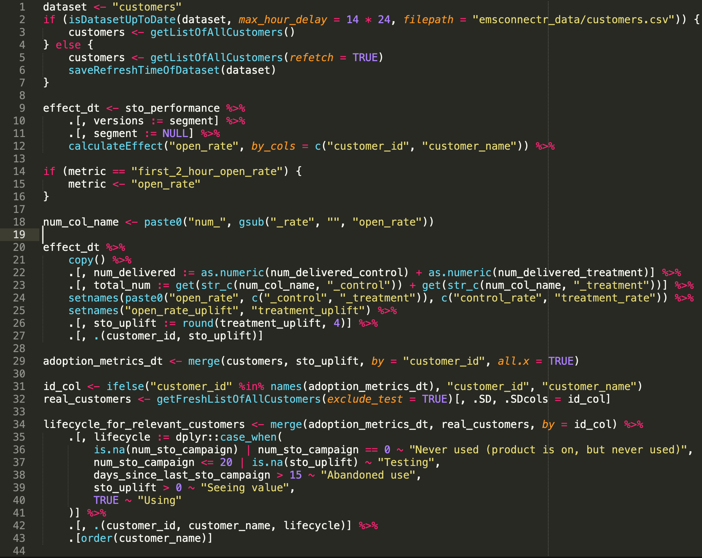
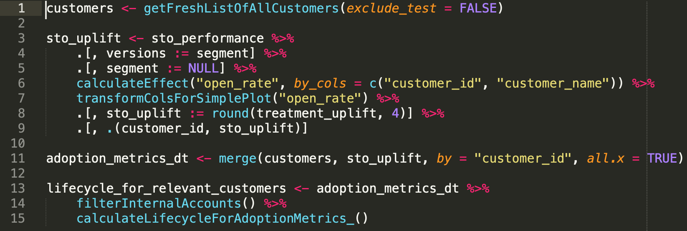

```{r setup, include=FALSE}
knitr::opts_chunk$set(echo = FALSE)
knitr::opts_chunk$set(warning = FALSE)
knitr::opts_chunk$set(message = FALSE)
# knitr::opts_knit$set(root.dir = '..')
library(knitr)
library(data.table)
library(magrittr)
library(ggplot2)
```

## About me

- Background in Economics
- Works as Data Scientist @ Emarsys

## Today's topics

- Coding guidelines
- Exploratory Data Analysis (EDA)
- Data visualization with ggplot

# Coding guidelines

## Why writing good code is important?

```{r, out.width='60%', fig.cap='https://www.inf.elte.hu/en/content/data-science-in-computer-science-msc.t.1732?m=361', fig.align='center'}
include_graphics(rep("./figures/data-science.png", 1))
```

## Try to make your code 'clean'!

- **\textcolor{red}{D}**(on't) **\textcolor{red}{R}**(epeat) **\textcolor{red}{Y}**(ourself)!
- Make your code readable!
- Use style guides!

## Keep it DRY!

```r
average_of_A <- sum(data['A_column']) / nrow(data['A_column'])
variance_of_A <- sum((data['A_column'] - average_of_A) ^ 2) /
    (nrow(data['A_column']) - 1)

... some line of codes ...

average_of_B <- sum(data['B_column']) / nrow(data['B_column'])
variance_of_B <- sum((data['B_column'] - average_of_B) ^ 2) /
    (nrow(data['B_column']) - 1)

... some line of codes ...

average_of_C <- sum(data['C_column']) / nrow(data['C_column'])
variance_of_C <- sum((data['C_column'] - average_of_C) ^ 2) /
    (nrow(data['C_column']) - 1)
```

## Move repeating code into functions!

```r
# Define a function
variance <- function(values) {
    N <- length(values)
    average <- sum(values) / N

    return ((values - N) ^ 2) / N
}

```
## Use the function instead!

```r
variance_of_A <- variance(data['A_column'])

... some line of codes ...

variance_of_B <- variance(data['B_column'])

... some line of codes ...

variance_of_C <- variance(data['C_column'])
```

## Watch out for messy code!

```{r, out.width='80%', fig.align='center'}

```

## Make it easy(er) to read!

```{r, out.width='100%', fig.align='center'}

```

## Quick recap

Structure of functions:

- name the function
- define input parameters / arguments
    - set default values if needed
- write down the logic
- provide a return value

## How to write functions

```r
name_of_the_function <- function(argument_1, argument_2, ...) {
    Body of the function

    last line is the return value
}
```

## Style guide

- [tidyverse](https://style.tidyverse.org/)
- [Google](https://google.github.io/styleguide/Rguide.html)
(- Your own within your company)

## Why use style guides?

1. Provides consistency
2. Easier to read (for you and others - for us to grade your homework :) )
3. Easier to write good - you need to make fewer decisions

## What's a style guide about?

- **naming** of files, functions, objects, etc.
- **structure** of files, functions
- **syntax** - spacing, brackets, inlining etc.

## Packages supporting style guides

- [lintr](https://github.com/jimhester/lintr)
- [styler](https://styler.r-lib.org/)

## Your turn!

1. Write a function that calculates the average of mpg from the mtcars dataset and prints: "The average of mpg is X"!
2. Use lintr and styler to check your code!

# Exploratory Data Analysis

## What's EDA about?

- Put it in a usable format
- Clean it
- Understand your data/features so it can help answer your question

**This usually takes much more time than creating models for prediction**

## Data cleaning

- Check if features are in the correct format
- Are there missing values? Is there anything we can do with them?
- Are there 'suspicious' values? (eg.: birthday = 1900-01-01)

## Understanding your data

- Understand distribution of features
- Do they make sense?
- Do they help answering your question?

## Example on Manhattan house price

You can check the code later at `week2/EDA.R`

# Data visualization with ggplot2 (and plotly)


