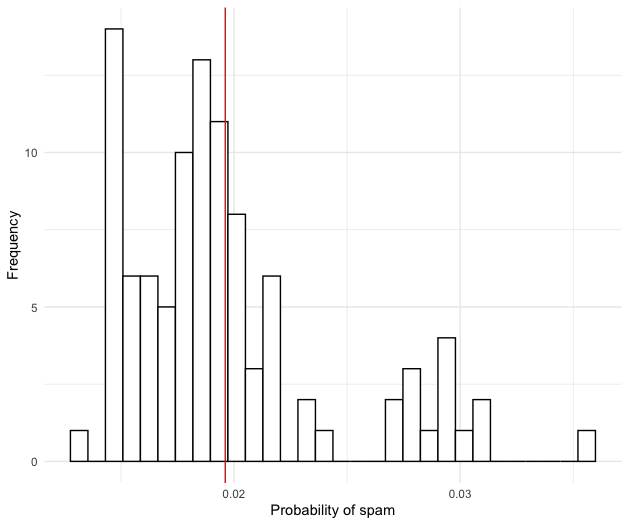
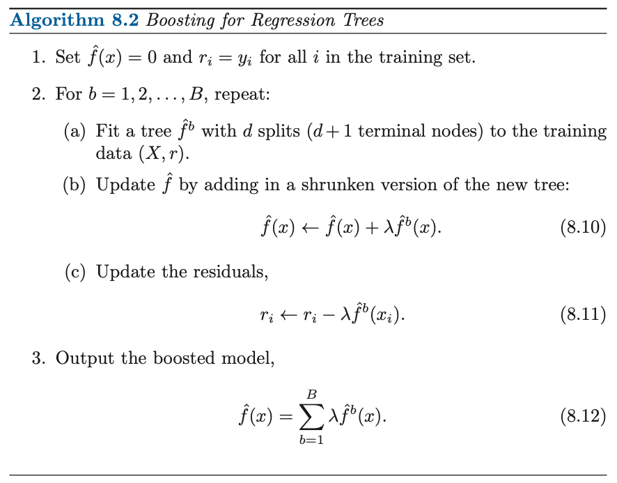

## About me

- Data Scientist @ Emarsys AI Labs
- (Previously: Assistant Professor in Economics at the University of Groningen)
- Contact: _sovago.sandor@gmail.com_

## Recap: What we have learnt thus far?

- Classification problems are about predicting categorical variables (making a purchase in the next 30 days)
- The logistic regression is a regression technique for binary classifications
- Decision trees are non-linear classifiers
- Accuracy may not be informative for classification problems
- The ROC curve visualizes the trade-off between True Positive Rates (TPR) and False Positive Rates (FPR) 

## Learning outcomes

After this lecture students will be able to

- understand the intuition behind more advanced tree-based methods, such as
    - bagging,
    - random forests,
    - boosting;
- implement these methods in R;
- interpret the output of tree-based methods
- understand pros and cons of these methods

## Bagging -- Background

- Tree-based models yield high variance predictions
- High variance predictions: different training sets give very different predictions

## High-variance predictions: illustration

- Spam dataset: can we predict spams with the length of the e-mails using a decision trees?
- What is the likelihood that an e-mail is a spam with a length of 61 characters?

- Mean: 0.02
- Standard deviation: 0.005

- Homework: conduct the same exercise using a logit model insted of a tree

##

## Bagging (Cont'd)

- Resample the data with replacement and fit a tree-model
- Create a prediction with the fitted model
- Repeat these steps B times, and compute the average prediction
- Intuition: 
    - The variance of the average predictions is smaller than the variance of the individual prediction

- Bootstrapping: random sampling with replacement
    - Often used to estimate the sampling distribution of statistics
    - Example: the distribution of the t-statistics (t-distribution) relies on asymptotic approximations. In finite samples, the distribution of the t-statistic can be obtained via bootstrapping

## Issues related to bagging
1. Out-of-Bagging Error: accuracy based on left out observations
2. Black box method (average of many trees) -- hard to interpret the importance of covariates
    - Solution: variance importance graphs
3. Limitation: trees will be correlated, which may result in high variance predictions
    - Potential cause: presence of a strong predictor
    - Why?

## Bagging: summary
- Bootstrap samples, and average predictions
- Pros:
    - Lower prediction variance relative to trees
    - No need to prune
    - No need to perform cross-validation when using out-of-bagging errors
    - The idea of bagging can be applied to other statistical learning methods
- Cons:
    - Hard to interpret the predictions
    - Trees can still be correlated, which increases the prediction variance

## Random Forests
- Aims at reducing the correlation between trees (cf. bagging)
- For a given bootstrap draw:
    - For each split, use a random subset of predictors $(m)$ 
    - If there are $p$ predictors, $m = \sqrt{p}$ is a typical choice
- The random forest prediction is the average of the bootstrapped predictions
- Intuition:
    - Important predictors are not always considered when splitting the tree
    - E.g., on average, an important predictor is not even considered in $(p-m)/p$ of the splits  
- Why bagging is a special _random forest_?

## Boosting
- Instead of bootstrapping trees (like bagging or random forests), we grow trees sequentially

## 

## Boosting (Cont'd)
- Overcomes the overfitting problems of large decision trees by growing the tree slowly (see $\lambda$)
- By fitting small additional trees ($d$ is small) we slowly improve the prediction
- Parameters:
    - $B$: number of trees
    - $d$: the depth of the trees
    - $\lambda$: learning rate (shrinkage parameter)
- Advantage over random forests: smaller trees (more like an additive model) make interpretation easier
- We need to cross-validation to avoid overfitting

## Summary
- Bagging, random forests and boosting could improve decison-tree-based predictions
- Bagging and random forests are based on bootstrapping, i.e., random resampling with replacement
- Bagging is a special random forest, where $m = p$
- Model interpretability is problemativ for random forests
- Boosting grows trees sequentially
